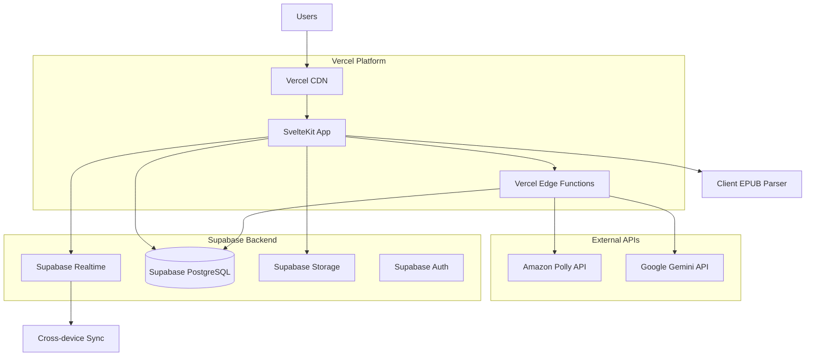
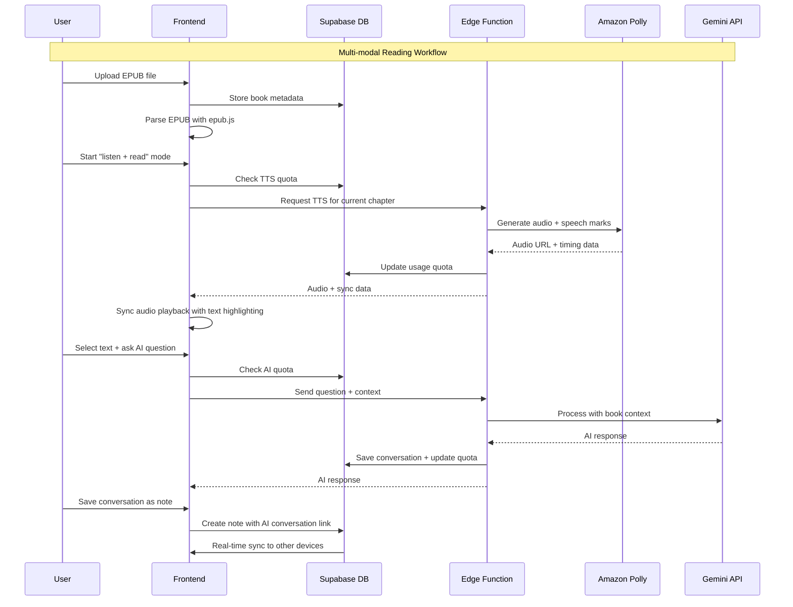
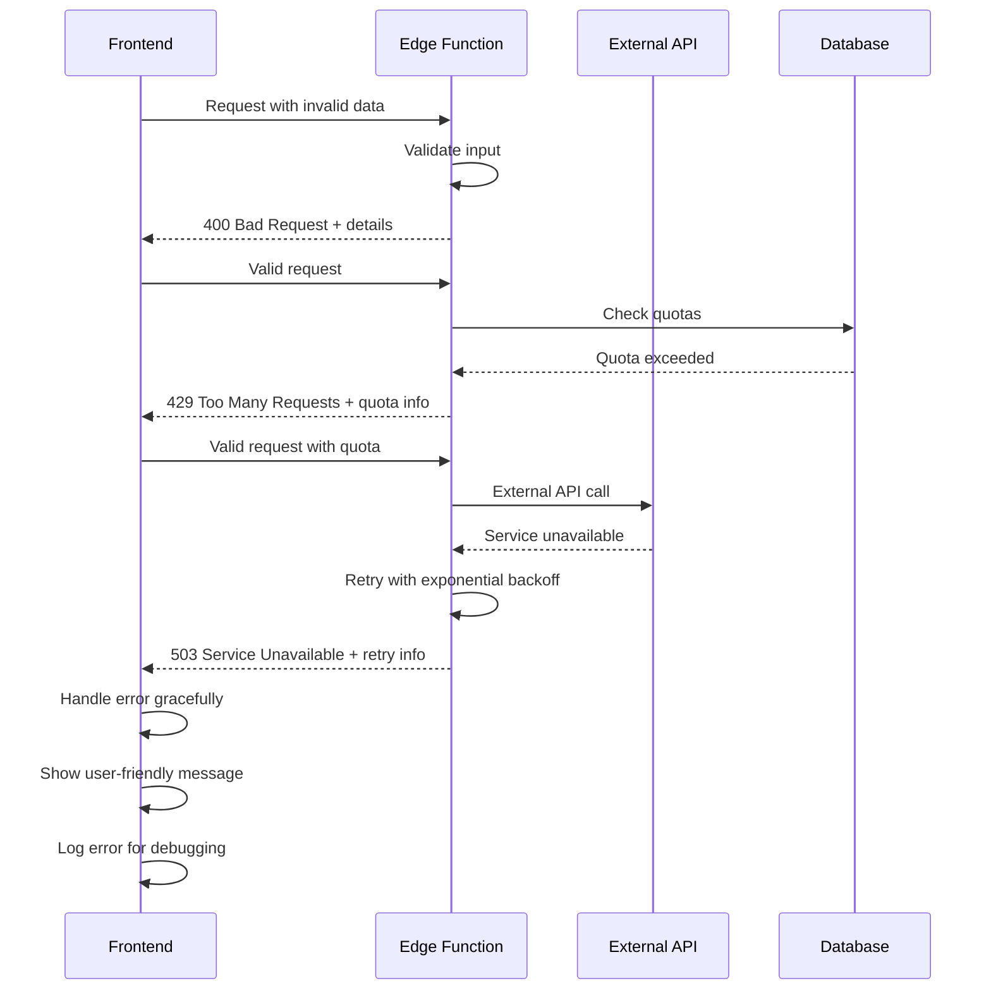

# FlowReader Full-Stack Architecture Document

## Introduction

This document outlines the complete full-stack architecture for FlowReader, including backend systems, frontend implementation, and their integration. It serves as the single source of truth for AI-driven development, ensuring consistency across the entire technology stack.

This unified approach combines what would traditionally be separate backend and frontend architecture documents, streamlining the development process for modern full-stack applications where these concerns are increasingly intertwined.

### Starter Template or Existing Project

**Status:** Greenfield project - no existing starter template

**Decision:** Will create custom architecture optimized for FlowReader's specific requirements around real-time audio-text sync and AI integration.

### Change Log

| Date | Version | Description | Author |
|------|---------|-------------|--------|
| 2025-09-08 | 1.0 | Initial architecture document | Winston (Architect) |

## High Level Architecture

### Technical Summary

FlowReader employs a modern serverless architecture with Svelte+SvelteKit frontend deployed on Vercel, integrated with Supabase for backend-as-a-service functionality. The system leverages Amazon Polly for high-quality text-to-speech with precise timing data, Google Gemini for AI conversations, and implements sophisticated client-side EPUB processing. This architecture prioritizes cost control through intelligent quota management while delivering sub-2-second response times for core interactions, enabling seamless multi-modal reading experiences that can scale from individual users to thousands of concurrent readers.

### Platform and Infrastructure Choice

**Platform:** Vercel + Supabase Ecosystem  
**Key Services:** Vercel Edge Functions, Supabase PostgreSQL, Supabase Auth, Supabase Storage, Supabase Realtime  
**Deployment Host and Regions:** Global CDN via Vercel (primary: US-East), Supabase (US-East-1 primary)

### Repository Structure

**Structure:** Monorepo with integrated frontend/backend  
**Monorepo Tool:** npm workspaces (native, lightweight)  
**Package Organization:** Apps (web, api), Packages (shared, ui, config)

### High Level Architecture Diagram



### Architectural Patterns

- **Jamstack Architecture:** Static-first with serverless APIs - _Rationale:_ Optimal performance, global CDN distribution, and cost efficiency for reading-focused application
- **Backend-as-a-Service (BaaS):** Supabase for core backend services - _Rationale:_ Rapid development, built-in auth/realtime, reduces infrastructure complexity
- **Edge-First Computing:** Critical API calls via Vercel Edge Functions - _Rationale:_ Lower latency, better security for API keys, cost-efficient scaling
- **Client-Heavy Processing:** EPUB parsing and text processing in browser - _Rationale:_ Reduces server costs, improves privacy, enables offline reading
- **Event-Driven Real-time:** Supabase Realtime for cross-device sync - _Rationale:_ Seamless experience across devices, immediate state synchronization
- **Quota-Based Resource Management:** Usage tracking for cost-sensitive APIs - _Rationale:_ Prevents cost spiraling from heavy users while maintaining UX quality

## Tech Stack

### Technology Stack Table

| Category | Technology | Version | Purpose | Rationale |
|----------|------------|---------|---------|-----------|
| Frontend Language | TypeScript | 5.3+ | Type-safe development | Essential for large codebase, API integration safety |
| Frontend Framework | SvelteKit | 2.0+ | UI framework and SSR | Superior performance, smaller bundle size than React/Vue |
| UI Component Library | Tailwind CSS + Headless UI | 3.4+ / 1.7+ | Styling and components | Rapid styling, accessibility built-in, customizable |
| State Management | Svelte Stores + Pinia | Native + 2.1+ | Client state management | Svelte native + enhanced store for complex state |
| Backend Language | TypeScript | 5.3+ | Server-side logic | Shared types with frontend, familiar syntax |
| Backend Framework | Supabase + Edge Functions | Latest | BaaS + serverless functions | Complete backend solution, built-in auth/realtime |
| API Style | REST + Supabase Client SDK | Supabase 2.38+ | API communication | Direct database access + custom endpoints for external APIs |
| Database | PostgreSQL (Supabase) | 15+ | Primary data store | ACID compliance, JSON support, excellent Supabase integration |
| Cache | Redis (Upstash) | 7.0+ | Session and API response cache | Edge-compatible, reduces API calls to Polly/Gemini |
| File Storage | Supabase Storage | Latest | EPUB files and assets | Integrated with auth, CDN delivery, cost-effective |
| Authentication | Supabase Auth | Latest | User authentication | Email/password + OAuth, session management included |
| Frontend Testing | Vitest + Testing Library | 1.0+ / 14+ | Unit and integration tests | Fast, modern testing with Svelte support |
| Backend Testing | Vitest + Supertest | 1.0+ / 6.3+ | API and function testing | Consistent testing stack, edge function testing |
| E2E Testing | Playwright | 1.40+ | End-to-end testing | Multi-browser support, reliable automation |
| Build Tool | Vite | 5.0+ | Development and build | Fast HMR, optimized for SvelteKit |
| Bundler | Vite (built-in) | 5.0+ | Module bundling | Integrated with SvelteKit, tree-shaking, code splitting |
| IaC Tool | Terraform | 1.6+ | Infrastructure as code | Reproducible deployments, version control |
| CI/CD | GitHub Actions | Latest | Continuous integration | Native GitHub integration, free for public repos |
| Monitoring | Vercel Analytics + Sentry | Latest | Performance and error tracking | Integrated monitoring, error tracking, performance insights |
| Logging | Vercel Logs + Supabase Logs | Latest | Application logging | Centralized logging, debugging support |
| CSS Framework | Tailwind CSS | 3.4+ | Utility-first styling | Rapid development, consistent design, small production bundle |

## Data Models

### User

**Purpose:** Represents a FlowReader user with authentication and preferences

**Key Attributes:**
- id: UUID - Primary identifier
- email: string - User's email address
- created_at: timestamp - Account creation time
- subscription_tier: enum - Free trial, Pro, etc.
- usage_quotas: JSONB - Current usage tracking for TTS/AI

#### TypeScript Interface

```typescript
interface User {
  id: string;
  email: string;
  created_at: string;
  subscription_tier: 'trial' | 'pro' | 'enterprise';
  usage_quotas: {
    tts_characters_used: number;
    ai_tokens_used: number;
    reset_date: string;
  };
  preferences: {
    reading_speed: number;
    voice_preference: string;
    theme: 'light' | 'dark' | 'sepia';
  };
}
```

#### Relationships
- One-to-many with Books (user owns multiple books)
- One-to-many with Notes (user creates multiple notes)
- One-to-many with AIConversations (user has multiple AI sessions)

### Book

**Purpose:** Represents an uploaded EPUB/TXT book with metadata and reading progress

**Key Attributes:**
- id: UUID - Primary identifier
- user_id: UUID - Owner reference
- title: string - Book title
- author: string - Book author
- file_path: string - Storage location
- reading_progress: JSONB - Current position and bookmarks

#### TypeScript Interface

```typescript
interface Book {
  id: string;
  user_id: string;
  title: string;
  author: string;
  file_path: string;
  file_size: number;
  upload_date: string;
  reading_progress: {
    current_cfi: string; // EPUB Canonical Fragment Identifier
    current_chapter: number;
    percentage: number;
    last_read: string;
  };
  metadata: {
    word_count?: number;
    estimated_reading_time?: number;
    language: string;
  };
}
```

#### Relationships
- Many-to-one with User (book belongs to user)
- One-to-many with Notes (book has multiple annotations)
- One-to-many with AIConversations (book generates multiple AI discussions)

### Note

**Purpose:** Captures user annotations, highlights, and thoughts during reading

**Key Attributes:**
- id: UUID - Primary identifier
- book_id: UUID - Associated book
- user_id: UUID - Note creator
- highlighted_text: text - Selected text (optional)
- note_content: text - User's annotation
- location_cfi: string - Precise location in book

#### TypeScript Interface

```typescript
interface Note {
  id: string;
  book_id: string;
  user_id: string;
  highlighted_text?: string;
  note_content?: string;
  location_cfi: string;
  created_at: string;
  note_type: 'highlight' | 'annotation' | 'bookmark' | 'question';
  tags?: string[];
  color?: string;
}
```

#### Relationships
- Many-to-one with Book (note belongs to book)
- Many-to-one with User (note created by user)
- One-to-many with AIConversations (note can spawn AI discussions)

### AIConversation

**Purpose:** Stores complete AI interaction sessions with context and history

**Key Attributes:**
- id: UUID - Primary identifier
- book_id: UUID - Associated book
- user_id: UUID - Conversation participant
- note_id: UUID - Originating note (optional)
- messages: JSONB - Complete conversation thread
- context_summary: text - AI-generated conversation summary

#### TypeScript Interface

```typescript
interface AIConversation {
  id: string;
  book_id: string;
  user_id: string;
  note_id?: string;
  messages: Array<{
    role: 'user' | 'assistant';
    content: string;
    timestamp: string;
    tokens_used?: number;
  }>;
  context_summary: string;
  conversation_type: 'explanation' | 'analysis' | 'brainstorm' | 'synthesis';
  created_at: string;
  total_tokens_used: number;
}
```

#### Relationships
- Many-to-one with Book (conversation about specific book)
- Many-to-one with User (user participates in conversation)
- Many-to-one with Note (conversation may originate from note)

## API Specification

### REST API Specification

```yaml
openapi: 3.0.0
info:
  title: FlowReader API
  version: 1.0.0
  description: FlowReader backend API for reading, AI interaction, and knowledge synthesis

servers:
  - url: https://your-project.vercel.app/api
    description: Production API
  - url: http://localhost:5173/api
    description: Development API

paths:
  /books:
    get:
      summary: Get user's book library
      security:
        - BearerAuth: []
      responses:
        '200':
          description: List of user's books
          content:
            application/json:
              schema:
                type: array
                items:
                  $ref: '#/components/schemas/Book'
    
    post:
      summary: Upload new book
      security:
        - BearerAuth: []
      requestBody:
        content:
          multipart/form-data:
            schema:
              type: object
              properties:
                file:
                  type: string
                  format: binary
                title:
                  type: string
                author:
                  type: string
      responses:
        '201':
          description: Book uploaded successfully
          content:
            application/json:
              schema:
                $ref: '#/components/schemas/Book'

  /books/{bookId}/tts:
    post:
      summary: Generate TTS audio for text passage
      security:
        - BearerAuth: []
      parameters:
        - name: bookId
          in: path
          required: true
          schema:
            type: string
      requestBody:
        content:
          application/json:
            schema:
              type: object
              properties:
                text:
                  type: string
                  maxLength: 3000
                voice_id:
                  type: string
                speed:
                  type: number
                  minimum: 0.25
                  maximum: 4.0
      responses:
        '200':
          description: TTS audio generated
          content:
            application/json:
              schema:
                type: object
                properties:
                  audio_url:
                    type: string
                  speech_marks:
                    type: array
                    items:
                      type: object
                  duration:
                    type: number
                  characters_used:
                    type: number

  /books/{bookId}/ai-chat:
    post:
      summary: Start or continue AI conversation
      security:
        - BearerAuth: []
      parameters:
        - name: bookId
          in: path
          required: true
          schema:
            type: string
      requestBody:
        content:
          application/json:
            schema:
              type: object
              properties:
                message:
                  type: string
                conversation_id:
                  type: string
                  nullable: true
                context:
                  type: object
                  properties:
                    selected_text:
                      type: string
                    location_cfi:
                      type: string
      responses:
        '200':
          description: AI response generated
          content:
            application/json:
              schema:
                type: object
                properties:
                  conversation_id:
                    type: string
                  response:
                    type: string
                  tokens_used:
                    type: number
                  remaining_quota:
                    type: number

components:
  securitySchemes:
    BearerAuth:
      type: http
      scheme: bearer
      
  schemas:
    Book:
      type: object
      properties:
        id:
          type: string
        title:
          type: string
        author:
          type: string
        reading_progress:
          type: object
        created_at:
          type: string
```

## Components

### Frontend Application (SvelteKit)

**Responsibility:** User interface, client-side book processing, real-time state management

**Key Interfaces:**
- Component-based UI with Svelte stores for state
- EPUB.js integration for book rendering
- WebSocket connection to Supabase Realtime
- Service layer for API communication

**Dependencies:** Supabase client SDK, EPUB.js, Tailwind CSS

**Technology Stack:** SvelteKit, TypeScript, Vite, Tailwind CSS

### API Gateway Layer (Vercel Edge Functions)

**Responsibility:** Secure proxy for external APIs, request validation, quota enforcement

**Key Interfaces:**
- `/api/tts` - Amazon Polly integration
- `/api/ai-chat` - Google Gemini integration
- `/api/usage` - Quota tracking and enforcement

**Dependencies:** Supabase client for data access, external API credentials

**Technology Stack:** Vercel Edge Runtime, TypeScript

### Database Layer (Supabase PostgreSQL)

**Responsibility:** Primary data persistence, user management, real-time subscriptions

**Key Interfaces:**
- Supabase client SDK for direct access
- PostgreSQL functions for complex queries
- Row Level Security for data protection

**Dependencies:** None (managed service)

**Technology Stack:** PostgreSQL 15+, Supabase platform

### Storage Layer (Supabase Storage)

**Responsibility:** EPUB file storage, generated audio caching, static assets

**Key Interfaces:**
- REST API for file upload/download
- CDN delivery for performance
- Automatic cleanup policies

**Dependencies:** Integrated with Supabase Auth for access control

**Technology Stack:** Supabase Storage with CDN

### Real-time Sync Engine (Supabase Realtime)

**Responsibility:** Cross-device reading progress sync, collaborative features

**Key Interfaces:**
- WebSocket subscriptions to database changes
- Conflict resolution for concurrent updates
- Presence tracking for active sessions

**Dependencies:** PostgreSQL triggers, WebSocket infrastructure

**Technology Stack:** Supabase Realtime, PostgreSQL triggers

## External APIs

### Amazon Polly API

- **Purpose:** High-quality text-to-speech with precise timing data
- **Documentation:** https://docs.aws.amazon.com/polly/
- **Base URL(s):** https://polly.region.amazonaws.com
- **Authentication:** AWS IAM credentials (stored securely in Vercel)
- **Rate Limits:** 100 requests/second, throttling available

**Key Endpoints Used:**
- `POST /v1/speech` - Generate audio from text
- `POST /v1/speech?OutputFormat=json` - Get speech marks for synchronization

**Integration Notes:** Critical for audio-text sync feature. Costs scale with character count. Implement aggressive caching and quota monitoring.

### Google Gemini API

- **Purpose:** AI-powered reading companion and knowledge synthesis
- **Documentation:** https://ai.google.dev/docs
- **Base URL(s):** https://generativelanguage.googleapis.com
- **Authentication:** API key (stored securely in Vercel environment)
- **Rate Limits:** 60 requests/minute, context caching for cost efficiency

**Key Endpoints Used:**
- `POST /v1beta/models/gemini-pro:generateContent` - AI conversation
- `POST /v1beta/models/gemini-pro:countTokens` - Token estimation

**Integration Notes:** Leverage context caching to reduce costs. Implement conversation summarization for long sessions.

## Core Workflows



## Database Schema

```sql
-- Users table
CREATE TABLE users (
    id UUID PRIMARY KEY DEFAULT gen_random_uuid(),
    email TEXT UNIQUE NOT NULL,
    created_at TIMESTAMPTZ DEFAULT NOW(),
    subscription_tier TEXT DEFAULT 'trial' CHECK (subscription_tier IN ('trial', 'pro', 'enterprise')),
    usage_quotas JSONB DEFAULT '{
        "tts_characters_used": 0,
        "ai_tokens_used": 0,
        "reset_date": null
    }',
    preferences JSONB DEFAULT '{
        "reading_speed": 1.0,
        "voice_preference": "Joanna",
        "theme": "light"
    }'
);

-- Books table
CREATE TABLE books (
    id UUID PRIMARY KEY DEFAULT gen_random_uuid(),
    user_id UUID REFERENCES users(id) ON DELETE CASCADE,
    title TEXT NOT NULL,
    author TEXT NOT NULL,
    file_path TEXT NOT NULL,
    file_size BIGINT,
    upload_date TIMESTAMPTZ DEFAULT NOW(),
    reading_progress JSONB DEFAULT '{
        "current_cfi": "",
        "current_chapter": 0,
        "percentage": 0,
        "last_read": null
    }',
    metadata JSONB DEFAULT '{}'
);

-- Notes table  
CREATE TABLE notes (
    id UUID PRIMARY KEY DEFAULT gen_random_uuid(),
    book_id UUID REFERENCES books(id) ON DELETE CASCADE,
    user_id UUID REFERENCES users(id) ON DELETE CASCADE,
    highlighted_text TEXT,
    note_content TEXT,
    location_cfi TEXT NOT NULL,
    created_at TIMESTAMPTZ DEFAULT NOW(),
    note_type TEXT DEFAULT 'annotation' CHECK (note_type IN ('highlight', 'annotation', 'bookmark', 'question')),
    tags TEXT[],
    color TEXT
);

-- AI Conversations table
CREATE TABLE ai_conversations (
    id UUID PRIMARY KEY DEFAULT gen_random_uuid(),
    book_id UUID REFERENCES books(id) ON DELETE CASCADE,
    user_id UUID REFERENCES users(id) ON DELETE CASCADE,
    note_id UUID REFERENCES notes(id) ON DELETE SET NULL,
    messages JSONB NOT NULL DEFAULT '[]',
    context_summary TEXT,
    conversation_type TEXT DEFAULT 'explanation' CHECK (conversation_type IN ('explanation', 'analysis', 'brainstorm', 'synthesis')),
    created_at TIMESTAMPTZ DEFAULT NOW(),
    total_tokens_used INTEGER DEFAULT 0
);

-- Indexes for performance
CREATE INDEX idx_books_user_id ON books(user_id);
CREATE INDEX idx_notes_book_id ON notes(book_id);
CREATE INDEX idx_notes_user_id ON notes(user_id);
CREATE INDEX idx_ai_conversations_book_id ON ai_conversations(book_id);
CREATE INDEX idx_ai_conversations_user_id ON ai_conversations(user_id);

-- Row Level Security
ALTER TABLE books ENABLE ROW LEVEL SECURITY;
ALTER TABLE notes ENABLE ROW LEVEL SECURITY;
ALTER TABLE ai_conversations ENABLE ROW LEVEL SECURITY;

-- RLS Policies
CREATE POLICY "Users can only access their own books" ON books
    FOR ALL USING (auth.uid() = user_id);

CREATE POLICY "Users can only access their own notes" ON notes
    FOR ALL USING (auth.uid() = user_id);

CREATE POLICY "Users can only access their own conversations" ON ai_conversations
    FOR ALL USING (auth.uid() = user_id);
```

## Frontend Architecture

### Component Architecture

#### Component Organization

```
src/
├── components/
│   ├── ui/                 # Reusable UI components
│   │   ├── Button.svelte
│   │   ├── Modal.svelte
│   │   └── Spinner.svelte
│   ├── reader/            # Reading-specific components
│   │   ├── BookRenderer.svelte
│   │   ├── AudioPlayer.svelte
│   │   └── AIChat.svelte
│   ├── library/           # Book library components
│   │   ├── BookGrid.svelte
│   │   ├── BookCard.svelte
│   │   └── UploadZone.svelte
│   └── layout/            # Layout components
│       ├── Header.svelte
│       ├── Sidebar.svelte
│       └── Navigation.svelte
├── routes/                # SvelteKit routes
│   ├── +layout.svelte
│   ├── +page.svelte
│   ├── library/
│   ├── reader/[bookId]/
│   └── settings/
├── stores/                # Svelte stores
├── services/              # API services
└── utils/                 # Utility functions
```

#### Component Template

```typescript
<script lang="ts">
    import type { Book } from '$lib/types';
    import { createEventDispatcher } from 'svelte';
    
    export let book: Book;
    export let isLoading = false;
    
    const dispatch = createEventDispatcher<{
        bookSelected: { book: Book };
        bookDeleted: { bookId: string };
    }>();
    
    function handleSelect() {
        dispatch('bookSelected', { book });
    }
</script>

<div class="book-card" role="button" tabindex="0" on:click={handleSelect} on:keydown>
    
    <h3>{book.title}</h3>
    <p>{book.author}</p>
    {#if isLoading}
        <Spinner />
    {/if}
</div>

<style>
    .book-card {
        @apply cursor-pointer rounded-lg bg-white p-4 shadow-md transition-shadow hover:shadow-lg;
    }
</style>
```

### State Management Architecture

#### State Structure

```typescript
// stores/reading.ts
import { writable, derived } from 'svelte/store';
import type { Book, ReadingProgress, AIConversation } from '$lib/types';

export const currentBook = writable<Book | null>(null);
export const readingProgress = writable<ReadingProgress>({
    currentCfi: '',
    currentChapter: 0,
    percentage: 0,
    lastRead: null
});

export const audioState = writable<{
    isPlaying: boolean;
    currentTime: number;
    duration: number;
    audioUrl: string | null;
}>({
    isPlaying: false,
    currentTime: 0,
    duration: 0,
    audioUrl: null
});

export const aiConversation = writable<AIConversation | null>(null);

// Derived stores
export const isInReadingMode = derived(
    [currentBook, audioState],
    ([book, audio]) => book !== null || audio.isPlaying
);

export const readingStats = derived(
    [currentBook, readingProgress],
    ([book, progress]) => {
        if (!book) return null;
        return {
            wordsRead: Math.floor(book.metadata.word_count * progress.percentage / 100),
            estimatedTimeRemaining: Math.floor(book.metadata.estimated_reading_time * (100 - progress.percentage) / 100),
            chaptersCompleted: progress.currentChapter
        };
    }
);
```

#### State Management Patterns

- **Reactive Stores:** Use Svelte's reactive stores for component state
- **Derived State:** Calculate dependent values automatically
- **Store Composition:** Combine multiple stores for complex state
- **Persistence:** Auto-save critical state to localStorage and Supabase

### Routing Architecture

#### Route Organization

```
src/routes/
├── +layout.svelte              # Root layout with auth
├── +page.svelte                # Landing/dashboard page
├── library/
│   ├── +page.svelte            # Book library grid
│   └── upload/
│       └── +page.svelte        # Book upload page
├── reader/
│   └── [bookId]/
│       ├── +page.svelte        # Main reading interface
│       ├── +page.server.ts     # Server-side book loading
│       └── notes/
│           └── +page.svelte    # Book notes management
├── settings/
│   └── +page.svelte            # User preferences
└── api/                        # API routes (Edge Functions)
    ├── books/
    ├── tts/
    └── ai-chat/
```

#### Protected Route Pattern

```typescript
// src/hooks.server.ts
import { redirect } from '@sveltejs/kit';
import { createServerSupabaseClient } from '@supabase/auth-helpers-sveltekit';

export async function handle({ event, resolve }) {
    event.locals.supabase = createServerSupabaseClient({
        supabaseUrl: SUPABASE_URL,
        supabaseKey: SUPABASE_ANON_KEY,
        event
    });

    // Protect authenticated routes
    if (event.route.id?.startsWith('/library') || event.route.id?.startsWith('/reader')) {
        const session = await event.locals.supabase.auth.getSession();
        if (!session.data.session) {
            throw redirect(302, '/auth/login');
        }
    }

    return resolve(event);
}
```

### Frontend Services Layer

#### API Client Setup

```typescript
// src/lib/services/api.ts
import { createSupabaseLoadClient } from '@supabase/auth-helpers-sveltekit';
import type { Database } from '$lib/types/supabase';

class ApiClient {
    private supabase: ReturnType<typeof createSupabaseLoadClient<Database>>;

    constructor(supabaseClient: ReturnType<typeof createSupabaseLoadClient<Database>>) {
        this.supabase = supabaseClient;
    }

    async uploadBook(file: File, metadata: { title: string; author: string }) {
        // Upload file to storage
        const { data: uploadData, error: uploadError } = await this.supabase.storage
            .from('books')
            .upload(`${Date.now()}-${file.name}`, file);

        if (uploadError) throw uploadError;

        // Create book record
        const { data: bookData, error: bookError } = await this.supabase
            .from('books')
            .insert({
                title: metadata.title,
                author: metadata.author,
                file_path: uploadData.path,
                file_size: file.size
            })
            .select()
            .single();

        if (bookError) throw bookError;
        return bookData;
    }

    async generateTTS(bookId: string, text: string, options: { voiceId: string; speed: number }) {
        const response = await fetch('/api/tts', {
            method: 'POST',
            headers: {
                'Content-Type': 'application/json',
            },
            body: JSON.stringify({
                bookId,
                text: text.slice(0, 3000), // Enforce character limit
                voiceId: options.voiceId,
                speed: options.speed
            })
        });

        if (!response.ok) {
            throw new Error(`TTS generation failed: ${response.statusText}`);
        }

        return response.json();
    }
}

export { ApiClient };
```

#### Service Example

```typescript
// src/lib/services/reading.ts
import type { Book, ReadingProgress } from '$lib/types';
import { currentBook, readingProgress, audioState } from '$lib/stores/reading';
import { ApiClient } from './api';

export class ReadingService {
    constructor(private apiClient: ApiClient) {}

    async loadBook(bookId: string): Promise<Book> {
        const { data: book, error } = await this.apiClient.supabase
            .from('books')
            .select('*')
            .eq('id', bookId)
            .single();

        if (error) throw error;

        currentBook.set(book);
        return book;
    }

    async updateProgress(progress: Partial<ReadingProgress>) {
        readingProgress.update(current => ({ ...current, ...progress }));
        
        // Sync to database
        const bookId = get(currentBook)?.id;
        if (bookId) {
            await this.apiClient.supabase
                .from('books')
                .update({ 
                    reading_progress: progress 
                })
                .eq('id', bookId);
        }
    }

    async startListening(text: string) {
        try {
            const book = get(currentBook);
            if (!book) return;

            const ttsData = await this.apiClient.generateTTS(book.id, text, {
                voiceId: 'Joanna',
                speed: 1.0
            });

            audioState.update(state => ({
                ...state,
                audioUrl: ttsData.audio_url,
                duration: ttsData.duration,
                isPlaying: true
            }));

        } catch (error) {
            console.error('Failed to generate TTS:', error);
            // Handle quota exceeded, network errors, etc.
        }
    }
}
```

## Backend Architecture

### Service Architecture (Serverless)

#### Function Organization

```
api/
├── books/
│   ├── index.ts           # GET /api/books - list user books
│   ├── [id].ts           # GET/PUT/DELETE /api/books/[id]
│   └── upload.ts         # POST /api/books/upload
├── tts/
│   └── index.ts          # POST /api/tts - generate speech
├── ai-chat/
│   └── index.ts          # POST /api/ai-chat - AI conversation
├── notes/
│   ├── index.ts          # GET /api/notes - list notes
│   └── [id].ts          # GET/PUT/DELETE /api/notes/[id]
└── usage/
    └── index.ts          # GET /api/usage - quota information
```

#### Function Template

```typescript
// api/tts/index.ts
import { createClient } from '@supabase/supabase-js';
import { PollyClient, SynthesizeSpeechCommand } from '@aws-sdk/client-polly';

interface TTSRequest {
    bookId: string;
    text: string;
    voiceId: string;
    speed: number;
}

export default async function handler(req: Request) {
    if (req.method !== 'POST') {
        return new Response('Method Not Allowed', { status: 405 });
    }

    try {
        // Parse and validate request
        const { bookId, text, voiceId, speed }: TTSRequest = await req.json();
        
        if (!text || text.length > 3000) {
            return new Response('Text length must be between 1-3000 characters', { 
                status: 400 
            });
        }

        // Get user from auth header
        const authHeader = req.headers.get('authorization');
        if (!authHeader) {
            return new Response('Unauthorized', { status: 401 });
        }

        const supabase = createClient(
            process.env.SUPABASE_URL!,
            process.env.SUPABASE_SERVICE_ROLE_KEY!
        );

        const { data: { user }, error: authError } = await supabase.auth.getUser(
            authHeader.replace('Bearer ', '')
        );

        if (authError || !user) {
            return new Response('Unauthorized', { status: 401 });
        }

        // Check usage quota
        const { data: userData, error: userError } = await supabase
            .from('users')
            .select('usage_quotas, subscription_tier')
            .eq('id', user.id)
            .single();

        if (userError) throw userError;

        const monthlyLimit = userData.subscription_tier === 'pro' ? 2000000 : 50000; // characters
        const currentUsage = userData.usage_quotas.tts_characters_used || 0;

        if (currentUsage + text.length > monthlyLimit) {
            return new Response('TTS quota exceeded', { status: 429 });
        }

        // Generate TTS with Amazon Polly
        const pollyClient = new PollyClient({ 
            region: process.env.AWS_REGION!,
            credentials: {
                accessKeyId: process.env.AWS_ACCESS_KEY_ID!,
                secretAccessKey: process.env.AWS_SECRET_ACCESS_KEY!
            }
        });

        const command = new SynthesizeSpeechCommand({
            Text: text,
            OutputFormat: 'mp3',
            VoiceId: voiceId,
            Engine: 'neural',
            SampleRate: '22050'
        });

        const pollyResponse = await pollyClient.send(command);
        
        // Store audio file and get URL
        const audioBuffer = await pollyResponse.AudioStream?.transformToByteArray();
        const audioFileName = `tts/${user.id}/${bookId}/${Date.now()}.mp3`;

        const { data: uploadData, error: uploadError } = await supabase.storage
            .from('audio-cache')
            .upload(audioFileName, audioBuffer!, {
                contentType: 'audio/mpeg',
                cacheControl: '86400' // 24 hours
            });

        if (uploadError) throw uploadError;

        // Get public URL
        const { data: urlData } = supabase.storage
            .from('audio-cache')
            .getPublicUrl(audioFileName);

        // Update usage quota
        await supabase
            .from('users')
            .update({
                usage_quotas: {
                    ...userData.usage_quotas,
                    tts_characters_used: currentUsage + text.length
                }
            })
            .eq('id', user.id);

        return new Response(JSON.stringify({
            audio_url: urlData.publicUrl,
            duration: estimateDuration(text), // Rough estimation
            characters_used: text.length,
            remaining_quota: monthlyLimit - (currentUsage + text.length)
        }), {
            headers: { 'Content-Type': 'application/json' }
        });

    } catch (error) {
        console.error('TTS generation error:', error);
        return new Response('Internal Server Error', { status: 500 });
    }
}

function estimateDuration(text: string): number {
    // Rough estimation: ~150 words per minute, ~5 characters per word
    const wordsPerMinute = 150;
    const charactersPerWord = 5;
    const words = text.length / charactersPerWord;
    return (words / wordsPerMinute) * 60; // seconds
}
```

## Unified Project Structure

```plaintext
FlowReader/
├── .github/                    # CI/CD workflows
│   └── workflows/
│       ├── ci.yaml
│       └── deploy.yaml
├── apps/                       # Application packages
│   ├── web/                    # Frontend application
│   │   ├── src/
│   │   │   ├── components/     # UI components
│   │   │   ├── routes/         # SvelteKit routes
│   │   │   ├── lib/           # Services, stores, utilities
│   │   │   │   ├── services/  # API client services
│   │   │   │   ├── stores/    # Svelte stores
│   │   │   │   ├── types/     # TypeScript interfaces
│   │   │   │   └── utils/     # Frontend utilities
│   │   │   └── app.html       # SvelteKit app template
│   │   ├── static/             # Static assets
│   │   ├── tests/              # Frontend tests
│   │   ├── package.json
│   │   ├── vite.config.ts
│   │   └── svelte.config.js
│   └── api/                    # Backend serverless functions
│       ├── books/              # Book management APIs
│       ├── tts/                # Text-to-speech API
│       ├── ai-chat/            # AI conversation API
│       ├── notes/              # Notes management API
│       ├── usage/              # Quota and usage tracking
│       └── tests/              # Backend/API tests
├── packages/                   # Shared packages
│   ├── shared/                 # Shared types/utilities
│   │   ├── src/
│   │   │   ├── types/          # TypeScript interfaces
│   │   │   ├── constants/      # Shared constants
│   │   │   └── utils/          # Shared utilities
│   │   └── package.json
│   ├── ui/                     # Shared UI components
│   │   ├── src/
│   │   └── package.json
│   └── config/                 # Shared configuration
│       ├── eslint/
│       ├── typescript/
│       └── tailwind/
├── infrastructure/             # Infrastructure as Code
│   ├── terraform/
│   │   ├── main.tf
│   │   ├── variables.tf
│   │   └── outputs.tf
│   └── supabase/
│       ├── migrations/
│       ├── functions/
│       └── config.toml
├── scripts/                    # Build/deploy scripts
│   ├── build.sh
│   ├── deploy.sh
│   └── dev.sh
├── docs/                       # Documentation
│   ├── prd.md
│   ├── architecture.md
│   └── api-reference.md
├── .env.example                # Environment template
├── package.json                # Root package.json
├── turbo.json                  # Turborepo configuration (if using)
└── README.md
```

## Development Workflow

### Local Development Setup

#### Prerequisites

```bash
# Install Node.js 18+ and npm
node --version  # Should be 18+
npm --version   # Should be 9+

# Install dependencies
npm install

# Install Supabase CLI
npm install -g @supabase/cli

# Install Vercel CLI (optional, for local edge function testing)
npm install -g vercel
```

#### Initial Setup

```bash
# Clone repository
git clone <repository-url>
cd FlowReader

# Install all dependencies
npm install

# Copy environment variables
cp .env.example .env.local

# Start Supabase locally (optional)
supabase start

# Set up database schema
supabase db reset

# Generate TypeScript types from Supabase
npm run types:generate
```

#### Development Commands

```bash
# Start all services (frontend + API functions)
npm run dev

# Start frontend only
npm run dev:web

# Start API functions only (Vercel dev server)
npm run dev:api

# Run tests
npm run test
npm run test:e2e
npm run test:watch

# Type checking
npm run type-check

# Linting
npm run lint
npm run lint:fix

# Build for production
npm run build
```

### Environment Configuration

#### Required Environment Variables

```bash
# Frontend (.env.local)
VITE_SUPABASE_URL=your_supabase_project_url
VITE_SUPABASE_ANON_KEY=your_supabase_anon_key
VITE_APP_ENV=development

# Backend (Vercel environment variables)
SUPABASE_URL=your_supabase_project_url
SUPABASE_SERVICE_ROLE_KEY=your_supabase_service_role_key

# External API Keys (Vercel environment)
AWS_ACCESS_KEY_ID=your_aws_access_key
AWS_SECRET_ACCESS_KEY=your_aws_secret_key
AWS_REGION=us-east-1
GOOGLE_AI_API_KEY=your_google_ai_api_key

# Shared
NODE_ENV=development
LOG_LEVEL=debug
```

## Deployment Architecture

### Deployment Strategy

**Frontend Deployment:**
- **Platform:** Vercel
- **Build Command:** `npm run build`
- **Output Directory:** `apps/web/build`
- **CDN/Edge:** Vercel Edge Network (global)

**Backend Deployment:**
- **Platform:** Vercel Edge Functions
- **Build Command:** Automatic (zero-config)
- **Deployment Method:** Git-based continuous deployment

### CI/CD Pipeline

```yaml
# .github/workflows/deploy.yaml
name: Deploy to Production

on:
  push:
    branches: [main]
  pull_request:
    branches: [main]

jobs:
  test:
    runs-on: ubuntu-latest
    steps:
      - uses: actions/checkout@v4
      
      - name: Setup Node.js
        uses: actions/setup-node@v4
        with:
          node-version: '18'
          cache: 'npm'
      
      - name: Install dependencies
        run: npm ci
      
      - name: Run type check
        run: npm run type-check
      
      - name: Run tests
        run: npm run test
      
      - name: Run E2E tests
        run: npm run test:e2e

  deploy:
    needs: test
    runs-on: ubuntu-latest
    if: github.ref == 'refs/heads/main'
    steps:
      - uses: actions/checkout@v4
      
      - name: Deploy to Vercel
        uses: amondnet/vercel-action@v25
        with:
          vercel-token: ${{ secrets.VERCEL_TOKEN }}
          vercel-org-id: ${{ secrets.ORG_ID }}
          vercel-project-id: ${{ secrets.PROJECT_ID }}
          vercel-args: '--prod'
```

### Environments

| Environment | Frontend URL | Backend URL | Purpose |
|-------------|--------------|-------------|---------|
| Development | http://localhost:5173 | http://localhost:5173/api | Local development |
| Preview | https://flowreader-git-[branch].vercel.app | https://flowreader-git-[branch].vercel.app/api | PR previews |
| Production | https://flowreader.app | https://flowreader.app/api | Live environment |

## Security and Performance

### Security Requirements

**Frontend Security:**
- CSP Headers: `default-src 'self'; script-src 'self' 'unsafe-inline'; connect-src 'self' https://*.supabase.co wss://*.supabase.co;`
- XSS Prevention: Input sanitization, Content Security Policy, secure templating
- Secure Storage: Supabase Auth tokens in httpOnly cookies, sensitive data encrypted

**Backend Security:**
- Input Validation: Zod schemas for all API inputs, strict type checking
- Rate Limiting: 100 requests/minute per IP, 1000/hour per authenticated user
- CORS Policy: Restricted to known domains, credentials included for auth

**Authentication Security:**
- Token Storage: JWT tokens in secure, httpOnly cookies with SameSite=strict
- Session Management: Supabase Auth with 1-hour access tokens, 30-day refresh tokens
- Password Policy: Minimum 8 characters, complexity requirements via Supabase Auth

### Performance Optimization

**Frontend Performance:**
- Bundle Size Target: <200KB initial load, <50KB route chunks
- Loading Strategy: Route-based code splitting, lazy loading for heavy components
- Caching Strategy: Service worker for static assets, IndexedDB for book content

**Backend Performance:**
- Response Time Target: <500ms for API calls, <2s for TTS generation
- Database Optimization: Proper indexing, connection pooling, query optimization
- Caching Strategy: Redis for API responses, CDN for static assets, Polly audio caching

## Testing Strategy

### Testing Pyramid

```
        E2E Tests (10%)
       /              \
   Integration Tests (20%)
  /                        \
Frontend Unit (35%)  Backend Unit (35%)
```

### Test Organization

#### Frontend Tests

```
apps/web/tests/
├── unit/                    # Component and utility tests
│   ├── components/
│   │   ├── BookCard.test.ts
│   │   └── AudioPlayer.test.ts
│   ├── services/
│   │   └── api.test.ts
│   └── utils/
│       └── epub-parser.test.ts
├── integration/             # Integration tests
│   ├── reading-flow.test.ts
│   └── ai-chat.test.ts
└── setup.ts                # Test configuration
```

#### Backend Tests

```
apps/api/tests/
├── unit/                    # Function unit tests
│   ├── tts.test.ts
│   ├── ai-chat.test.ts
│   └── books.test.ts
├── integration/             # API integration tests
│   ├── auth-flow.test.ts
│   └── quota-enforcement.test.ts
└── setup.ts                # Test configuration
```

#### E2E Tests

```
tests/e2e/
├── auth.spec.ts            # Authentication flows
├── book-upload.spec.ts     # Book upload and library
├── reading-modes.spec.ts   # Multi-modal reading
├── ai-interaction.spec.ts  # AI chat functionality
└── cross-device-sync.spec.ts # Real-time sync testing
```

### Test Examples

#### Frontend Component Test

```typescript
// apps/web/tests/unit/components/AudioPlayer.test.ts
import { render, fireEvent, waitFor } from '@testing-library/svelte';
import AudioPlayer from '$lib/components/reader/AudioPlayer.svelte';
import { audioState } from '$lib/stores/reading';

describe('AudioPlayer', () => {
    beforeEach(() => {
        audioState.set({
            isPlaying: false,
            currentTime: 0,
            duration: 100,
            audioUrl: 'test-audio.mp3'
        });
    });

    it('should play audio when play button is clicked', async () => {
        const { getByRole } = render(AudioPlayer);
        const playButton = getByRole('button', { name: /play/i });

        await fireEvent.click(playButton);

        await waitFor(() => {
            expect(playButton).toHaveTextContent('Pause');
        });
    });

    it('should sync playback position with reading progress', async () => {
        const { component } = render(AudioPlayer);
        
        // Mock audio element
        const mockAudio = {
            currentTime: 0,
            addEventListener: vi.fn(),
            play: vi.fn().mockResolvedValue(undefined)
        };
        
        component.$set({ audioElement: mockAudio });
        
        audioState.update(state => ({ ...state, currentTime: 50 }));
        
        await waitFor(() => {
            expect(mockAudio.currentTime).toBe(50);
        });
    });
});
```

#### Backend API Test

```typescript
// apps/api/tests/unit/tts.test.ts
import { createMocks } from 'node-mocks-http';
import ttsHandler from '../../tts/index';
import { PollyClient } from '@aws-sdk/client-polly';

// Mock AWS Polly
vi.mock('@aws-sdk/client-polly');
const mockPollyClient = vi.mocked(PollyClient);

describe('/api/tts', () => {
    beforeEach(() => {
        vi.clearAllMocks();
    });

    it('should generate TTS audio successfully', async () => {
        const { req, res } = createMocks({
            method: 'POST',
            headers: {
                'authorization': 'Bearer valid-token'
            },
            body: {
                bookId: 'test-book-id',
                text: 'Hello world',
                voiceId: 'Joanna',
                speed: 1.0
            }
        });

        // Mock Polly response
        mockPollyClient.prototype.send.mockResolvedValue({
            AudioStream: {
                transformToByteArray: () => Promise.resolve(new Uint8Array([1, 2, 3]))
            }
        });

        const response = await ttsHandler(req as any);
        const responseData = await response.json();

        expect(response.status).toBe(200);
        expect(responseData).toHaveProperty('audio_url');
        expect(responseData).toHaveProperty('duration');
        expect(responseData.characters_used).toBe(11);
    });

    it('should enforce character limits', async () => {
        const { req } = createMocks({
            method: 'POST',
            headers: {
                'authorization': 'Bearer valid-token'
            },
            body: {
                text: 'x'.repeat(3001), // Exceeds 3000 character limit
                bookId: 'test-book-id',
                voiceId: 'Joanna',
                speed: 1.0
            }
        });

        const response = await ttsHandler(req as any);

        expect(response.status).toBe(400);
        expect(await response.text()).toContain('Text length must be between 1-3000 characters');
    });

    it('should enforce usage quotas', async () => {
        // Mock user with exceeded quota
        vi.mocked(supabase.from).mockReturnValue({
            select: vi.fn().mockReturnValue({
                eq: vi.fn().mockReturnValue({
                    single: vi.fn().mockResolvedValue({
                        data: {
                            usage_quotas: { tts_characters_used: 1999000 },
                            subscription_tier: 'pro'
                        }
                    })
                })
            })
        } as any);

        const { req } = createMocks({
            method: 'POST',
            headers: {
                'authorization': 'Bearer valid-token'
            },
            body: {
                text: 'x'.repeat(2000), // Would exceed quota
                bookId: 'test-book-id',
                voiceId: 'Joanna',
                speed: 1.0
            }
        });

        const response = await ttsHandler(req as any);

        expect(response.status).toBe(429);
        expect(await response.text()).toContain('TTS quota exceeded');
    });
});
```

#### E2E Test

```typescript
// tests/e2e/reading-modes.spec.ts
import { test, expect } from '@playwright/test';

test.describe('Multi-modal Reading', () => {
    test.beforeEach(async ({ page }) => {
        // Login and navigate to reader
        await page.goto('/auth/login');
        await page.fill('[data-testid="email"]', 'test@example.com');
        await page.fill('[data-testid="password"]', 'password123');
        await page.click('[data-testid="login-button"]');
        
        // Upload test book
        await page.goto('/library');
        await page.setInputFiles('[data-testid="file-upload"]', 'tests/fixtures/test-book.epub');
        await page.waitForSelector('[data-testid="book-card"]');
        await page.click('[data-testid="book-card"]');
    });

    test('should switch between reading modes seamlessly', async ({ page }) => {
        // Start in read-only mode
        expect(await page.locator('[data-testid="reader-content"]').isVisible()).toBe(true);
        expect(await page.locator('[data-testid="audio-player"]').isVisible()).toBe(false);

        // Switch to listen mode
        await page.click('[data-testid="listen-button"]');
        await page.waitForSelector('[data-testid="audio-player"]');
        
        expect(await page.locator('[data-testid="audio-player"]').isVisible()).toBe(true);
        expect(await page.locator('[data-testid="play-button"]').isVisible()).toBe(true);

        // Switch to read + listen mode
        await page.click('[data-testid="read-listen-button"]');
        
        expect(await page.locator('[data-testid="reader-content"]').isVisible()).toBe(true);
        expect(await page.locator('[data-testid="audio-player"]').isVisible()).toBe(true);
        
        // Verify audio-text synchronization
        await page.click('[data-testid="play-button"]');
        await page.waitForTimeout(2000);
        
        // Check if currently reading text is highlighted
        expect(await page.locator('.highlighted-text').count()).toBeGreaterThan(0);
    });

    test('should maintain reading progress across sessions', async ({ page, context }) => {
        // Read to middle of book
        await page.click('[data-testid="chapter-2"]');
        await page.waitForTimeout(1000);
        
        const initialProgress = await page.locator('[data-testid="progress-indicator"]').textContent();
        
        // Open new tab to simulate different session
        const newPage = await context.newPage();
        await newPage.goto('/library');
        await newPage.click('[data-testid="book-card"]');
        
        // Verify progress is maintained
        const syncedProgress = await newPage.locator('[data-testid="progress-indicator"]').textContent();
        expect(syncedProgress).toBe(initialProgress);
    });

    test('should handle AI chat integration', async ({ page }) => {
        // Select text to trigger AI chat
        await page.locator('[data-testid="reader-content"] p').first().selectText();
        await page.click('[data-testid="ask-ai-button"]');
        
        // Wait for AI chat modal
        await page.waitForSelector('[data-testid="ai-chat-modal"]');
        
        // Send question
        await page.fill('[data-testid="ai-input"]', 'What does this passage mean?');
        await page.click('[data-testid="send-button"]');
        
        // Wait for AI response
        await page.waitForSelector('[data-testid="ai-response"]', { timeout: 10000 });
        
        const response = await page.locator('[data-testid="ai-response"]').textContent();
        expect(response).toBeTruthy();
        expect(response.length).toBeGreaterThan(10);
        
        // Save conversation as note
        await page.click('[data-testid="save-conversation-button"]');
        await page.waitForSelector('[data-testid="note-saved-indicator"]');
        
        // Verify note appears in sidebar
        expect(await page.locator('[data-testid="notes-sidebar"] .note-item').count()).toBe(1);
    });
});
```

## Coding Standards

### Critical Full-Stack Rules

- **Type Sharing:** Always define shared types in packages/shared and import consistently across frontend/backend
- **API Error Handling:** All API routes must use the standardized error response format with proper HTTP status codes
- **Environment Variables:** Access only through typed config objects, never process.env directly in application code
- **State Management:** Never mutate Svelte stores directly - use proper update methods and reactive patterns
- **Authentication:** Every protected API endpoint must validate JWT tokens through Supabase Auth middleware
- **Quota Enforcement:** All external API calls (Polly, Gemini) must check and update user quotas before execution
- **File Upload Security:** Validate file types, sizes, and scan for malicious content before storage
- **Database Access:** Use Supabase RLS policies, never bypass with service role key in frontend code

### Naming Conventions

| Element | Frontend | Backend | Example |
|---------|----------|---------|---------|
| Components | PascalCase | - | `BookReader.svelte` |
| Stores | camelCase | - | `readingProgress` |
| API Routes | - | kebab-case | `/api/ai-chat` |
| Database Tables | - | snake_case | `ai_conversations` |
| Functions | camelCase | camelCase | `generateTTS()` |
| Constants | SCREAMING_SNAKE | SCREAMING_SNAKE | `MAX_FILE_SIZE` |

## Error Handling Strategy

### Error Flow



### Error Response Format

```typescript
interface ApiError {
  error: {
    code: string;
    message: string;
    details?: Record<string, any>;
    timestamp: string;
    requestId: string;
    retryAfter?: number; // For rate limiting
  };
}

interface ApiSuccess<T> {
  data: T;
  meta?: {
    requestId: string;
    timestamp: string;
    quota?: {
      used: number;
      limit: number;
      resetDate: string;
    };
  };
}
```

### Frontend Error Handling

```typescript
// src/lib/services/error-handler.ts
import { toast } from '$lib/components/ui/toast';
import type { ApiError } from '$lib/types';

export class ErrorHandler {
    static handle(error: unknown): void {
        if (error instanceof Response) {
            this.handleApiError(error);
        } else if (error instanceof Error) {
            this.handleGenericError(error);
        } else {
            this.handleUnknownError(error);
        }
    }

    private static async handleApiError(response: Response): Promise<void> {
        try {
            const errorData: ApiError = await response.json();
            
            switch (response.status) {
                case 400:
                    toast.error('Invalid request: ' + errorData.error.message);
                    break;
                case 401:
                    toast.error('Please log in to continue');
                    window.location.href = '/auth/login';
                    break;
                case 429:
                    const retryMinutes = Math.ceil((errorData.error.retryAfter || 3600) / 60);
                    toast.error(`Usage limit reached. Try again in ${retryMinutes} minutes.`);
                    break;
                case 503:
                    toast.error('Service temporarily unavailable. Please try again.');
                    break;
                default:
                    toast.error('An unexpected error occurred');
            }

            // Log for debugging
            console.error('API Error:', {
                status: response.status,
                code: errorData.error.code,
                message: errorData.error.message,
                requestId: errorData.error.requestId
            });

        } catch (parseError) {
            toast.error('An unexpected error occurred');
            console.error('Failed to parse error response:', parseError);
        }
    }

    private static handleGenericError(error: Error): void {
        toast.error('Something went wrong: ' + error.message);
        console.error('Generic Error:', error);
    }

    private static handleUnknownError(error: unknown): void {
        toast.error('An unexpected error occurred');
        console.error('Unknown Error:', error);
    }
}

// Usage in components
export async function safeApiCall<T>(apiCall: () => Promise<T>): Promise<T | null> {
    try {
        return await apiCall();
    } catch (error) {
        ErrorHandler.handle(error);
        return null;
    }
}
```

### Backend Error Handling

```typescript
// api/_lib/error-handler.ts
import { v4 as uuidv4 } from 'uuid';

export class ApiErrorHandler {
    static createErrorResponse(
        code: string,
        message: string,
        status: number,
        details?: Record<string, any>,
        retryAfter?: number
    ): Response {
        const errorResponse: ApiError = {
            error: {
                code,
                message,
                details,
                timestamp: new Date().toISOString(),
                requestId: uuidv4(),
                retryAfter
            }
        };

        const headers: HeadersInit = {
            'Content-Type': 'application/json',
            'X-Request-ID': errorResponse.error.requestId
        };

        if (retryAfter) {
            headers['Retry-After'] = retryAfter.toString();
        }

        return new Response(JSON.stringify(errorResponse), {
            status,
            headers
        });
    }

    static badRequest(message: string, details?: Record<string, any>): Response {
        return this.createErrorResponse('BAD_REQUEST', message, 400, details);
    }

    static unauthorized(message = 'Authentication required'): Response {
        return this.createErrorResponse('UNAUTHORIZED', message, 401);
    }

    static forbidden(message = 'Access denied'): Response {
        return this.createErrorResponse('FORBIDDEN', message, 403);
    }

    static quotaExceeded(message: string, retryAfter: number): Response {
        return this.createErrorResponse('QUOTA_EXCEEDED', message, 429, undefined, retryAfter);
    }

    static externalServiceError(service: string, retryAfter = 300): Response {
        return this.createErrorResponse(
            'EXTERNAL_SERVICE_ERROR',
            `${service} is temporarily unavailable`,
            503,
            { service },
            retryAfter
        );
    }

    static internalServerError(message = 'Internal server error'): Response {
        return this.createErrorResponse('INTERNAL_ERROR', message, 500);
    }
}

// Usage wrapper for API functions
export function withErrorHandling(handler: (req: Request) => Promise<Response>) {
    return async (req: Request): Promise<Response> => {
        try {
            return await handler(req);
        } catch (error) {
            console.error('Unhandled error in API:', error);
            
            if (error instanceof Error) {
                // Check for specific error types
                if (error.message.includes('quota')) {
                    return ApiErrorHandler.quotaExceeded('Usage quota exceeded', 3600);
                }
                if (error.message.includes('network') || error.message.includes('timeout')) {
                    return ApiErrorHandler.externalServiceError('External API');
                }
            }

            return ApiErrorHandler.internalServerError();
        }
    };
}
```

## Monitoring and Observability

### Monitoring Stack

- **Frontend Monitoring:** Vercel Analytics + Sentry for React/Svelte
- **Backend Monitoring:** Vercel Functions monitoring + Sentry for serverless
- **Error Tracking:** Sentry with custom error boundaries and API error capture
- **Performance Monitoring:** Core Web Vitals tracking, API response time monitoring, Lighthouse CI

### Key Metrics

**Frontend Metrics:**
- Core Web Vitals (LCP < 2.5s, FID < 100ms, CLS < 0.1)
- JavaScript errors and unhandled promise rejections
- API response times and error rates
- User interactions (book opens, AI chat usage, TTS generations)

**Backend Metrics:**
- Request rate per endpoint
- Error rate by status code
- Response time percentiles (P50, P90, P95)
- Database query performance and connection pool utilization
- External API success rates and latencies
- Quota utilization rates and cost tracking

## Risk Assessment & Mitigation Strategies

### High-Priority Technical Risks

#### 1. API Cost Spiral Risk 🚨
**Risk:** Heavy users could generate thousands of dollars in Polly/Gemini costs monthly
**Probability:** High | **Impact:** Critical | **Risk Score:** 9/10

**Mitigation Strategies:**
- **Immediate:** Implement hard usage caps per user tier
- **Short-term:** Real-time cost monitoring with auto-shutoff at $100/user/month
- **Long-term:** Implement usage prediction ML model and proactive user communication

**Technical Implementation:**
```typescript
// Cost monitoring middleware
const COST_LIMITS = {
  trial: 5,    // $5 max
  pro: 100,    // $100 max  
  enterprise: 1000
};

async function checkCostLimits(userId: string, estimatedCost: number) {
  const currentCost = await calculateMonthlyAPISpend(userId);
  const userTier = await getUserTier(userId);
  
  if (currentCost + estimatedCost > COST_LIMITS[userTier]) {
    throw new QuotaExceededError('Monthly API budget exceeded');
  }
}
```

#### 2. Real-time Audio-Text Sync Accuracy 🎯
**Risk:** Poor synchronization creates frustrating user experience
**Probability:** Medium | **Impact:** High | **Risk Score:** 6/10

**Mitigation Strategies:**
- **Technical:** Use Amazon Polly Speech Marks for word-level timing
- **Fallback:** Client-side text chunking with estimated timing
- **Quality:** Extensive testing across different text types and lengths

#### 3. Client-side Performance Degradation 📱
**Risk:** Large EPUB files + AI integration overwhelms browser performance
**Probability:** Medium | **Impact:** Medium | **Risk Score:** 4/10

**Mitigation Strategies:**
- **Architecture:** Implement progressive EPUB loading (chapter-by-chapter)
- **Caching:** Aggressive browser caching with ServiceWorker
- **Monitoring:** Real-time performance tracking with automatic degradation

#### 4. Third-party Service Reliability 🔗
**Risk:** AWS Polly or Google Gemini outages break core functionality
**Probability:** Low | **Impact:** High | **Risk Score:** 4/10

**Mitigation Strategies:**
- **Redundancy:** Multiple TTS provider options (Polly + ElevenLabs backup)
- **Graceful Degradation:** Core reading works without AI features
- **Status Monitoring:** Real-time service health checks

#### 5. Data Privacy & Security Compliance 🔒
**Risk:** User-uploaded books contain copyrighted content or sensitive data
**Probability:** High | **Impact:** Medium | **Risk Score:** 6/10

**Mitigation Strategies:**
- **Legal:** Clear terms of service regarding user responsibility
- **Technical:** No server-side book content analysis or storage of text
- **Architecture:** Client-side EPUB processing only

### Business Model Risks

#### Pricing Strategy Validation
**Risk:** $18-22/month price point too high for reading app market
**Mitigation:** 
- Start with generous 30-day free trial
- Implement freemium tier with limited usage
- A/B test pricing with different user segments

#### User Acquisition Cost
**Risk:** Customer acquisition cost exceeds lifetime value
**Mitigation:**
- Focus on organic growth through exceptional UX
- Partner with book clubs and educational institutions
- Implement referral program with usage credits

---

## Architecture Decision Records (ADRs)

### ADR-001: Serverless-First Architecture
**Decision:** Use Vercel Edge Functions instead of traditional server
**Rationale:** Variable workload patterns, cost efficiency, global distribution
**Alternatives Considered:** AWS Lambda, traditional Node.js server, Supabase Edge Functions
**Trade-offs:** Vendor lock-in vs operational simplicity

### ADR-002: Client-Side EPUB Processing  
**Decision:** Process EPUB files entirely in browser with epub.js
**Rationale:** Privacy protection, server cost reduction, offline capability
**Alternatives Considered:** Server-side processing, hybrid approach
**Trade-offs:** Client performance impact vs privacy and cost benefits

### ADR-003: Supabase as Primary Backend
**Decision:** Use Supabase for auth, database, storage, and real-time features
**Rationale:** Rapid development, integrated ecosystem, PostgreSQL reliability
**Alternatives Considered:** AWS Amplify, Firebase, custom backend
**Trade-offs:** Vendor dependency vs development velocity

This architecture document provides a comprehensive foundation for building FlowReader while managing costs, risks, and technical complexity. The serverless-first approach with intelligent quota management should enable sustainable growth while delivering the premium reading experience your users expect.