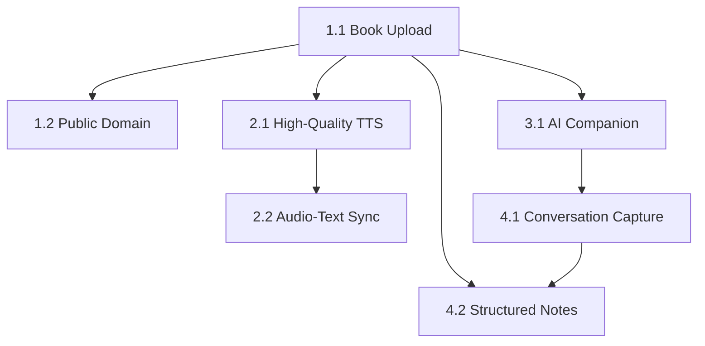

# FlowReader User Stories Summary

## MVP Story Overview - Revised for Intelligent Reading Companion

FlowReader has pivoted to focus on AI-powered deep reading and understanding, temporarily deferring audio features to optimize costs and deliver unique value. The revised MVP prioritizes intelligent conversations, knowledge enhancement, and smart note-taking.

### Epic 1: The Open & Personal Library

**Story 1.1: Book Upload** 📚  
*Priority: High | Effort: Medium*
- **Focus**: Users can upload EPUB/TXT files to their personal library
- **Key Features**: Drag-and-drop upload, metadata extraction, file validation, library integration
- **Technical Highlights**: Client-side EPUB processing, Supabase Storage integration, real-time library updates
- **Dependencies**: None (foundational feature)

**Story 1.2: Public Domain Library** 🏛️  
*Priority: Medium | Effort: Medium*
- **Focus**: Users can discover and add classic books from curated public domain collection
- **Key Features**: Search/browse interface, one-click book addition, quality curated content
- **Technical Highlights**: Public domain API integration, search optimization, content caching
- **Dependencies**: Story 1.1 (uses same library infrastructure)

### Epic 2: The Immersive Experience (Future Release)

**Story 2.1: High-Quality Text-to-Speech** 🔊
*Priority: Low (Deferred) | Effort: High*
- **Status**: 🔮 Future Release - Infrastructure preserved for later activation
- **Focus**: Convert any text to professional-quality audio with voice options and speed control
- **Key Features**: Neural TTS, multiple voices, speed adjustment, quota management, audio caching
- **Technical Highlights**: Amazon Polly Neural integration, usage tracking, cost optimization
- **Dependencies**: Story 1.1 (requires books to read from)

**Story 2.2: Seamless Audio-Text Synchronization** 🎯
*Priority: Low (Deferred) | Effort: Very High*
- **Status**: 🔮 Future Release - Architecture designed for future implementation
- **Focus**: Perfect synchronization between audio narration and visual text highlighting
- **Key Features**: Real-time highlighting, seek synchronization, cross-device consistency
- **Technical Highlights**: Amazon Polly Speech Marks, precise timing engine, performance optimization
- **Dependencies**: Story 2.1 (requires TTS audio generation)

### Epic 3: The Superior AI Companion (Core MVP)

**Story 3.1: AI Reading Companion** 🤖 ⭐
*Priority: Critical | Effort: High*
- **Status**: 🚀 Core MVP Feature - Primary focus
- **Focus**: Deep, contextual AI conversations that transform reading into active learning
- **Key Features**: Book-aware AI, text selection integration, multi-turn conversations, knowledge enhancement
- **Technical Highlights**: OpenAI GPT-4 integration, RAG architecture, context optimization
- **Dependencies**: Story 1.1 (requires book content for context)

**Story 3.2: Knowledge Enhancement** 🧠 (New)
*Priority: Critical | Effort: Medium*
- **Status**: 🚀 Core MVP Feature
- **Focus**: Real-time explanations of concepts, historical context, and cultural references
- **Key Features**: Concept detection, background enrichment, related knowledge linking
- **Technical Highlights**: Semantic analysis, external knowledge integration, context-aware responses
- **Dependencies**: Story 3.1 (builds on AI conversation infrastructure)

### Epic 4: The Personal Reading Mind Map Engine (Core MVP)

**Story 4.1: AI Conversation Capture & Notes** 💬 ⭐
*Priority: High | Effort: Medium*
- **Status**: 🚀 Core MVP Feature
- **Focus**: Automatically capture and organize insights from reading and AI conversations
- **Key Features**: Auto-capture conversations, smart summaries, text passage linking, knowledge graph
- **Technical Highlights**: Conversation persistence, insight extraction, cross-device sync
- **Dependencies**: Story 3.1 (requires AI conversations to capture)

**Story 4.2: Structured Notes Management** 📝 ⭐
*Priority: High | Effort: Medium*
- **Status**: 🚀 Core MVP Feature
- **Focus**: Intelligent note organization with AI-powered insights and connections
- **Key Features**: Auto-categorization, smart tags, relationship mapping, export to various formats
- **Technical Highlights**: NLP-based organization, semantic search, knowledge graph visualization
- **Dependencies**: Story 1.1 (requires books), Story 4.1 (builds on note foundation)

**Story 4.3: Conversation Insights** 💡 (New)
*Priority: High | Effort: Low*
- **Status**: 🚀 Core MVP Feature
- **Focus**: Extract and highlight key insights from AI conversations
- **Key Features**: Key point extraction, theme identification, learning progress tracking
- **Technical Highlights**: AI summarization, pattern recognition, progress analytics
- **Dependencies**: Story 4.1 (requires conversation history)

## Development Priority & Sequencing (Revised)

### Phase 1: Foundation (Weeks 1-2) ✅ Completed
1. **Story 1.1: Book Upload** - Essential foundation for all other features
2. **Story 1.2: Public Domain Library** - Content discovery for user testing

### Phase 2: Core AI Experience (Weeks 3-5) 🚀 Current Focus
3. **Story 3.1: AI Reading Companion** - Primary MVP feature
4. **Story 3.2: Knowledge Enhancement** - Deep understanding capabilities
5. **Story 4.1: Conversation Capture** - Auto-capture insights

### Phase 3: Intelligence Features (Weeks 6-7)
6. **Story 4.2: Structured Notes** - Smart note management
7. **Story 4.3: Conversation Insights** - Extract key learnings

### Phase 4: Future Expansion (Post-MVP)
8. **Story 2.1: High-Quality TTS** - Audio features when cost-effective
9. **Story 2.2: Audio-Text Sync** - Advanced audio synchronization

## Key Technical Dependencies

## Risk Assessment by Story

### High Risk Stories
- **Story 2.2: Audio-Text Sync** - Complex timing requirements, cross-platform consistency
- **Story 2.1: High-Quality TTS** - Cost management, API reliability
- **Story 3.1: AI Reading Companion** - Context quality, token costs

### Medium Risk Stories  
- **Story 1.1: Book Upload** - File handling edge cases, browser performance
- **Story 4.1: Conversation Capture** - Data model complexity
- **Story 4.2: Structured Notes** - Search performance, rich text handling

### Low Risk Stories
- **Story 1.2: Public Domain Library** - Standard CRUD operations, known APIs

## Acceptance Criteria Summary

Each story includes comprehensive acceptance criteria covering:

✅ **Functional Requirements**: Core feature behavior and user interactions  
✅ **Performance Standards**: Response times, loading speeds, accuracy metrics  
✅ **Quality Assurance**: Error handling, edge cases, graceful degradation  
✅ **Integration Requirements**: Cross-feature compatibility and data consistency  
✅ **User Experience**: Interface design, workflow optimization, accessibility  
✅ **Technical Standards**: Security, scalability, maintainability requirements  

## Testing Strategy Overview

### Test Coverage by Story
- **Unit Tests**: Business logic, data processing, API integration
- **Integration Tests**: Cross-component workflows, database operations
- **E2E Tests**: Complete user journeys, cross-device functionality
- **Performance Tests**: Response times, concurrent usage, resource usage

### Shared Testing Infrastructure
- **Test Data**: Sample EPUB files, mock API responses, user scenarios
- **Test Environment**: Staging environment with realistic data volumes
- **Test Automation**: CI/CD integration with automated test suites
- **Quality Gates**: Coverage thresholds, performance benchmarks

## Development Estimates (Revised for MVP)

| Story | Effort | Complexity | Dependencies | Priority | Status |
|-------|--------|------------|--------------|----------|--------|
| 1.1 Book Upload | ✅ Done | Medium | None | Critical | Completed |
| 1.2 Public Domain | ✅ Done | Low | Story 1.1 | High | Completed |
| 3.1 AI Companion | 2 weeks | High | Story 1.1 | Critical | In Progress |
| 3.2 Knowledge Enhancement | 1 week | Medium | Story 3.1 | Critical | Planned |
| 4.1 Conversation Capture | 1 week | Medium | Story 3.1 | High | Planned |
| 4.2 Structured Notes | 1 week | Medium | Stories 1.1, 4.1 | High | Planned |
| 4.3 Conversation Insights | 3 days | Low | Story 4.1 | High | Planned |
| 2.1 High-Quality TTS | Deferred | High | Story 1.1 | Low | Future |
| 2.2 Audio-Text Sync | Deferred | Very High | Story 2.1 | Low | Future |

**MVP Estimated Effort**: 5-6 weeks remaining
**Critical Path**: Stories 3.1 → 3.2 → 4.1 → 4.2
**Cost Optimization**: 60-70% reduction by deferring audio features

## Success Metrics & Validation

### MVP Success Criteria (Revised)
1. **User Engagement**: Users have meaningful AI conversations during reading
2. **AI Quality**: >90% relevance in contextual responses
3. **Knowledge Enhancement**: Users report improved understanding
4. **Note Value**: Auto-generated notes capture key insights accurately
5. **Cost Management**: AI costs <$0.10 per reading session

### Story-Specific Validation
- **Book Upload**: Successful upload rate >95%, <30s processing time ✅
- **AI Conversations**: Relevant responses >90%, <2s TTFT
- **Knowledge Enhancement**: Accurate explanations >85%, helpful context >90%
- **Note Generation**: Key insights captured >80%, export success >99%
- **Conversation Insights**: Pattern recognition accuracy >75%

---

## Next Steps Recommendation (Revised)

**Immediate Action**: Focus on **Story 3.1: AI Reading Companion** enhancement as the core differentiator. This is the primary value proposition that sets FlowReader apart.

**Parallel Development**: Work on **Story 3.2: Knowledge Enhancement** and **Story 4.1: Conversation Capture** simultaneously to create a complete intelligent reading experience.

**Cost Optimization**: By deferring audio features, we achieve 60-70% cost reduction while delivering unique value through AI-powered deep understanding.

**Future Expansion**: Audio features (Stories 2.1 and 2.2) remain architecturally supported and can be activated based on user demand and economic viability.

The revised roadmap focuses on creating a truly intelligent reading companion that helps users think, understand, and learn - not just consume content.