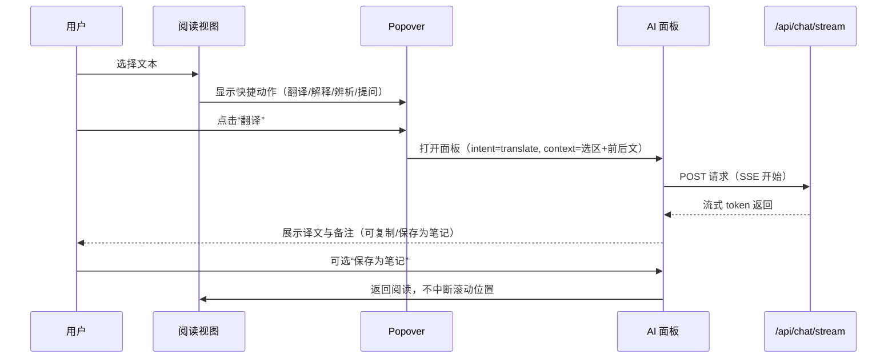

# 交互规格：阅读页上下文 AI 快捷动作（含翻译）

> 版本: v1.0 | 负责人: PO/UX | 目标: 降低阅读障碍，不中断阅读

样式与文案规范详见：`FlowReader/docs/ux/reader_context_actions_style.md`

## 1. 触发方式

- 文本选择触发：用户在阅读区域选择文本后，出现小型浮层（Popover）。
- 快捷键：`T`=翻译，`E`=解释，`D`=辨析，`?`=提问（需有选区时生效）。
- 输入框命令：在左侧 AI 面板输入框支持`/翻译`、`/解释`、`/辨析`、`/问`。

## 2. 流程（选区→面板）

1) 选中文本 → Popover 显示按钮（翻译/解释/辨析/提问）。
2) 点击其中之一 → 打开左侧 AI 面板，自动填入 `intent` 与 `context`。
3) AI 流式返回结果；提供“复制”“保存为笔记”按钮（后者在 Notes 基础完成后启用）。

## 3. Popover 细节

- 位置：靠近选区上/下方，避免遮挡正文。
- 选项：翻译、解释、辨析、提问；移动端可折叠为一个主按钮展开二级菜单。
- 限制：当选区长度>300字符时禁用，提示“选区过长”。

## 4. 左侧 AI 面板

- 标题：根据 intent 自动显示（如“翻译”）。
- 上下文预览：展示选中段落（最多 2 行），可展开查看前后文。
- 输出：
  - 翻译：主译文 + 可选语义备注；
  - 解释：关键点列举；
  - 辨析：义项/语域判断 + 理由；
  - 提问：常规答案。
- 操作：复制、保存为笔记（若已实现 Notes 基础）。

## 5. 视觉与可用性

- 与现有 `apps/web/src/lib/components/ui` 组件保持风格一致。
- 清晰聚焦：打开面板时不遮挡正文，可随时关闭回到阅读。
- 状态反馈：加载态（Skeleton/Spinner），错误态明确可重试。

## 6. 空间与性能

- 最大上下文：前后各≤300字符；
- 请求并发：同时仅处理一个快捷动作请求；
- 升级路径：未来可将 Popover 配置项（目标语言等）折叠在“更多”。

## 7. 无障碍与键盘导航

- 所有按钮可通过 Tab/Enter 触达；
- 为屏幕阅读器提供选区文本与按钮说明的 aria-label。

## 8. 错误与降级

- 超长选区：提示并允许用户缩短选区。
- 网络错误：可重试；提供“复制选区”便于外部翻译备选。

## 9. 线框图（桌面）

阅读页（选区 + Popover）

```
┌──────────────────────────────────────────────────────────────────────────────┐
│ Sidebar (AI 面板折叠状态)        │                 阅读正文                  │
│                                      │  段落文字段落文字段落文字段落文字    │
│                                      │  段落文字段落【选中内容】段落文字…   │
│                                      │                ▲                      │
│                                      │        ┌────────┴────────┐            │
│                                      │        │ 翻译 │ 解释 │ 辨析 │ ? │      │
│                                      │        └──────────────────┘            │
└──────────────────────────────────────────────────────────────────────────────┘
```

AI 面板（展开，承载统一结果）

```
┌────────────────── 左侧 AI 面板 ──────────────────┐
│ 标题: 翻译  （可切换 intent 标签或显示图标）     │
├───────────────────────────────────────────────────┤
│ 上下文预览（可展开）                               │
│  In this poem, the author compares love to a ...  │
│  [ 展开更多前后文 ]                                │
├───────────────────────────────────────────────────┤
│ 流式输出区域                                       │
│  译文：在这首诗中，作者将“爱”比作“花朵”…         │
│  备注：此处更偏隐喻义，理由是…                    │
│  …（SSE token 持续追加）…                          │
├───────────────────────────────────────────────────┤
│ [复制]  [保存为笔记]  [关闭]                        │
└───────────────────────────────────────────────────┘
```

## 10. 线框图（移动）

移动端（选区 → 底部操作条 → 抽屉面板）

```
┌──────────── 屏幕 ────────────┐
│ 正文…【选中内容】…             │
├───────────────────────────────┤
│  翻译  解释  辨析  提问         │ ← 底部操作条（可横向滚动）
├───────────────────────────────┤
│         AI 抽屉面板            │
│  标题 / 上下文预览             │
│  流式输出…                     │
│  [复制] [保存为笔记]            │
└───────────────────────────────┘
```

可达性（A11y）
- 底部操作条按钮有清晰的 aria-label（含 intent 名与选区摘要）。
- 抽屉可用手势/键盘收起；焦点管理返回正文。

## 11. 状态与细节

- 加载态：面板内使用 Skeleton 行（3–5 行），按钮禁用态并显示旋转指示。
- 错误态：面板区块提示“请求失败，可重试”，提供 [重试] 与 [复制选区]。
- 超长选区：Popover 灰置按钮并提示“选区过长（>300 字）”。
- 无上下文模式：正常对话输入框无选区时仍可直接提问。

## 12. 交互流程图（Mermaid）


