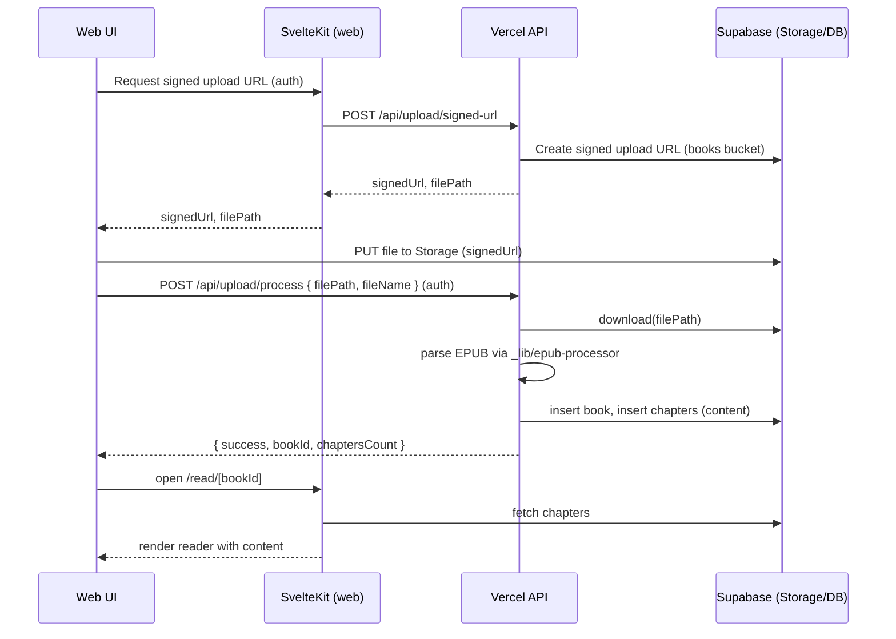

# REVISED EXECUTION PLAN — Plan Only (No Code Changes Yet)

Status: Draft for Review • Purpose: Replace prior plan with an evidence‑aligned, actionable, and minimal plan to restore the Upload → Parse → Chapters → Read closed loop before any implementation begins.

Owner: PO • Intended executor: Cloud (after GO tokens)

Note: This is a plan-only deliverable. Do not implement until GO tokens are issued per Track.

---

## 1) Problem Statement & Current-State Calibration

Goal: Restore the end-to-end reading loop by fixing the broken integration from file upload to EPUB parsing and chapter creation, with minimal, focused changes.

Evidence-based gaps in the current repo:

- Schema/Type inconsistencies
  - Chapters field mismatch: DB migration defines `chapters.content`, but code writes/reads `chapters.text` in several places.
    - Insert: `api/upload/process.ts` uses `text` when inserting chapters.
    - Query: `api/_lib/rag-processor.ts` selects `id, idx, text` (should select `content`).
    - `api/_lib/epub-processor.ts` creates chapter records with `text: chapter.content`; needs to write `content`.
  - Shared types mismatch: `packages/shared/src/types/index.ts` has `Book.user_id`, while code/DB use `owner_id`.

- API/implementation defects
  - `api/chat/stream.ts` uses `supabaseAdminAdmin` (typo). Also passes `actualUserId` to a function without matching parameter in the signature.
  - `api/upload/process.ts` imports `_lib` via `./_lib/...` but the correct path is `../_lib/...`.
  - `api/upload/process.ts` currently generates mock chapters; even if kept temporarily, it must insert `content` and wire the chain properly.

- Frontend upload chain does not invoke parsing
  - `apps/web/src/routes/api/books/upload/+server.ts` only creates a book record (and sets `processed: true`) but never calls the parsing/processing API. Result: `chapters` empty → reader shows no content.

- Missing DB objects referenced by code
  - The code references `rate_limit_entries`, `failed_login_attempts` tables and RPCs/functions `log_security_event`, `track_failed_login`, `reset_failed_login_attempts`, `update_reading_position`. Current migrations only include `001_books` and `002_chapters`; the rest need to be added if required for local operation.

- Prior report overstatements (to correct in any new plan)
  - It stated that `notes`, `ai_conversations`, `embeddings`, etc. were already created. These are not present in current migrations. Do not assume resources exist unless defined in migrations or documented.

---

## 2) Solution Options & Trade-offs

- Option A (Recommended): Reuse existing EPUB pipeline
  - Use `_lib/epub-processor.ts` (SecureEPUBParser) to perform real parsing, create `books` + `chapters.content`, and trigger embeddings.
  - Pros: Minimal new dependencies, consistent with repo’s design and perf/security work; closer to production behavior.
  - Cons: Slightly higher complexity than a mock if the parser has edge cases.

- Option B (Interim): Keep mock chapter generation but fix schema + chain
  - Ensure `content` is used instead of `text`, wire upload → process, so reader works now; switch to real parsing later.
  - Pros: Fastest path to restore UX; useful if time-boxed.
  - Cons: Diverges from real behavior; risks “temporary” becoming persistent.

Recommendation: Execute B quickly to restore the loop if timeline is critical, then move to A in the same Track T4 (or immediately afterward) once T1–T3 stabilize. If time allows, go straight to A.

---

## 3) Tracks (Plan Only) — Tasks, Impacted Files, AC, Risks, ETA

Important: Do not start implementation until GO tokens are issued. This section defines WHAT/AC/Evidence for each Track.

### T1-TYPES-ALIGN — Schema/Type Consistency
- Scope
  - Replace all `chapters.text` usages with `chapters.content`.
    - `api/upload/process.ts` (insert): `text` → `content`.
    - `api/_lib/rag-processor.ts` (select): `id, idx, text` → `id, idx, content`; adjust references.
    - `api/_lib/epub-processor.ts` (createChapterRecords): write `content` instead of `text: chapter.content`.
  - Align shared types: `Book.user_id` → `owner_id`; `Chapter.text` → `content`.
- Acceptance Criteria (AC)
  - `npm run type-check` passes.
  - `npm run test` passes for suites not relying on unavailable external services.
  - Grep shows no lingering `\.text\b` references for chapter content fields.
- Risks & Mitigation
  - Risk: Overlooked references → Mitigate via repo-wide grep and targeted tests.
- ETA
  - 2–4 hours.

### T2-AUTH-NAMING-FIX — auth/client naming and signature
- Scope
  - `api/chat/stream.ts`: fix `supabaseAdminAdmin` → `supabaseAdmin`.
  - Align `handleIntentRequest` signature with actual arguments (either remove `actualUserId` arg at call site or add it to signature and use it safely).
- AC
  - Build/type-check pass; simple SSE path does not crash (mock streaming acceptable).
- Risks
  - SSE edge cases during refactor → keep changes minimal.
- ETA
  - 1–2 hours.

### T3-DB-FUNCTIONS-SEED — Seed required DB objects
- Scope
  - Add migration `apps/web/supabase/migrations/003_security_and_rate_limit.sql` to create/init:
    - Tables: `rate_limit_entries`, `failed_login_attempts`.
    - RPCs/Functions: `log_security_event`, `track_failed_login`, `reset_failed_login_attempts`, `update_reading_position`.
  - Apply minimal RLS/safety constraints appropriate for local dev.
- AC
  - `supabase db reset` completes successfully.
  - Rate limiting and security logging paths can insert records (basic smoke via RPC/insert).
- Risks
  - Function signatures must match code usage; validate carefully.
- ETA
  - 3–5 hours (includes SQL authoring/testing).

### T4-UPLOAD-CHAIN — Wire Upload → Parse → Chapters → Read
- Scope
  - Backend: `api/upload/process.ts`
    - Fix imports to `../_lib/...`.
    - If using interim mock: insert chapters with `content` field (not `text`).
    - Preferred: call `_lib/epub-processor.ts` to parse and create chapters.
    - Enforce: never accept client-provided `userId`; always derive from auth token.
  - Frontend/Server boundary: After upload, invoke `/api/upload/process` with `{ filePath, fileName }` only.
    - `apps/web/src/routes/api/books/upload/+server.ts` must not set `processed: true` prematurely; either call process here or ensure the client calls the Vercel API directly with auth.
- AC
  - Follow `docs/personal-smoke-check.md` to: Upload EPUB → Processing → Chapters exist → Reader page shows chapter content.
- Risks
  - Parser edge cases; add guardrails and fallbacks.
- ETA
  - 4–8 hours (mock path: ~2–3 hours; full parser path: ~6–8 hours depending on validation).

### T5-VERIFY-SMOKE — Verification & Acceptance
- Scope
  - Execute key tests and verification scripts.
- AC
  - Health OK; signed URL auth OK; library lists uploaded book; reader displays chapter(s); chat SSE does not crash (may be simulated).
  - `npm run type-check`, `npm run test`, optional: `scripts/post-deploy-verify.ts` (with local config).
- ETA
  - 1–2 hours.

---

## 4) DB Migration Impact Assessment

- New migration (003) will define tables/functions referenced by code paths:
  - `rate_limit_entries`, `failed_login_attempts` tables for limiting and auth hardening.
  - `log_security_event`, `track_failed_login`, `reset_failed_login_attempts`, `update_reading_position`.
- Compatibility
  - No destructive changes to existing books/chapters.
  - If historical books exist without chapters, plan a backfill task (out-of-scope for this iteration; can add a dedicated TRIGGERed or manual job later).

---

## 5) Security & Stability Considerations

- Authentication
  - Always derive `userId` from auth token server-side; reject client-provided `userId`.
- RLS & Ownership
  - Ensure `books.owner_id` is used consistently for row access; queries filter by authenticated user.
- Rate Limiting & Logging
  - Ensure limiter wrappers fail-close (already implemented) and required tables exist.
- Error Handling & Idempotency
  - `/api/upload/process` should be idempotent for the same `filePath`; proposal: use an idempotency key or check if a book/chapters already exist before reprocessing.

---

## 6) Test & Acceptance Plan (Evidence Plan)

- Commands
  - `npm run type-check`
  - `npm run test`
  - `supabase db reset`
  - `rg -n "\.text\b"` and `rg -n "user_id"` to confirm cleanup
  - curl workflow for Upload → Process → Read (per docs/personal-smoke-check.md)
- Expected
  - Type-checks pass; tests pass; chapters exist after processing; reader displays content; SSE endpoint responds without crashing.

---

## 7) Timeline & Milestones (Plan)

- Day 0.5: T1 (Types Align), T2 (Auth Naming) — ready for review.
- Day 1: T3 (DB Functions Seed) — migration validated.
- Day 1–2: T4 (Upload Chain) — mock first or direct parser; E2E smoke.
- Day 2: T5 (Verify/Accept) — finalize.

Notes: Tracks may partially overlap after T1 completes; do not start implementation without GO.

---

## 8) Out of Scope (This Iteration)

- UX enhancements (progress bars, bookmarks, advanced navigation).
- Performance optimizations beyond correctness (large file batching, streaming parse).
- New file formats beyond EPUB.

---

## 9) Diff vs Prior Report

- Corrected assumptions about existing DB objects (only books/chapters migrations present).
- Removed recommendation to add new EPUB parser dependency; prioritize existing `_lib/epub-processor.ts`.
- Elevated schema/type consistency as a first-class Track to prevent cascading defects.
- Clarified that frontend upload chain must explicitly trigger `/api/upload/process`.
- Added explicit AC, Evidence, risks, and idempotency/security notes.

---

## 10) Upload→Process Sequence (Target State)

---

## 11) Review & Gate

- This is a proposal document. Please review.
- If approved, issue GO tokens in order: GO:T1-TYPES-ALIGN → GO:T2-AUTH-NAMING-FIX → GO:T3-DB-FUNCTIONS-SEED → GO:T4-UPLOAD-CHAIN → GO:T5-VERIFY-SMOKE.
- No implementation should begin without the corresponding GO.

