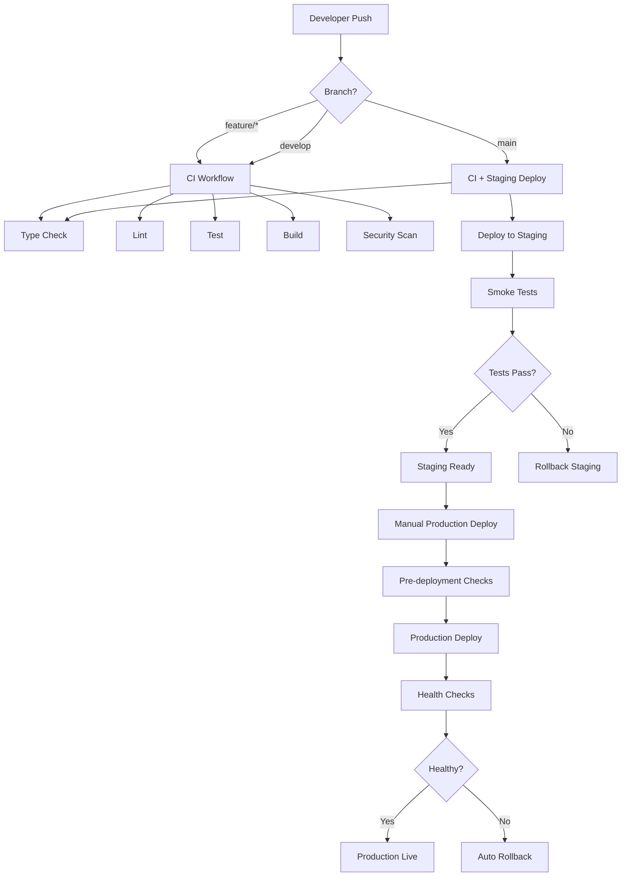
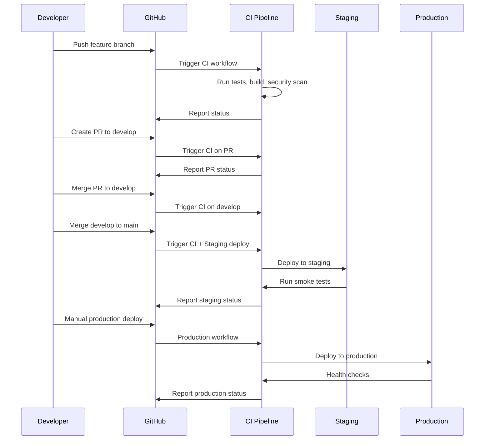

# FlowReader CI/CD Pipeline Guide

## Overview

This guide provides comprehensive documentation for FlowReader's CI/CD pipeline, covering automated workflows, deployment strategies, and best practices for maintaining a reliable delivery process.

**Pipeline Architecture:**
- **GitHub Actions**: Primary CI/CD platform
- **Vercel**: Deployment platform for staging and production
- **Supabase**: Database and backend services
- **Automated Testing**: Multi-stage verification and smoke tests

## Table of Contents

1. [Pipeline Overview](#pipeline-overview)
2. [GitHub Actions Workflows](#github-actions-workflows)
3. [Branch Strategy](#branch-strategy)
4. [Environment Management](#environment-management)
5. [Deployment Process](#deployment-process)
6. [Security and Secrets](#security-and-secrets)
7. [Monitoring and Alerts](#monitoring-and-alerts)
8. [Troubleshooting](#troubleshooting)
9. [Best Practices](#best-practices)

## Pipeline Overview

### Workflow Diagram



### Pipeline Stages

| Stage | Trigger | Duration | Purpose |
|-------|---------|----------|---------|
| **CI** | Push/PR to any branch | 5-8 minutes | Code quality, security, build verification |
| **Staging Deploy** | Push to main | 3-5 minutes | Automated deployment to preview environment |
| **Staging Tests** | After staging deploy | 2-3 minutes | Smoke tests and basic functionality verification |
| **Production Deploy** | Manual trigger | 5-10 minutes | Production deployment with health checks |
| **Post-deploy Verification** | After production deploy | 2-3 minutes | Comprehensive health and performance checks |

## GitHub Actions Workflows

### 1. Continuous Integration (ci.yml)

**Purpose**: Validate code quality, run tests, and verify builds on every push and pull request.

**Triggers:**
- Push to `main` or `develop` branches
- Pull requests to `main` or `develop` branches

**Jobs:**

#### build-and-test
- **Setup**: Node.js 18, npm cache
- **Dependencies**: Install with `npm ci`
- **Validation**: TypeScript type checking, ESLint, tests
- **Build**: Production build verification
- **Artifacts**: Build outputs validation

#### security-scan
- **Audit**: npm audit for vulnerabilities
- **Dependencies**: Security vulnerability scan
- **Thresholds**: Fail on high severity issues

#### api-validation
- **Structure**: Verify required API endpoints exist
- **Configuration**: Validate environment setup
- **Documentation**: Check .env.example completeness

**Success Criteria:**
- All tests pass
- No high severity vulnerabilities
- Clean TypeScript compilation
- Successful production build

### 2. Staging Deployment (deploy-staging.yml)

**Purpose**: Automatically deploy to staging environment and run integration tests.

**Triggers:**
- Push to `main` branch
- Manual workflow dispatch

**Jobs:**

#### ci-check
- Reuses CI workflow for validation
- Ensures code quality before deployment

#### deploy-staging
- **Environment**: Vercel preview environment
- **Build**: Production-like build with staging config
- **Deploy**: Deploy to unique preview URL
- **Output**: Staging URL for testing

#### smoke-tests
- **Health Check**: API endpoint availability
- **Security**: Verify authentication protection
- **Performance**: Basic response time validation
- **Frontend**: Page load verification

**Success Criteria:**
- CI checks pass
- Deployment successful
- All smoke tests pass
- Staging environment accessible

### 3. Production Deployment (deploy-production.yml)

**Purpose**: Safely deploy to production with comprehensive checks and rollback capabilities.

**Triggers:**
- Manual workflow dispatch only
- Requires "DEPLOY" confirmation

**Jobs:**

#### pre-deployment-checks
- **Confirmation**: Validate deployment confirmation
- **Branch**: Ensure deployment from main branch
- **Recency**: Check for recent commits

#### staging-verification
- **Health**: Verify staging environment is healthy
- **Tests**: Run staging verification tests
- **Approval**: Can be skipped with flag (not recommended)

#### production-deployment
- **Backup**: Create rollback reference
- **Deploy**: Deploy to production Vercel environment
- **Verification**: Wait for deployment propagation

#### post-deployment-verification
- **Health Checks**: Comprehensive API testing
- **Performance**: Response time validation
- **Database**: Connectivity verification
- **Security**: Headers and endpoint protection

#### rollback-on-failure
- **Trigger**: Automatic on verification failure
- **Action**: Promote previous stable deployment
- **Verification**: Confirm rollback success

**Success Criteria:**
- All pre-checks pass
- Production deployment successful
- Health checks pass
- No rollback triggered

## Branch Strategy

### Branch Types

```
main
├── develop
│   ├── feature/user-authentication
│   ├── feature/ai-chat-enhancement
│   └── feature/reading-progress-sync
├── hotfix/security-patch
└── release/v1.2.0
```

#### main
- **Purpose**: Production-ready code
- **Protection**: Requires PR reviews, status checks
- **Deployment**: Auto-deploys to staging
- **Access**: Direct pushes restricted

#### develop
- **Purpose**: Integration branch for features
- **Merging**: Features merge here first
- **Testing**: Full CI pipeline runs
- **Stability**: Should always be deployable

#### feature/*
- **Purpose**: Individual feature development
- **Naming**: `feature/description-of-feature`
- **Lifecycle**: Branch from develop, merge back to develop
- **CI**: Full CI runs on pushes and PRs

#### hotfix/*
- **Purpose**: Emergency production fixes
- **Branching**: From main branch
- **Merging**: To both main and develop
- **Priority**: Fast-track deployment process

### Merge Strategy

1. **Feature Development**
   ```bash
   git checkout develop
   git pull origin develop
   git checkout -b feature/new-feature
   # Development work
   git push origin feature/new-feature
   # Create PR to develop
   ```

2. **Release Process**
   ```bash
   git checkout main
   git pull origin main
   git merge develop
   git push origin main
   # Triggers staging deployment
   # Manual production deployment after verification
   ```

3. **Hotfix Process**
   ```bash
   git checkout main
   git pull origin main
   git checkout -b hotfix/critical-fix
   # Fix implementation
   git push origin hotfix/critical-fix
   # Create PR to main (expedited review)
   # Emergency production deployment
   ```

## Environment Management

### Environment Configuration

| Environment | Branch | Database | Features | Monitoring |
|-------------|--------|----------|----------|------------|
| **Development** | Any | Local/Staging | All enabled | Minimal |
| **Staging** | main | Staging Supabase | All enabled | Full |
| **Production** | main (manual) | Production Supabase | Selected | Full |

### Secret Management

#### GitHub Secrets

Required secrets for CI/CD:

```yaml
# Vercel Integration
VERCEL_TOKEN: "vercel_token_xxx"
VERCEL_ORG_ID: "team_xxx"
VERCEL_PROJECT_ID: "prj_xxx"

# Database
SUPABASE_ACCESS_TOKEN: "sbp_xxx"

# External Services
OPENAI_API_KEY: "sk-proj-xxx"

# Notifications (optional)
SLACK_WEBHOOK_URL: "https://hooks.slack.com/xxx"
DISCORD_WEBHOOK_URL: "https://discord.com/api/webhooks/xxx"
```

#### Environment Variables per Environment

**Staging Environment Variables:**
```bash
# Core
NODE_ENV=staging
APP_URL=https://flowreader-git-main-*.vercel.app

# Database
PUBLIC_SUPABASE_URL=https://xxx-staging.supabase.co
PUBLIC_SUPABASE_ANON_KEY=eyJhbGciOiJIUzI1NiIsInR5cCI6IkpXVCJ9...
SUPABASE_SERVICE_ROLE_KEY=eyJhbGciOiJIUzI1NiIsInR5cCI6IkpXVCJ9...

# Features (testing enabled)
FEATURE_TTS_ENABLED=true
FEATURE_AI_ENHANCED=true
FEATURE_SMART_NOTES=true

# Rate Limiting (relaxed for testing)
RATE_LIMIT_MAX=200
RATE_LIMIT_WINDOW=900000
```

**Production Environment Variables:**
```bash
# Core
NODE_ENV=production
APP_URL=https://flowreader.vercel.app

# Database
PUBLIC_SUPABASE_URL=https://xxx.supabase.co
PUBLIC_SUPABASE_ANON_KEY=eyJhbGciOiJIUzI1NiIsInR5cCI6IkpXVCJ9...
SUPABASE_SERVICE_ROLE_KEY=eyJhbGciOiJIUzI1NiIsInR5cCI6IkpXVCJ9...

# Features (production optimized)
FEATURE_TTS_ENABLED=false  # Cost optimization
FEATURE_AI_ENHANCED=true
FEATURE_SMART_NOTES=true

# Rate Limiting (production limits)
RATE_LIMIT_MAX=100
RATE_LIMIT_WINDOW=900000

# Monitoring
SENTRY_DSN=https://xxx@xxx.ingest.sentry.io/xxx
```

## Deployment Process

### 1. Feature Deployment Flow



### 2. Automated Staging Deployment

When code is pushed to `main`:

1. **CI Validation** (5 minutes)
   - Type checking, linting, testing
   - Security vulnerability scan
   - Build verification

2. **Staging Deployment** (3 minutes)
   - Pull Vercel environment config
   - Build with staging environment
   - Deploy to preview URL

3. **Smoke Testing** (2 minutes)
   - Health endpoint validation
   - Authentication security check
   - Frontend accessibility test
   - Basic performance check

4. **Notification** (30 seconds)
   - GitHub status update
   - PR comment (if applicable)
   - Team notification (Slack/Discord)

### 3. Manual Production Deployment

Production deployments require manual trigger with confirmation:

1. **Pre-deployment Validation**
   ```bash
   # Verify production readiness
   ./scripts/verify-production-readiness.sh

   # Check staging environment
   ./scripts/verify-deployment.sh staging
   ```

2. **GitHub Actions Deployment**
   ```bash
   # Trigger via GitHub CLI
   gh workflow run deploy-production.yml \
     -f confirmation=DEPLOY \
     -f environment=production
   ```

3. **Production Verification**
   - Automated health checks
   - Performance baseline validation
   - Security header verification
   - Database connectivity test

4. **Post-deployment Actions**
   - Monitor error rates
   - Check performance metrics
   - Verify user functionality
   - Create release notes

## Security and Secrets

### Secret Rotation Strategy

1. **Quarterly Rotation** (scheduled)
   - JWT secrets
   - API keys for external services
   - Database passwords

2. **Emergency Rotation** (immediate)
   - Suspected compromise
   - Security incident
   - Team member departure

3. **Rotation Process**
   ```bash
   # Generate new secret
   NEW_JWT_SECRET=$(openssl rand -base64 32)

   # Update in Vercel
   vercel env add JWT_SECRET "$NEW_JWT_SECRET" production
   vercel env add JWT_SECRET "$NEW_JWT_SECRET" preview

   # Update in GitHub Secrets
   gh secret set JWT_SECRET --body "$NEW_JWT_SECRET"

   # Redeploy applications
   vercel redeploy --prod
   ```

### Security Scanning

#### 1. Dependency Scanning
- **npm audit**: Run on every CI build
- **Threshold**: Fail on high severity vulnerabilities
- **Frequency**: Every push and PR

#### 2. Code Scanning
- **ESLint security rules**: Static analysis
- **CodeQL**: Advanced semantic analysis (if enabled)
- **Custom rules**: FlowReader-specific security patterns

#### 3. Infrastructure Scanning
- **Vercel security headers**: Automated verification
- **SSL/TLS configuration**: Certificate validation
- **Environment leakage**: Prevent secrets in logs

## Monitoring and Alerts

### Performance Monitoring

1. **Response Time Tracking**
   - Health endpoint: < 1s
   - API endpoints: < 3s
   - Page loads: < 5s

2. **Error Rate Monitoring**
   - Production: < 1% error rate
   - Staging: < 5% error rate
   - Alerts on threshold breach

3. **Availability Monitoring**
   - Uptime target: 99.9%
   - Health check frequency: 30 seconds
   - Multi-region monitoring

### Deployment Alerts

```yaml
# GitHub Actions notifications
on:
  workflow_run:
    workflows: ["Deploy to Production"]
    types: [completed]

jobs:
  notify:
    if: ${{ github.event.workflow_run.conclusion == 'failure' }}
    steps:
      - name: Notify team
        uses: slack-notify-action
        with:
          webhook: ${{ secrets.SLACK_WEBHOOK_URL }}
          message: "🚨 Production deployment failed!"
```

### Alert Channels

1. **Critical Alerts** (immediate)
   - Production deployment failures
   - Security incidents
   - Service outages

2. **Warning Alerts** (within 1 hour)
   - Performance degradation
   - High error rates
   - Staging deployment issues

3. **Info Notifications** (daily digest)
   - Successful deployments
   - Performance reports
   - Security scan results

## Troubleshooting

### Common CI/CD Issues

#### 1. Build Failures

**Symptoms:**
- TypeScript compilation errors
- ESLint failures
- Test failures

**Solutions:**
```bash
# Local debugging
npm run type-check
npm run lint
npm test

# Fix common issues
npm install  # Update dependencies
npm audit fix  # Fix security issues
rm -rf node_modules package-lock.json && npm install  # Clean install
```

#### 2. Deployment Failures

**Symptoms:**
- Vercel deployment timeout
- Environment variable issues
- Build process errors

**Solutions:**
```bash
# Check Vercel logs
vercel logs --prod

# Verify environment variables
vercel env ls

# Test build locally
NODE_ENV=production npm run build

# Check Vercel status
curl -I https://vercel.com/api/v1/status
```

#### 3. Health Check Failures

**Symptoms:**
- API endpoints returning errors
- Database connectivity issues
- Performance regression

**Solutions:**
```bash
# Manual health check
curl -f https://flowreader.vercel.app/api/health

# Check database status
# Via Supabase Dashboard

# Performance investigation
./scripts/verify-deployment.sh production

# Rollback if necessary
vercel rollback
```

### Debug Workflows

#### 1. Enable Debug Logging

```yaml
# In GitHub Actions workflow
- name: Debug step
  run: |
    echo "Debug information:"
    env | sort
    ls -la
  env:
    ACTIONS_STEP_DEBUG: true
```

#### 2. Manual Workflow Testing

```bash
# Test workflow locally with act
act -j deploy-staging

# Test specific jobs
act -j build-and-test

# Use specific environment
act -s GITHUB_TOKEN=$GITHUB_TOKEN
```

### Emergency Procedures

#### 1. Pipeline Failure Response

1. **Immediate Assessment** (2 minutes)
   - Identify failure stage
   - Check impact scope
   - Determine if rollback needed

2. **Investigation** (10 minutes)
   - Review logs and errors
   - Check external service status
   - Identify root cause

3. **Resolution** (30 minutes)
   - Apply immediate fix
   - Test fix in staging
   - Deploy to production

4. **Post-incident** (24 hours)
   - Document incident
   - Improve pipeline
   - Update procedures

## Best Practices

### Development Workflow

1. **Small, Frequent Commits**
   - Atomic changes
   - Clear commit messages
   - Regular pushes to remote

2. **Feature Branch Strategy**
   - Short-lived branches
   - Single feature per branch
   - Regular rebasing

3. **Code Review Process**
   - All changes via pull requests
   - Required reviewer approval
   - Automated checks pass

### CI/CD Optimization

1. **Build Performance**
   - Parallel job execution
   - Dependency caching
   - Incremental builds

2. **Test Strategy**
   - Fast unit tests in CI
   - Integration tests in staging
   - E2E tests in production verification

3. **Deployment Safety**
   - Blue-green deployments
   - Canary releases for major changes
   - Automated rollback triggers

### Security Best Practices

1. **Secret Management**
   - No secrets in code
   - Regular rotation
   - Least privilege access

2. **Environment Isolation**
   - Separate credentials per environment
   - Network isolation
   - Access controls

3. **Monitoring and Alerting**
   - Real-time security monitoring
   - Anomaly detection
   - Incident response procedures

---

## Appendix

### Useful Commands

```bash
# CI/CD Management
gh workflow list
gh workflow run deploy-staging.yml
gh run list --workflow=ci.yml

# Vercel Management
vercel ls
vercel logs
vercel env ls

# Deployment Verification
./scripts/verify-production-readiness.sh
./scripts/verify-deployment.sh staging
./scripts/verify-deployment.sh production

# Emergency Procedures
vercel rollback
vercel promote https://deployment-url.vercel.app --scope=production
```

### References

- [GitHub Actions Documentation](https://docs.github.com/en/actions)
- [Vercel CLI Documentation](https://vercel.com/docs/cli)
- [Supabase CLI Documentation](https://supabase.com/docs/reference/cli)
- [FlowReader Deployment Runbook](./deploy_runbook.md)

---

**Document Version**: 1.0
**Last Updated**: 2025-09-18
**Next Review**: 2025-10-18
**Maintained by**: DevOps Team