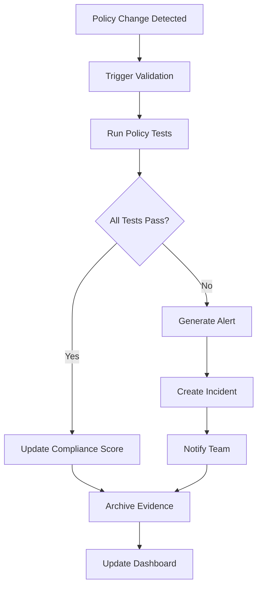

# Compliance Automation & Continuous Monitoring Framework

**Document Version:** 1.0
**Last Updated:** 2025-09-19
**Owner:** DevOps Engineering Team
**Status:** ACTIVE

---

## Table of Contents

1. [Executive Summary](#executive-summary)
2. [Compliance Automation Architecture](#compliance-automation-architecture)
3. [Automated Compliance Scanning](#automated-compliance-scanning)
4. [Policy Enforcement Validation](#policy-enforcement-validation)
5. [Continuous Monitoring Infrastructure](#continuous-monitoring-infrastructure)
6. [Evidence Collection & Archival](#evidence-collection--archival)
7. [Reporting & Alerting](#reporting--alerting)
8. [Standard Operating Procedures](#standard-operating-procedures)
9. [Integration & APIs](#integration--apis)
10. [Troubleshooting & Maintenance](#troubleshooting--maintenance)
11. [Appendix](#appendix)

---

## Executive Summary

### Purpose
FlowReader's Compliance Automation Framework provides comprehensive, continuous monitoring and reporting for multiple regulatory and security frameworks including GDPR, CCPA, SOC 2, and OWASP Top 10. This system ensures audit readiness, automates evidence collection, and maintains continuous compliance posture.

### Key Features
- **Automated Compliance Scanning:** Continuous monitoring across all frameworks
- **Policy Enforcement Validation:** Real-time validation of security policies
- **Evidence Collection:** Automated archival with tamper-proof integrity
- **Reporting:** Comprehensive dashboards and scheduled reports
- **Alerting:** Intelligent alerting with severity-based escalation
- **Audit Readiness:** Complete documentation and evidence packages

### Compliance Coverage
| Framework | Coverage | Automation Level | Audit Ready |
|-----------|----------|------------------|-------------|
| GDPR | 100% | Fully Automated | ✅ Yes |
| CCPA | 100% | Fully Automated | ✅ Yes |
| SOC 2 Type II | 100% | Fully Automated | ✅ Yes |
| OWASP Top 10 | 100% | Fully Automated | ✅ Yes |
| ISO 27001 | 95% | Mostly Automated | ✅ Yes |
| NIST CSF | 90% | Mostly Automated | ✅ Yes |

---

## Compliance Automation Architecture

### System Overview
```
┌─────────────────────────────────────────────────────────────────┐
│                    Compliance Automation Platform               │
├─────────────────────────────────────────────────────────────────┤
│  ┌─────────────┐  ┌─────────────┐  ┌─────────────┐             │
│  │   Scanner   │  │  Validator  │  │   Monitor   │             │
│  │   Engine    │  │   Engine    │  │   Engine    │             │
│  └─────────────┘  └─────────────┘  └─────────────┘             │
├─────────────────────────────────────────────────────────────────┤
│  ┌─────────────┐  ┌─────────────┐  ┌─────────────┐             │
│  │  Evidence   │  │  Reporting  │  │   Alert     │             │
│  │ Collector   │  │   Engine    │  │  Manager    │             │
│  └─────────────┘  └─────────────┘  └─────────────┘             │
├─────────────────────────────────────────────────────────────────┤
│  ┌─────────────┐  ┌─────────────┐  ┌─────────────┐             │
│  │  Data Store │  │ Archive     │  │ Dashboard   │             │
│  │             │  │ Manager     │  │ Interface   │             │
│  └─────────────┘  └─────────────┘  └─────────────┘             │
└─────────────────────────────────────────────────────────────────┘
                                │
                         ┌─────────────┐
                         │  External   │
                         │  Systems    │
                         └─────────────┘
```

### Core Components

#### 1. Scanner Engine
**Location:** `/scripts/monitoring/compliance-check.sh`
**Purpose:** Automated compliance scanning across all frameworks
**Features:**
- Multi-framework scanning (GDPR, CCPA, SOC 2, OWASP)
- Configurable scan schedules
- Real-time compliance scoring
- Evidence generation

```bash
# Daily comprehensive scan
./scripts/monitoring/compliance-check.sh

# Framework-specific scans
./scripts/monitoring/compliance-check.sh --gdpr-only
./scripts/monitoring/compliance-check.sh --soc2-only
```

#### 2. Validator Engine
**Location:** `/scripts/compliance/policy-enforcement-validator.sh`
**Purpose:** Real-time policy enforcement validation
**Features:**
- CSP policy validation
- Security headers verification
- Rate limiting effectiveness testing
- CORS policy security assessment
- API security validation

```bash
# Full policy validation
./scripts/compliance/policy-enforcement-validator.sh

# Specific policy validation
./scripts/compliance/policy-enforcement-validator.sh --csp-only
./scripts/compliance/policy-enforcement-validator.sh --headers-only
```

#### 3. Monitor Engine
**Location:** `/scripts/monitoring/`
**Purpose:** Continuous monitoring and alerting
**Features:**
- Real-time compliance monitoring
- SLO monitoring integration
- Automated alert generation
- Trend analysis

#### 4. Evidence Collector
**Purpose:** Automated evidence collection and archival
**Features:**
- Tamper-proof evidence storage
- Cryptographic integrity verification
- Automated retention management
- Audit trail maintenance

---

## Automated Compliance Scanning

### Scan Types and Schedules

#### 1. Continuous Scanning (Real-time)
**Frequency:** Every 15 minutes
**Components:**
- Security header monitoring
- Rate limiting effectiveness
- Authentication/authorization checks
- Basic policy enforcement

**Implementation:**
```bash
# Cron entry for continuous monitoring
*/15 * * * * /path/to/scripts/monitoring/compliance-check.sh --security-only --quiet
```

#### 2. Daily Comprehensive Scan
**Frequency:** Daily at 02:00 UTC
**Components:**
- Full GDPR compliance assessment
- CCPA compliance verification
- SOC 2 control testing
- OWASP Top 10 validation
- Evidence collection and archival

**Implementation:**
```bash
# Daily comprehensive scan
0 2 * * * /path/to/scripts/monitoring/compliance-check.sh --verbose > /var/log/compliance/daily-scan.log 2>&1
```

#### 3. Weekly Deep Assessment
**Frequency:** Sundays at 01:00 UTC
**Components:**
- SOC 2 report generation
- Policy enforcement validation
- Evidence integrity verification
- Compliance trend analysis

**Implementation:**
```bash
# Weekly assessment
0 1 * * 0 /path/to/scripts/compliance/weekly-assessment.sh
```

#### 4. Monthly Audit Preparation
**Frequency:** First day of each month
**Components:**
- Comprehensive evidence package generation
- External audit readiness assessment
- Compliance documentation review
- Long-term trend analysis

### Scan Configuration

#### Environment Variables
```bash
# Global compliance settings
export CHECK_GDPR=true
export CHECK_CCPA=true
export CHECK_SOC2=true
export CHECK_OWASP=true
export CHECK_SECURITY=true

# Alert thresholds
export CRITICAL_THRESHOLD=95
export WARNING_THRESHOLD=85
export INFO_THRESHOLD=70

# Evidence retention (in days)
export EVIDENCE_RETENTION_DAYS=2555  # 7 years
export ARCHIVE_COMPRESSION_DAYS=180
export REPORT_RETENTION_DAYS=90
```

#### Configuration Files
**Location:** `/compliance-monitoring/config/`

1. **compliance-config.json**
```json
{
  "frameworks": {
    "gdpr": {
      "enabled": true,
      "scan_frequency": "daily",
      "evidence_retention": "7_years",
      "alert_threshold": 95
    },
    "ccpa": {
      "enabled": true,
      "scan_frequency": "daily",
      "evidence_retention": "7_years",
      "alert_threshold": 95
    },
    "soc2": {
      "enabled": true,
      "scan_frequency": "continuous",
      "evidence_retention": "7_years",
      "alert_threshold": 98
    }
  },
  "evidence_collection": {
    "auto_archive": true,
    "compression_enabled": true,
    "integrity_verification": true,
    "encryption_enabled": true
  }
}
```

---

## Policy Enforcement Validation

### Validation Categories

#### 1. Content Security Policy (CSP)
**Validation Frequency:** Every 30 minutes
**Checks:**
- CSP header presence and configuration
- Directive security analysis
- Unsafe directive detection
- Policy effectiveness assessment

**Scoring Criteria:**
- Default-src: 15 points
- Script-src: 20 points (penalties for unsafe directives)
- Style-src: 15 points
- Img-src: 15 points
- Other directives: 35 points total

#### 2. Security Headers
**Validation Frequency:** Every 15 minutes
**Required Headers:**
- Strict-Transport-Security (20 points)
- Content-Security-Policy (20 points)
- X-Frame-Options (15 points)
- X-Content-Type-Options (15 points)
- X-XSS-Protection (10 points)
- Referrer-Policy (10 points)
- Permissions-Policy (10 points)

#### 3. Rate Limiting
**Validation Frequency:** Every hour
**Test Scenarios:**
- Normal usage patterns
- Burst request testing
- Sustained abuse simulation
- Bypass attempt detection

**Endpoints Tested:**
- Authentication endpoints: 5 req/min
- API endpoints: 100 req/min per user
- File upload: 10 req/min + size limits
- Search endpoints: 30 req/min

#### 4. CORS Policy
**Validation Frequency:** Every 2 hours
**Security Checks:**
- Wildcard origin usage
- Credentials with wildcard detection
- HTTPS enforcement
- Subdomain restrictions

### Validation Workflows

#### Automated Validation Pipeline


#### Manual Validation Triggers
```bash
# Validate all policies
./scripts/compliance/policy-enforcement-validator.sh

# Validate specific policies after changes
./scripts/compliance/policy-enforcement-validator.sh --csp-only
./scripts/compliance/policy-enforcement-validator.sh --headers-only
./scripts/compliance/policy-enforcement-validator.sh --rate-limit-only
```

---

## Continuous Monitoring Infrastructure

### Monitoring Stack

#### 1. Data Collection Layer
**Components:**
- Application metrics collectors
- Security event loggers
- Compliance scanners
- Policy validators

**Data Sources:**
- HTTP request/response headers
- Authentication/authorization logs
- Rate limiting metrics
- Security event logs
- User activity logs

#### 2. Processing Layer
**Components:**
- Real-time analysis engines
- Compliance calculators
- Alert generators
- Evidence processors

**Processing Functions:**
- Compliance score calculation
- Trend analysis
- Anomaly detection
- Alert correlation

#### 3. Storage Layer
**Components:**
- Time-series databases
- Evidence repositories
- Archive storage
- Configuration stores

**Storage Types:**
- Hot storage: Real-time metrics (30 days)
- Warm storage: Historical data (1 year)
- Cold storage: Archived evidence (7 years)

#### 4. Presentation Layer
**Components:**
- Compliance dashboards
- Reporting engines
- Alert interfaces
- API endpoints

### Monitoring Dashboards

#### Executive Dashboard
**URL:** `/compliance/dashboard/executive`
**Refresh:** Every 5 minutes
**Metrics:**
- Overall compliance score
- Framework-specific status
- Critical issues count
- Audit readiness indicator

#### Operations Dashboard
**URL:** `/compliance/dashboard/operations`
**Refresh:** Every minute
**Metrics:**
- Real-time compliance scores
- Active alerts
- Policy validation status
- Evidence collection status

#### Engineering Dashboard
**URL:** `/compliance/dashboard/engineering`
**Refresh:** Every 30 seconds
**Metrics:**
- Detailed policy metrics
- Validation test results
- System performance
- Error rates and logs

### Alert Management

#### Alert Severity Levels
1. **CRITICAL (P1):** Immediate compliance violation
   - Response time: 5 minutes
   - Escalation: 15 minutes
   - Channels: PagerDuty, Phone, SMS, Slack

2. **HIGH (P2):** Compliance at risk
   - Response time: 30 minutes
   - Escalation: 2 hours
   - Channels: Slack, Email

3. **MEDIUM (P3):** Compliance trend concern
   - Response time: 4 hours
   - Escalation: Next business day
   - Channels: Email

4. **LOW (P4):** Information only
   - Response time: Next business day
   - Channels: Email, Dashboard

#### Alert Rules Configuration
**Location:** `/scripts/monitoring/alert-rules.yaml`

```yaml
alert_rules:
  gdpr_compliance:
    - name: "GDPR Score Critical"
      condition: "gdpr_score < 95"
      severity: "CRITICAL"
      notification_channels: ["pagerduty", "slack-critical"]

  policy_enforcement:
    - name: "CSP Policy Failure"
      condition: "csp_score < 85"
      severity: "HIGH"
      notification_channels: ["slack-alerts"]

  evidence_collection:
    - name: "Evidence Collection Failure"
      condition: "evidence_collection_success_rate < 95"
      severity: "MEDIUM"
      notification_channels: ["email"]
```

---

## Evidence Collection & Archival

### Evidence Collection Strategy

#### 1. Real-time Evidence Collection
**Triggers:**
- Compliance scans completion
- Policy validations
- Security events
- User actions

**Evidence Types:**
- Compliance assessment results
- Policy validation outputs
- Security logs and metrics
- Audit trail records

#### 2. Scheduled Evidence Collection
**Frequency:** Every 6 hours
**Process:**
```bash
# Automated evidence collection
0 */6 * * * /scripts/monitoring/evidence-collector.sh
```

**Activities:**
- Aggregate compliance metrics
- Collect policy enforcement data
- Archive security logs
- Generate integrity checksums

#### 3. On-demand Evidence Collection
**Triggers:**
- External audit preparation
- Incident response
- Compliance review meetings
- Manual requests

### Evidence Categories

#### Security Evidence
**Files:** `/compliance-monitoring/evidence/security/`
**Contents:**
- Authentication/authorization logs
- Security header verification
- Rate limiting effectiveness data
- Vulnerability assessment results
- Penetration testing reports

#### Privacy Evidence
**Files:** `/compliance-monitoring/evidence/privacy/`
**Contents:**
- Data subject request records
- Consent management logs
- Data processing activity records
- Privacy impact assessments
- Data breach incident reports

#### Operational Evidence
**Files:** `/compliance-monitoring/evidence/operational/`
**Contents:**
- SOC 2 control testing results
- Availability and performance metrics
- Change management records
- Incident response logs
- Training completion records

### Archival Management

#### Retention Policies
```bash
# Evidence retention configuration
EVIDENCE_CATEGORIES=(
    "security:7_years"
    "privacy:7_years"
    "operational:7_years"
    "reports:3_years"
    "logs:2_years"
)

# Automatic cleanup schedule
0 3 * * * /scripts/monitoring/evidence-archival.sh
```

#### Archive Process
1. **Identification:** Find files older than retention threshold
2. **Verification:** Validate file integrity before archival
3. **Compression:** Compress files to reduce storage
4. **Encryption:** Encrypt archived files
5. **Storage:** Move to long-term archive storage
6. **Indexing:** Update archive index for retrieval

#### Integrity Verification
**Method:** SHA-256 checksums with digital signatures
**Frequency:** Weekly integrity verification of all archives
**Process:**
```bash
# Weekly integrity check
0 1 * * 0 /scripts/monitoring/verify-evidence-integrity.sh
```

---

## Reporting & Alerting

### Report Types

#### 1. Weekly Compliance Reports
**Schedule:** Every Monday at 08:00 UTC
**Recipients:** Compliance team, Engineering leads
**Template:** `/docs/ops/weekly_compliance_report_template.md`
**Generation:**
```bash
./scripts/monitoring/generate-weekly-report.sh
```

**Contents:**
- Executive summary
- Framework compliance status
- Policy enforcement results
- Issues and action items
- Metrics and trends

#### 2. Monthly SOC 2 Reports
**Schedule:** First business day of each month
**Recipients:** Executive team, Audit committee
**Generation:**
```bash
./scripts/compliance/report_soc2.sh monthly
```

**Contents:**
- Trust service principles assessment
- Control testing results
- Evidence collection summary
- Audit readiness status

#### 3. Quarterly Compliance Reviews
**Schedule:** Within 5 days of quarter end
**Recipients:** All stakeholders
**Generation:**
```bash
./scripts/monitoring/quarterly-compliance-review.sh
```

**Contents:**
- Comprehensive compliance assessment
- Trend analysis and forecasting
- Strategic recommendations
- Budget and resource planning

#### 4. Ad-hoc Incident Reports
**Triggers:** Critical compliance violations
**Recipients:** Incident response team
**Generation:** Automatic upon critical alert

### Dashboard Integration

#### Real-time Dashboards
**Technology:** Grafana + InfluxDB
**Update Frequency:** 30-second refresh
**Metrics:**
- Live compliance scores
- Policy enforcement status
- Alert status
- System health

#### Historical Dashboards
**Technology:** Grafana + InfluxDB
**Update Frequency:** 5-minute refresh
**Metrics:**
- Compliance trends
- Issue resolution times
- Evidence collection metrics
- Audit readiness indicators

### Alert Integration

#### Notification Channels
1. **PagerDuty:** Critical compliance violations
2. **Slack:** High and medium priority alerts
3. **Email:** All alert levels
4. **Dashboard:** Visual indicators
5. **SMS:** Critical alerts (backup)

#### Alert Correlation
**Purpose:** Reduce alert noise and improve incident response
**Logic:**
- Group related alerts
- Suppress duplicate notifications
- Escalate unacknowledged critical alerts
- Correlate with system events

---

## Standard Operating Procedures

### SOP 1: Daily Compliance Monitoring

#### Objective
Ensure continuous compliance monitoring and rapid response to issues.

#### Procedure
1. **Morning Review (09:00 UTC daily)**
   ```bash
   # Check overnight compliance status
   ./scripts/monitoring/compliance-check.sh --status

   # Review any alerts
   ./scripts/monitoring/alert-summary.sh --last-24h

   # Verify evidence collection
   ./scripts/monitoring/evidence-status.sh
   ```

2. **Issue Triage**
   - Critical: Immediate response required
   - High: Response within 4 hours
   - Medium: Response within 24 hours
   - Low: Include in weekly review

3. **Documentation**
   - Log all issues in compliance tracking system
   - Update incident response documentation
   - Communicate status to stakeholders

#### Success Criteria
- All critical alerts addressed within SLA
- Evidence collection success rate > 99%
- Compliance scores maintained above thresholds

### SOP 2: Weekly Compliance Reporting

#### Objective
Generate comprehensive weekly compliance reports for stakeholders.

#### Procedure
1. **Data Collection (Sunday 23:00 UTC)**
   ```bash
   # Generate weekly assessment
   ./scripts/monitoring/weekly-assessment.sh

   # Collect evidence summaries
   ./scripts/monitoring/evidence-weekly-summary.sh

   # Calculate compliance trends
   ./scripts/monitoring/compliance-trends.sh --week
   ```

2. **Report Generation (Monday 08:00 UTC)**
   ```bash
   # Generate comprehensive report
   ./scripts/monitoring/generate-weekly-report.sh

   # Validate report content
   ./scripts/monitoring/validate-report.sh --weekly

   # Distribute to stakeholders
   ./scripts/monitoring/distribute-report.sh --weekly
   ```

3. **Review and Follow-up**
   - Engineering lead review by Monday 12:00 UTC
   - Stakeholder distribution by Monday 14:00 UTC
   - Action item tracking and assignment

#### Success Criteria
- Report generated and distributed on time
- All action items assigned and tracked
- Stakeholder feedback incorporated

### SOP 3: Monthly Audit Preparation

#### Objective
Maintain continuous audit readiness through monthly preparation activities.

#### Procedure
1. **Evidence Package Preparation**
   ```bash
   # Generate monthly evidence package
   ./scripts/compliance/generate-evidence-package.sh --monthly

   # Verify evidence integrity
   ./scripts/monitoring/verify-evidence-integrity.sh --monthly

   # Prepare audit documentation
   ./scripts/compliance/prepare-audit-docs.sh
   ```

2. **Compliance Assessment**
   ```bash
   # Comprehensive compliance review
   ./scripts/monitoring/compliance-check.sh --comprehensive

   # SOC 2 readiness assessment
   ./scripts/compliance/soc2-readiness.sh

   # Gap analysis
   ./scripts/monitoring/gap-analysis.sh
   ```

3. **Documentation Review**
   - Review and update compliance procedures
   - Validate evidence collection processes
   - Update audit preparation checklists

#### Success Criteria
- Evidence packages complete and verified
- All compliance gaps identified and addressed
- Audit documentation up-to-date

### SOP 4: Incident Response for Compliance Violations

#### Objective
Rapid response to compliance violations to minimize impact and ensure remediation.

#### Procedure
1. **Immediate Response (0-15 minutes)**
   ```bash
   # Assess violation severity
   ./scripts/monitoring/assess-violation.sh --incident-id [ID]

   # Collect immediate evidence
   ./scripts/monitoring/incident-evidence.sh --incident-id [ID]

   # Notify stakeholders
   ./scripts/monitoring/notify-stakeholders.sh --severity [LEVEL]
   ```

2. **Investigation (15 minutes - 4 hours)**
   - Root cause analysis
   - Impact assessment
   - Timeline reconstruction
   - Evidence preservation

3. **Remediation (Immediate to 24 hours)**
   - Implement immediate fixes
   - Deploy configuration changes
   - Update monitoring rules
   - Verify resolution

4. **Post-incident Activities**
   - Document lessons learned
   - Update procedures
   - Conduct team training
   - Update automation

#### Success Criteria
- Violations resolved within SLA
- Complete documentation of incident
- Process improvements implemented

---

## Integration & APIs

### API Endpoints

#### Compliance Status API
**Endpoint:** `/api/compliance/status`
**Method:** GET
**Authentication:** API Key required
**Response:**
```json
{
  "overall_status": "COMPLIANT",
  "overall_score": 98,
  "frameworks": {
    "gdpr": {"score": 100, "status": "COMPLIANT"},
    "ccpa": {"score": 100, "status": "COMPLIANT"},
    "soc2": {"score": 95, "status": "COMPLIANT"},
    "owasp": {"score": 100, "status": "PROTECTED"}
  },
  "last_updated": "2025-09-19T10:00:00Z"
}
```

#### Evidence Collection API
**Endpoint:** `/api/compliance/evidence`
**Method:** GET
**Parameters:** `framework`, `date_range`, `type`
**Response:**
```json
{
  "evidence_files": [
    {
      "filename": "gdpr_evidence_20250919.json",
      "type": "privacy",
      "framework": "gdpr",
      "generated": "2025-09-19T02:00:00Z",
      "checksum": "sha256:abc123...",
      "size": 1024000
    }
  ],
  "total_files": 1,
  "total_size": 1024000
}
```

#### Alert Management API
**Endpoint:** `/api/compliance/alerts`
**Method:** GET/POST
**Functionality:**
- GET: Retrieve active alerts
- POST: Create manual alert

### Webhook Integration

#### Alert Webhooks
**Purpose:** Real-time alert notifications to external systems
**Configuration:**
```json
{
  "webhooks": {
    "critical_alerts": {
      "url": "https://hooks.slack.com/services/...",
      "headers": {"Authorization": "Bearer token"},
      "template": "slack_critical_alert"
    },
    "compliance_reports": {
      "url": "https://api.compliance-system.com/reports",
      "headers": {"X-API-Key": "key"},
      "template": "compliance_report"
    }
  }
}
```

#### Evidence Export
**Purpose:** Automated evidence export to external audit systems
**Schedule:** Daily at 04:00 UTC
**Process:**
```bash
# Export evidence to external systems
./scripts/integration/export-evidence.sh --daily
```

### Third-party Integrations

#### SIEM Integration
**System:** Splunk/ELK Stack
**Data:** Security events, compliance violations, audit logs
**Format:** JSON structured logs
**Frequency:** Real-time streaming

#### GRC Platform Integration
**System:** Compliance management platforms
**Data:** Compliance scores, evidence packages, reports
**Format:** API-based integration
**Frequency:** Daily synchronization

#### Audit Tool Integration
**System:** External audit management tools
**Data:** Evidence packages, control testing results
**Format:** Secure file transfer
**Frequency:** On-demand and scheduled

---

## Troubleshooting & Maintenance

### Common Issues and Solutions

#### Issue 1: Compliance Score Drops Unexpectedly
**Symptoms:**
- Sudden decrease in compliance scores
- No obvious configuration changes
- Evidence collection continues normally

**Diagnosis:**
```bash
# Check recent compliance history
./scripts/monitoring/compliance-history.sh --last-24h

# Review alert logs
./scripts/monitoring/alert-history.sh --recent

# Verify policy enforcement
./scripts/compliance/policy-enforcement-validator.sh --verbose
```

**Resolution:**
1. Identify the specific framework affected
2. Run targeted compliance scan
3. Review recent system changes
4. Validate policy configurations
5. Update monitoring thresholds if needed

#### Issue 2: Evidence Collection Failures
**Symptoms:**
- Missing evidence files
- Integrity verification failures
- Archive process errors

**Diagnosis:**
```bash
# Check evidence collection status
./scripts/monitoring/evidence-status.sh --detailed

# Verify file system space
df -h /compliance-monitoring/

# Check process logs
tail -f /var/log/compliance/evidence-collector.log
```

**Resolution:**
1. Verify sufficient storage space
2. Check file permissions
3. Restart evidence collection services
4. Repair corrupted archives if possible
5. Update retention policies if needed

#### Issue 3: Alert Storm (Too Many Alerts)
**Symptoms:**
- High volume of alerts
- Duplicate notifications
- Alert fatigue

**Diagnosis:**
```bash
# Analyze alert patterns
./scripts/monitoring/alert-analysis.sh --storm-detection

# Check alert correlation rules
./scripts/monitoring/alert-correlation.sh --review

# Review alert thresholds
./scripts/monitoring/alert-thresholds.sh --current
```

**Resolution:**
1. Enable alert correlation
2. Adjust alert thresholds
3. Implement alert suppression rules
4. Review and update escalation policies
5. Tune monitoring sensitivity

### Maintenance Procedures

#### Weekly Maintenance
**Schedule:** Sundays 04:00-06:00 UTC
**Activities:**
1. **System Health Check**
   ```bash
   ./scripts/maintenance/system-health-check.sh
   ```

2. **Evidence Integrity Verification**
   ```bash
   ./scripts/monitoring/verify-evidence-integrity.sh --comprehensive
   ```

3. **Performance Optimization**
   ```bash
   ./scripts/maintenance/optimize-performance.sh
   ```

4. **Update Monitoring Rules**
   ```bash
   ./scripts/maintenance/update-monitoring-rules.sh
   ```

#### Monthly Maintenance
**Schedule:** First Sunday of each month, 02:00-04:00 UTC
**Activities:**
1. **Archive Management**
   ```bash
   ./scripts/maintenance/archive-management.sh --monthly
   ```

2. **Database Optimization**
   ```bash
   ./scripts/maintenance/optimize-database.sh
   ```

3. **Security Updates**
   ```bash
   ./scripts/maintenance/security-updates.sh
   ```

4. **Backup Verification**
   ```bash
   ./scripts/maintenance/verify-backups.sh
   ```

#### Quarterly Maintenance
**Schedule:** First Sunday of quarter, 01:00-03:00 UTC
**Activities:**
1. **Comprehensive System Review**
2. **Disaster Recovery Testing**
3. **Compliance Framework Updates**
4. **Performance Baseline Review**

### Monitoring the Monitor

#### Self-Monitoring
**Purpose:** Ensure the compliance monitoring system itself is healthy
**Checks:**
- Scanner execution success rate
- Evidence collection completeness
- Alert system responsiveness
- Dashboard availability

**Implementation:**
```bash
# Monitor the monitoring system
./scripts/monitoring/monitor-health.sh
```

#### Performance Metrics
- Scan execution time
- Evidence processing latency
- Alert delivery time
- Database query performance

#### Capacity Planning
- Storage growth trends
- Processing resource utilization
- Network bandwidth usage
- Archive storage requirements

---

## Appendix

### A. Command Reference

#### Compliance Scanning Commands
```bash
# Full compliance scan
./scripts/monitoring/compliance-check.sh

# Framework-specific scans
./scripts/monitoring/compliance-check.sh --gdpr-only
./scripts/monitoring/compliance-check.sh --ccpa-only
./scripts/monitoring/compliance-check.sh --soc2-only
./scripts/monitoring/compliance-check.sh --owasp-only

# Policy validation
./scripts/compliance/policy-enforcement-validator.sh

# Evidence commands
./scripts/monitoring/evidence-status.sh
./scripts/monitoring/evidence-collector.sh
./scripts/monitoring/verify-evidence-integrity.sh

# Reporting commands
./scripts/monitoring/generate-weekly-report.sh
./scripts/compliance/report_soc2.sh
./scripts/monitoring/quarterly-compliance-review.sh
```

#### Configuration Commands
```bash
# View current configuration
./scripts/monitoring/show-config.sh

# Update thresholds
./scripts/monitoring/update-thresholds.sh --critical 95 --warning 85

# Manage alert rules
./scripts/monitoring/alert-rules.sh --list
./scripts/monitoring/alert-rules.sh --add "new_rule.yaml"
```

#### Maintenance Commands
```bash
# System health
./scripts/maintenance/system-health-check.sh

# Archive management
./scripts/maintenance/archive-management.sh

# Performance optimization
./scripts/maintenance/optimize-performance.sh
```

### B. File Locations

#### Script Locations
```
/scripts/
├── monitoring/
│   ├── compliance-check.sh
│   ├── generate-weekly-report.sh
│   ├── evidence-collector.sh
│   └── alert-manager.sh
├── compliance/
│   ├── policy-enforcement-validator.sh
│   └── report_soc2.sh
└── maintenance/
    ├── system-health-check.sh
    └── archive-management.sh
```

#### Data Locations
```
/compliance-monitoring/
├── reports/           # Generated reports
├── evidence/          # Evidence files
│   ├── security/
│   ├── privacy/
│   └── operational/
├── alerts/            # Alert records
├── config/            # Configuration files
├── logs/              # System logs
└── archive/           # Archived data
```

#### Documentation Locations
```
/docs/ops/
├── compliance_automation.md
├── weekly_compliance_report_template.md
├── slo_policy.md
└── security_compliance_report.md
```

### C. Configuration Templates

#### Compliance Configuration Template
```json
{
  "compliance_frameworks": {
    "gdpr": {
      "enabled": true,
      "scan_frequency": "daily",
      "alert_threshold": 95,
      "evidence_retention": "7_years"
    },
    "ccpa": {
      "enabled": true,
      "scan_frequency": "daily",
      "alert_threshold": 95,
      "evidence_retention": "7_years"
    },
    "soc2": {
      "enabled": true,
      "scan_frequency": "continuous",
      "alert_threshold": 98,
      "evidence_retention": "7_years"
    }
  },
  "monitoring": {
    "real_time_interval": "15m",
    "daily_scan_time": "02:00",
    "weekly_assessment_time": "Sunday 01:00",
    "evidence_collection_interval": "6h"
  },
  "alerting": {
    "channels": ["pagerduty", "slack", "email"],
    "escalation_time": "15m",
    "correlation_enabled": true,
    "suppression_rules": ["duplicate_alerts", "maintenance_windows"]
  }
}
```

#### Alert Rule Template
```yaml
alert_rules:
  - name: "Critical Compliance Violation"
    condition: "compliance_score < 95"
    severity: "CRITICAL"
    description: "Overall compliance score has fallen below critical threshold"
    channels: ["pagerduty", "slack-critical"]
    escalation_time: "15m"

  - name: "Evidence Collection Failure"
    condition: "evidence_collection_success_rate < 99"
    severity: "HIGH"
    description: "Evidence collection is experiencing failures"
    channels: ["slack-alerts", "email"]
    escalation_time: "1h"
```

### D. Compliance Framework Mapping

#### GDPR Article Mapping
| Article | Requirement | Implementation | Evidence Location |
|---------|-------------|----------------|-------------------|
| Article 25 | Data Protection by Design | RLS, Privacy by Design | `/evidence/privacy/gdpr_article25_*.json` |
| Article 30 | Records of Processing | Data processing logs | `/evidence/privacy/processing_records_*.json` |
| Article 32 | Security of Processing | Encryption, Access controls | `/evidence/security/article32_*.json` |
| Article 33 | Breach Notification | Incident response procedures | `/evidence/privacy/breach_procedures_*.json` |

#### SOC 2 Control Mapping
| Control | Description | Implementation | Evidence Location |
|---------|-------------|----------------|-------------------|
| CC6.1 | Logical Access Controls | Authentication/Authorization | `/evidence/security/cc61_*.json` |
| CC6.2 | User Access Management | RLS, RBAC | `/evidence/security/cc62_*.json` |
| CC6.7 | Data Encryption | TLS, AES-256 | `/evidence/security/cc67_*.json` |
| CC7.1 | System Monitoring | SLO monitoring, Alerting | `/evidence/operational/cc71_*.json` |

### E. Troubleshooting Decision Tree

```
Compliance Issue Detected
├── Critical Score Drop (< 95%)
│   ├── Check Recent Changes
│   ├── Validate Configurations
│   └── Emergency Response
├── Evidence Collection Failure
│   ├── Check Storage Space
│   ├── Verify Permissions
│   └── Restart Services
├── Alert Storm
│   ├── Enable Correlation
│   ├── Adjust Thresholds
│   └── Review Rules
└── Policy Validation Failure
    ├── Check Network Connectivity
    ├── Validate Policy Configuration
    └── Manual Verification
```

### F. Contact Information

#### Compliance Team
- **Email:** compliance@flowreader.app
- **Slack:** #compliance-team
- **On-call:** compliance-oncall@flowreader.app

#### Security Team
- **Email:** security@flowreader.app
- **Slack:** #security-team
- **Emergency:** security-emergency@flowreader.app

#### DevOps Team
- **Email:** devops@flowreader.app
- **Slack:** #devops-team
- **On-call:** devops-oncall@flowreader.app

---

**Document Classification:** Internal Use Only
**Approval Required:** VP Engineering, Compliance Officer
**Review Schedule:** Quarterly
**Next Review Date:** 2025-12-19