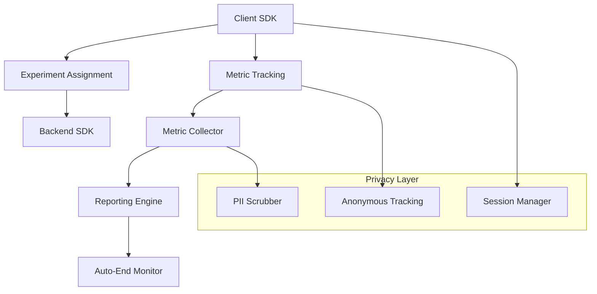

# FlowReader Experiments Framework Guide

A comprehensive guide to using FlowReader's controlled experiments framework for A/B testing, feature flags, and data-driven optimization.

## Table of Contents

1. [Overview](#overview)
2. [Getting Started](#getting-started)
3. [Architecture](#architecture)
4. [Creating Experiments](#creating-experiments)
5. [Knowledge Enhancement Experiments](#knowledge-enhancement-experiments)
6. [Feedback Entry Experiments](#feedback-entry-experiments)
7. [Metric Tracking](#metric-tracking)
8. [Reporting and Analysis](#reporting-and-analysis)
9. [Auto-End Conditions](#auto-end-conditions)
10. [Best Practices](#best-practices)
11. [Troubleshooting](#troubleshooting)
12. [API Reference](#api-reference)

## Overview

The FlowReader Experiments Framework is a privacy-first, comprehensive A/B testing system designed for controlled experiments and feature flags. It provides:

- **Anonymous User Assignment**: Privacy-preserving experiment participation
- **Real-time Metric Collection**: Performance, engagement, and satisfaction tracking
- **Automatic Analysis**: Statistical significance testing and recommendations
- **Feature-Specific Testing**: Specialized frameworks for knowledge enhancement and feedback UX
- **Auto-End Conditions**: Intelligent experiment termination based on configurable criteria

### Key Features

- 🔒 **Privacy-First**: Anonymous session-based tracking with PII scrubbing
- 📊 **Real-time Analytics**: Live experiment monitoring and reporting
- 🤖 **Intelligent Auto-End**: Configurable conditions for automatic experiment termination
- 🎯 **Feature-Specific**: Specialized testing for AI features and UX components
- 📈 **Statistical Rigor**: Proper significance testing and confidence intervals
- 🛠 **Developer-Friendly**: Simple APIs and comprehensive tooling

## Getting Started

### Installation

The experiments framework is built into FlowReader. No additional installation required.

### Basic Setup

1. **Initialize the SDK** (Frontend):

```typescript
import { initializeExperiments } from '$lib/exp/client-sdk.js';

// Initialize in your app
const experiments = initializeExperiments({
  debug: true, // Enable in development
  autoTrackPageViews: true,
  enableDevTools: true
});
```

2. **Configure Backend SDK**:

```typescript
import { createExperimentSDK } from '@flowreader/shared/experiments/backend-sdk.js';

const experimentSDK = createExperimentSDK({
  apiEndpoint: '/api/experiments',
  debug: process.env.NODE_ENV === 'development'
});

await experimentSDK.loadExperiments();
```

### Quick Example

```typescript
// Get experiment assignment
const result = await getExperiment('my_feature_test');

if (result.variant) {
  const config = result.variant.configuration;

  // Use variant configuration
  if (config.enableNewFeature) {
    renderNewFeature();
  } else {
    renderOldFeature();
  }

  // Track metrics
  await track('my_feature_test', 'feature_usage', 1);
}
```

## Architecture

### Core Components



### Data Flow

1. **User Session Start**: Anonymous session ID generated
2. **Experiment Assignment**: User assigned to variant based on targeting rules
3. **Event Tracking**: Anonymous metrics collected in real-time
4. **Analysis**: Statistical analysis performed on aggregated data
5. **Reporting**: Automated reports and recommendations generated
6. **Auto-End**: Experiments automatically terminated based on conditions

## Creating Experiments

### Experiment Configuration

```typescript
import type { ExperimentConfig } from '@flowreader/shared/experiments/types.js';

const experiment: ExperimentConfig = {
  id: 'reading_interface_v2',
  name: 'Reading Interface V2 Test',
  description: 'Test new reading interface design',
  status: 'active',

  variants: [
    {
      id: 'control',
      name: 'Current Interface',
      allocation: 50,
      isControl: true,
      configuration: {
        useNewInterface: false,
        theme: 'current'
      }
    },
    {
      id: 'treatment',
      name: 'New Interface',
      allocation: 50,
      isControl: false,
      configuration: {
        useNewInterface: true,
        theme: 'modern',
        enableAnimations: true
      }
    }
  ],

  targeting: {
    trafficAllocation: 100,
    sessionBased: true,
    routes: ['/read/*']
  },

  metrics: [
    {
      id: 'reading_time',
      name: 'Reading Time',
      type: 'engagement',
      isPrimary: true,
      target: { value: 300, direction: 'increase' },
      aggregation: 'average'
    },
    {
      id: 'user_satisfaction',
      name: 'User Satisfaction',
      type: 'satisfaction',
      isPrimary: false,
      target: { value: 4.0, direction: 'increase' },
      aggregation: 'average'
    }
  ],

  autoEndConditions: [
    {
      type: 'statistical_significance',
      configuration: { targetConfidence: 0.95 },
      priority: 1
    },
    {
      type: 'sample_size',
      configuration: { targetSampleSize: 1000 },
      priority: 2
    }
  ],

  startDate: new Date().toISOString(),
  metadata: {
    owner: 'product-team',
    tags: ['ui', 'reading'],
    category: 'ui_ux',
    priority: 'high'
  }
};
```

### Variant Configuration

Each variant can have custom configuration that affects feature behavior:

```typescript
// Frontend usage
const { config } = await getKnowledgeConfig(context);

if (config.useNewInterface) {
  // Render new interface
  return <NewReadingInterface theme={config.theme} />;
} else {
  // Render current interface
  return <CurrentReadingInterface />;
}
```

## Knowledge Enhancement Experiments

### Specialized Framework

FlowReader includes a specialized framework for testing knowledge enhancement features:

```typescript
import { getKnowledgeConfig, trackKnowledgeMetrics } from '$lib/exp/knowledge-experiments.js';

// Get configuration for knowledge request
const context = {
  bookId: 'book_123',
  intent: 'explain',
  selectionText: 'selected text',
  sessionId: 'session_456'
};

const { config, experimentId } = await getKnowledgeConfig(context);

// Use configuration to determine enhancement strategy
const enhancementResult = await processKnowledgeRequest(context, config);

// Track performance metrics
await trackKnowledgeMetrics(context, {
  firstByteTime: enhancementResult.firstByteTime,
  totalProcessingTime: enhancementResult.totalTime,
  qualityScore: enhancementResult.quality,
  tokensUsed: enhancementResult.tokens,
  cacheHit: enhancementResult.fromCache,
  fallbackUsed: enhancementResult.usedFallback,
  strategy: enhancementResult.strategy
}, experimentId);
```

### Pre-built Knowledge Experiments

#### Latency Optimization Experiment

```typescript
import { KnowledgeExperimentManager } from '$lib/exp/knowledge-experiments.js';

const latencyExperiment = KnowledgeExperimentManager.createLatencyOptimizationExperiment();

// Variants:
// - control_basic: Standard knowledge enhancement
// - progressive_fill: Early response with progressive enhancement
// - precomputed: Use precomputed cache
// - hybrid_optimized: Combination approach
```

#### Quality vs Speed Trade-off

```typescript
const qualityExperiment = KnowledgeExperimentManager.createQualitySpeedTradeoffExperiment();

// Variants:
// - control_balanced: Current balanced approach
// - speed_optimized: Prioritize speed over quality
// - quality_optimized: Prioritize quality over speed
```

### Helper Functions

```typescript
// Check if progressive fill should be enabled
const useProgressiveFill = await shouldUseProgressiveFill(context);

// Get target latency for requests
const latencyTarget = await getLatencyTarget(context);

// Get quality threshold
const qualityThreshold = await getQualityThreshold(context);
```

## Feedback Entry Experiments

### Specialized Feedback Testing

Test different feedback collection strategies:

```typescript
import { getFeedbackUIConfig, trackFeedbackInteraction } from '$lib/exp/feedback-experiments.js';

const feedbackContext = {
  route: '/read/book-123',
  feature: 'knowledge_enhancement',
  sessionDuration: 300000, // 5 minutes
  feedbackCount: 0,
  sessionId: 'session_456'
};

const { config, shouldShow, experimentId } = await getFeedbackUIConfig(feedbackContext);

if (shouldShow) {
  // Show feedback trigger with experiment configuration
  renderFeedbackTrigger(config);

  // Track trigger shown
  await trackFeedbackInteraction('trigger_click', feedbackContext, null, experimentId);
}
```

### Pre-built Feedback Experiments

#### Smart Triggers Experiment

```typescript
import { FeedbackExperimentManager } from '$lib/exp/feedback-experiments.js';

const triggerExperiment = FeedbackExperimentManager.createSmartTriggerExperiment();

// Variants:
// - control_always: Always show feedback trigger
// - contextual_smart: Show based on user context
// - time_based: Show after time intervals
// - ai_smart: AI-driven optimal timing
```

#### Form Style Optimization

```typescript
const formExperiment = FeedbackExperimentManager.createFormStyleExperiment();

// Variants:
// - control_minimal: Simple minimal form
// - detailed_form: Comprehensive form with more fields
// - conversational_form: Chat-like interface
```

## Metric Tracking

### Core Metrics

The framework automatically tracks several core metrics:

- **Engagement**: Time spent, interactions, feature usage
- **Conversion**: Task completion, successful actions
- **Satisfaction**: User ratings, feedback quality
- **Performance**: Load times, response times
- **Retention**: Return visits, continued usage

### Custom Metric Tracking

```typescript
// Track simple metric
await track('experiment_id', 'custom_metric', value, properties);

// Track conversion
await trackConversion('experiment_id', 'signup', 1, { source: 'experiment' });

// Track engagement
await trackEngagement('experiment_id', 'reading_time', durationMs, { bookId: 'book_123' });

// Track satisfaction
await trackSatisfaction('experiment_id', rating, feedbackText);
```

### Metric Registration

```typescript
import { metricCollector } from '$lib/exp/metrics.js';

// Register custom metric
metricCollector.registerMetric({
  id: 'custom_completion_rate',
  name: 'Custom Task Completion Rate',
  type: 'conversion',
  description: 'Rate of users completing custom task',
  aggregation: 'rate',
  isPrimary: false,
  target: { value: 0.8, direction: 'increase' }
});
```

### Privacy-First Tracking

All tracking is anonymous and privacy-preserving:

- No personal identifiers stored
- Automatic PII scrubbing
- Session-based anonymous tracking
- Configurable data retention
- Optional consent integration

## Reporting and Analysis

### Command-Line Reporting

```bash
# Generate report for specific experiment
node scripts/experiments/run_ab_report.ts --experiment-id knowledge_latency_optimization

# Generate report for last 7 days
node scripts/experiments/run_ab_report.ts --last-7d

# Health check for all experiments
node scripts/experiments/run_ab_report.ts --health

# Interactive dashboard
node scripts/experiments/run_ab_report.ts --interactive

# Export data in different formats
node scripts/experiments/run_ab_report.ts --experiment-id exp_123 --format csv --output report.csv
```

### Programmatic Reporting

```typescript
import { experimentReporter } from '$lib/exp/reporting.js';

// Generate experiment report
const report = await experimentReporter.generateReport(experimentConfig);

// Check auto-end conditions
const shouldEnd = await experimentReporter.checkAutoEndConditions(experimentConfig);

// Get dashboard data
const dashboard = await experimentReporter.getDashboardData(['exp_1', 'exp_2']);

// Export analytics
const analytics = await experimentReporter.exportAnalytics('exp_123', 'json');
```

### Real-time Dashboard

Access real-time experiment data:

```typescript
// Get live metrics
const liveMetrics = metricCollector.getMetrics('experiment_id');

// Compare variants
const comparison = metricCollector.compareVariants(
  'experiment_id',
  'control',
  'treatment',
  'conversion_rate'
);

// Export data for external analysis
const exportData = metricCollector.exportData('experiment_id');
```

## Auto-End Conditions

### Configuration

Experiments can automatically end based on various conditions:

```typescript
const autoEndConditions = [
  {
    type: 'statistical_significance',
    configuration: {
      targetConfidence: 0.95,
      primaryMetricOnly: true
    },
    priority: 1
  },
  {
    type: 'sample_size',
    configuration: { targetSampleSize: 1000 },
    priority: 2
  },
  {
    type: 'time',
    configuration: { maxDurationDays: 30 },
    priority: 3
  },
  {
    type: 'metric_threshold',
    configuration: {
      metricId: 'conversion_rate',
      threshold: 0.2,
      direction: 'increase'
    },
    priority: 1
  },
  {
    type: 'safety',
    configuration: {
      safetyMetrics: ['error_rate', 'user_complaints'],
      minSafetyThreshold: 0.05
    },
    priority: 1
  }
];
```

### Condition Types

1. **Statistical Significance**: End when target confidence reached
2. **Sample Size**: End when sufficient participants enrolled
3. **Time**: End after maximum duration
4. **Metric Threshold**: End when metric reaches target value
5. **Safety**: End if safety metrics indicate problems

### Monitoring

Auto-end conditions are checked automatically:

```typescript
// Manual check
const endCheck = await experimentReporter.checkAutoEndConditions(experiment);

if (endCheck.shouldEnd) {
  console.log(`Experiment should end: ${endCheck.reason}`);
  // Experiment will be automatically ended
}
```

## Best Practices

### Experiment Design

1. **Clear Hypothesis**: Define what you're testing and expected outcome
2. **Primary Metric**: Choose one primary metric for decision making
3. **Sufficient Power**: Ensure adequate sample size for statistical significance
4. **Control Variants**: Always include a proper control group
5. **Targeting**: Use appropriate targeting to avoid bias

### Implementation

1. **Feature Flags**: Use experiments as feature flags for gradual rollouts
2. **Error Handling**: Gracefully handle assignment failures
3. **Performance**: Minimize impact on page load and user experience
4. **Testing**: Test experiment logic thoroughly before launch

### Privacy and Ethics

1. **Anonymous Tracking**: Never track personally identifiable information
2. **Consent**: Obtain user consent where required
3. **Data Retention**: Set appropriate data retention policies
4. **Transparency**: Be transparent about experimentation

### Statistical Rigor

1. **Pre-registration**: Define success criteria before starting
2. **Multiple Testing**: Account for multiple comparisons
3. **Confidence Intervals**: Report confidence intervals, not just p-values
4. **Effect Size**: Consider practical significance, not just statistical
5. **Bias Prevention**: Use proper randomization and avoid selection bias

## Troubleshooting

### Common Issues

#### Assignment Not Working

```typescript
// Check experiment status
const experiment = await getExperiment('experiment_id');
if (!experiment.assignment) {
  console.log('Assignment failed:', experiment.error);
}

// Verify targeting conditions
const context = {
  sessionId: 'session_123',
  route: '/current/route',
  // ... other context
};
```

#### Metrics Not Tracking

```typescript
// Verify experiment assignment
const assignment = getStoreValue().assignments.get('experiment_id');
if (!assignment) {
  console.log('User not in experiment');
}

// Check tracking configuration
const config = getExperimentSDKConfig();
if (!config.trackingEnabled) {
  console.log('Tracking disabled');
}
```

#### Low Sample Size

1. **Check Targeting**: Verify targeting conditions aren't too restrictive
2. **Traffic Allocation**: Increase traffic allocation percentage
3. **Routes**: Ensure experiment runs on high-traffic routes
4. **Duration**: Allow sufficient time for sample collection

#### Statistical Significance Issues

1. **Effect Size**: Ensure expected effect size is realistic
2. **Sample Size**: Calculate required sample size beforehand
3. **Baseline Metrics**: Verify baseline performance is stable
4. **Metric Variance**: Check if metrics have high variance

### Debugging Tools

#### Development Tools

```typescript
// Enable debug mode
const experiments = initializeExperiments({ debug: true });

// Access debug information
console.log(window.__FLOWREADER_EXPERIMENTS__);

// Manual assignment check
const assignment = await experiments.getExperiment('test_id');
console.log('Assignment:', assignment);
```

#### Command-Line Tools

```bash
# Check experiment health
node scripts/experiments/run_ab_report.ts --health

# View experiment configuration
node scripts/experiments/run_ab_report.ts --experiment-id exp_123 --verbose

# Export raw data for analysis
node scripts/experiments/run_ab_report.ts --experiment-id exp_123 --include-raw-data
```

### Performance Monitoring

Monitor experiment framework performance:

```typescript
// Track SDK performance
const startTime = performance.now();
const assignment = await getExperiment('exp_id');
const assignmentTime = performance.now() - startTime;

if (assignmentTime > 100) { // 100ms threshold
  console.warn('Slow experiment assignment:', assignmentTime);
}
```

## API Reference

### Client SDK

#### `initializeExperiments(config)`

Initialize the experiments SDK.

```typescript
const experiments = initializeExperiments({
  debug: boolean,
  autoTrackPageViews: boolean,
  enableDevTools: boolean,
  baseUrl: string,
  sessionId: string
});
```

#### `getExperiment(experimentId, context?)`

Get experiment assignment and variant.

```typescript
const result = await getExperiment('exp_id', {
  route: '/current/route',
  feature: 'feature_name'
});
```

#### `track(experimentId, metricId, value?, properties?)`

Track experiment event.

```typescript
await track('exp_id', 'conversion', 1, { source: 'button' });
```

#### `createFeatureFlag(key, defaultValue?, experimentId?)`

Create a reactive feature flag store.

```typescript
const featureEnabled = createFeatureFlag('new_feature', false, 'exp_id');
```

### Backend SDK

#### `createExperimentSDK(config)`

Create backend SDK instance.

```typescript
const sdk = createExperimentSDK({
  apiEndpoint: '/api/experiments',
  debug: false
});
```

#### `getAssignment(experimentId, context)`

Get experiment assignment for session.

```typescript
const result = await sdk.getAssignment('exp_id', {
  sessionId: 'session_123',
  route: '/page'
});
```

#### `trackEvent(event)`

Track experiment event.

```typescript
await sdk.trackEvent({
  experimentId: 'exp_id',
  variantId: 'variant_id',
  sessionId: 'session_123',
  metricId: 'conversion',
  eventType: 'conversion',
  value: 1
});
```

### Metric Collector

#### `registerMetric(metric)`

Register custom metric definition.

```typescript
metricCollector.registerMetric({
  id: 'custom_metric',
  name: 'Custom Metric',
  type: 'conversion',
  aggregation: 'rate'
});
```

#### `compareVariants(experimentId, controlId, treatmentId, metricId)`

Compare variant performance.

```typescript
const comparison = metricCollector.compareVariants(
  'exp_id',
  'control',
  'treatment',
  'conversion_rate'
);
```

### Reporting

#### `generateReport(experimentConfig)`

Generate comprehensive experiment report.

```typescript
const report = await experimentReporter.generateReport(experimentConfig);
```

#### `checkAutoEndConditions(experimentConfig)`

Check if experiment should automatically end.

```typescript
const shouldEnd = await experimentReporter.checkAutoEndConditions(experimentConfig);
```

---

## Support

For questions, issues, or contributions:

1. **Documentation**: Check this guide and inline code comments
2. **Debug Tools**: Use development tools and CLI commands
3. **Logs**: Enable debug mode for detailed logging
4. **Testing**: Use the included test experiments for validation

## Changelog

### v1.0.0
- Initial release with core A/B testing framework
- Anonymous user assignment and tracking
- Knowledge enhancement experiment specialization
- Feedback entry experiment controls
- Automatic reporting and end conditions
- Command-line tools and documentation