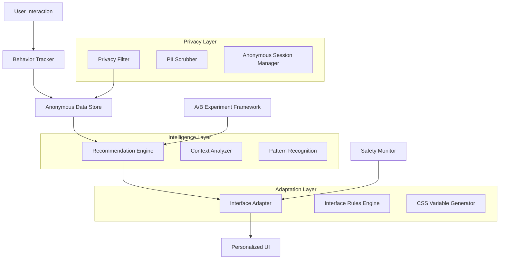

# FlowReader Personalization System Guide

A comprehensive guide to FlowReader's privacy-first real-time UX personalization system with anonymous metrics collection and intelligent adaptation.

## Table of Contents

1. [Overview](#overview)
2. [Architecture](#architecture)
3. [Privacy-First Design](#privacy-first-design)
4. [Core Components](#core-components)
5. [Usage Guide](#usage-guide)
6. [A/B Testing](#ab-testing)
7. [Configuration](#configuration)
8. [Monitoring & Metrics](#monitoring--metrics)
9. [Troubleshooting](#troubleshooting)
10. [Best Practices](#best-practices)

## Overview

The FlowReader Personalization System provides intelligent, real-time user experience adaptations while maintaining strict privacy standards. The system uses anonymous behavioral data to deliver personalized recommendations, interface adaptations, and contextual assistance.

### Key Features

- 🔒 **Privacy-First**: Zero PII collection, anonymous session tracking only
- 🎯 **Real-Time Adaptation**: Immediate interface adjustments based on user behavior
- 📊 **Statistical Rigor**: A/B testing with proper significance testing
- 🤖 **Intelligent Recommendations**: Context-aware suggestion engine
- 🛡️ **Safety First**: Automatic rollback on satisfaction threshold violations
- 📈 **Gradual Rollout**: Controlled deployment with feature flags

### Primary Goals

1. **Achieve 4.5+ user satisfaction score** through personalized experiences
2. **Maintain zero PII collection** while providing valuable personalization
3. **Improve task completion rates** by 10% through intelligent adaptations
4. **Increase feature discovery** by 20% via contextual recommendations

## Architecture



### Component Interaction Flow

1. **User Interaction** → Anonymous tracking via Privacy Filter
2. **Behavior Analysis** → Pattern recognition and context analysis
3. **Recommendation Generation** → Rule-based and ML-enhanced suggestions
4. **Interface Adaptation** → Real-time CSS and component modifications
5. **Feedback Collection** → Anonymous satisfaction tracking
6. **Continuous Improvement** → A/B testing and optimization

## Privacy-First Design

### Zero PII Guarantee

The personalization system is designed with privacy as a core principle:

#### What We DON'T Collect
- ❌ Email addresses or usernames
- ❌ IP addresses (beyond geolocation for timezone)
- ❌ Device fingerprints
- ❌ Cross-session tracking
- ❌ Personal reading content
- ❌ Social media connections

#### What We DO Collect (Anonymously)
- ✅ Session-based behavioral patterns
- ✅ Reading speed and engagement metrics
- ✅ Feature usage statistics
- ✅ Interface interaction patterns
- ✅ Satisfaction scores (1-5 scale)
- ✅ Performance metrics

### Anonymous Session Management

```typescript
// Session ID generation (non-persistent)
const sessionId = `ps_${Date.now()}_${Math.random().toString(36).substr(2, 9)}`;

// Automatic PII scrubbing
const cleanData = scrubPII(behaviorData);
```

### Data Retention Policy

- **Session Data**: Automatically expires after 24 hours
- **Aggregated Metrics**: Retained for 30 days for analysis
- **No Long-term User Profiles**: No persistent user identification
- **Automatic Cleanup**: Expired data automatically purged

## Core Components

### 1. Personalization SDK (`/lib/personalization/sdk.ts`)

The main SDK provides the client-side interface for personalization features.

```typescript
import { initializePersonalization } from '$lib/personalization/sdk.js';

// Initialize personalization
const personalization = initializePersonalization({
  apiEndpoint: '/api/personalization',
  debug: true,
  privacyConfig: {
    anonOnly: true,
    dataRetentionDays: 7,
    allowOptOut: true
  }
});

// Track behavior
personalization.trackReadingPattern({
  documentType: 'book',
  sessionDuration: 30,
  engagementLevel: 0.8
});

// Get recommendations
const recommendations = personalization.getRecommendations();
```

### 2. Recommendation Engine (`/lib/personalization/recommendation-engine.ts`)

Context-aware recommendation system with rule-based intelligence.

```typescript
import { recommendationEngine } from '$lib/personalization/recommendation-engine.js';

// Generate recommendations
const recommendations = recommendationEngine.generateRecommendations(
  context,
  maxRecommendations: 5
);

// Apply recommendation
await personalization.applyRecommendation(recommendationId);
```

### 3. Interface Adapter (`/lib/personalization/interface-adapter.ts`)

Real-time interface adaptation system.

```typescript
import { interfaceAdapter } from '$lib/personalization/interface-adapter.js';

// Analyze and adapt interface
const adaptations = interfaceAdapter.analyzeAndAdapt(context, sessionId);

// Apply adaptation
interfaceAdapter.applyAdaptation(adaptationId, sessionId, userAccepted);

// Get current CSS variables
const cssVariables = interfaceAdapter.cssVariables;
```

### 4. A/B Testing Framework (`/scripts/experiments/personalization_ab.ts`)

Statistical A/B testing with automatic rollback capabilities.

```bash
# Start experiment with gradual rollout
node scripts/experiments/personalization_ab.ts --start rollout

# Check experiment status
node scripts/experiments/personalization_ab.ts --status

# Generate detailed report
node scripts/experiments/personalization_ab.ts --report rollout
```

## Usage Guide

### Frontend Integration

#### 1. Initialize Personalization

```svelte
<!-- App.svelte -->
<script>
  import { onMount } from 'svelte';
  import { initializePersonalization } from '$lib/personalization/sdk.js';
  import { interfaceAdapter } from '$lib/personalization/interface-adapter.js';

  let personalization;

  onMount(async () => {
    personalization = initializePersonalization({
      debug: dev,
      privacyConfig: {
        anonOnly: true,
        allowOptOut: true
      }
    });
  });

  // Subscribe to CSS variables for real-time adaptation
  $: cssVariables = $interfaceAdapter.cssVariables;
</script>

<div class="app" style={Object.entries(cssVariables).map(([k, v]) => `${k}: ${v}`).join('; ')}>
  <!-- App content -->
</div>
```

#### 2. Track User Behavior

```svelte
<!-- ReadingInterface.svelte -->
<script>
  import { getPersonalizationSDK } from '$lib/personalization/sdk.js';

  let startTime = Date.now();
  let scrollEngagement = 0;

  function trackReadingSession() {
    const personalization = getPersonalizationSDK();

    personalization?.trackReadingPattern({
      sessionDuration: (Date.now() - startTime) / 1000 / 60,
      engagementLevel: scrollEngagement,
      averageReadingSpeed: calculateReadingSpeed(),
      deviceType: getDeviceType()
    });
  }

  function handleSatisfactionRating(score) {
    const personalization = getPersonalizationSDK();
    personalization?.trackSatisfaction(score, 'reading', 'post-chapter');
  }
</script>
```

#### 3. Display Recommendations

```svelte
<!-- RecommendationDisplay.svelte -->
<script>
  import { getPersonalizationSDK } from '$lib/personalization/sdk.js';

  let recommendations = [];

  async function loadRecommendations() {
    const personalization = getPersonalizationSDK();
    recommendations = personalization?.getRecommendations() || [];
  }

  async function applyRecommendation(rec) {
    const personalization = getPersonalizationSDK();
    const success = await personalization?.applyRecommendation(rec.id);

    if (success) {
      // Remove applied recommendation
      recommendations = recommendations.filter(r => r.id !== rec.id);
    }
  }
</script>

{#each recommendations as rec}
  <div class="recommendation" class:high-priority={rec.priority >= 8}>
    <h4>{rec.title}</h4>
    <p>{rec.description}</p>
    <div class="impact">
      Expected improvement: {(rec.expectedImpact.satisfactionImprovement * 100).toFixed(0)}%
    </div>
    <button on:click={() => applyRecommendation(rec)}>
      Apply Suggestion
    </button>
  </div>
{/each}
```

### Backend Integration

#### 1. API Endpoints

The personalization system provides three main API endpoints:

```typescript
// GET /api/personalization/config - Get personalization configuration
// POST /api/personalization/behavior - Track behavior data
// POST /api/personalization/metrics - Track satisfaction and usage metrics
```

#### 2. Database Schema

```sql
-- Anonymous behavior tracking
CREATE TABLE anonymous_behaviors (
  id SERIAL PRIMARY KEY,
  session_id TEXT NOT NULL,
  behavior_data JSONB NOT NULL,
  created_at TIMESTAMP WITH TIME ZONE DEFAULT NOW(),
  expires_at TIMESTAMP WITH TIME ZONE NOT NULL
);

-- Personalization metrics
CREATE TABLE personalization_metrics (
  id SERIAL PRIMARY KEY,
  session_id TEXT NOT NULL,
  variant_id TEXT NOT NULL,
  metric_data JSONB NOT NULL,
  timestamp TIMESTAMP WITH TIME ZONE NOT NULL,
  created_at TIMESTAMP WITH TIME ZONE DEFAULT NOW(),
  expires_at TIMESTAMP WITH TIME ZONE NOT NULL
);

-- Indexes for performance
CREATE INDEX idx_anonymous_behaviors_session ON anonymous_behaviors(session_id);
CREATE INDEX idx_anonymous_behaviors_expires ON anonymous_behaviors(expires_at);
CREATE INDEX idx_personalization_metrics_session ON personalization_metrics(session_id);
CREATE INDEX idx_personalization_metrics_expires ON personalization_metrics(expires_at);
```

## A/B Testing

### Experiment Types

The system supports multiple types of personalization experiments:

1. **Rollout Experiment** - Main personalization feature rollout
2. **Advanced Experiment** - ML-enhanced personalization
3. **Interface Experiment** - Interface adaptation testing
4. **Recommendations Experiment** - Recommendation engine testing
5. **Performance Experiment** - Performance impact measurement

### Running Experiments

#### Start Experiment

```bash
# Dry run to validate configuration
node scripts/experiments/personalization_ab.ts --dry-run

# Start rollout experiment with 5% traffic
node scripts/experiments/personalization_ab.ts --start rollout

# Start specific experiment type
node scripts/experiments/personalization_ab.ts --start interface
```

#### Monitor Experiments

```bash
# Check status of all experiments
node scripts/experiments/personalization_ab.ts --status

# Generate detailed report
node scripts/experiments/personalization_ab.ts --report rollout

# Stop experiment with reason
node scripts/experiments/personalization_ab.ts --stop rollout --reason "target achieved"
```

### Safety Features

- **Automatic Rollback**: Triggered when satisfaction drops below 3.5
- **Gradual Rollout**: 5% → 10% → 25% → 50% → 100% progression
- **Statistical Significance**: 95% confidence required before recommendations
- **Sample Size Validation**: Minimum 500 users per variant
- **Performance Monitoring**: Automatic rollback on performance degradation

## Configuration

### Environment Variables

```bash
# Personalization feature toggle
PERSONALIZATION_ENABLED=true
PERSONALIZATION_ROLLOUT_PERCENTAGE=10

# Safety thresholds
PERSONALIZATION_SATISFACTION_THRESHOLD=3.5
PERSONALIZATION_ERROR_RATE_THRESHOLD=0.05
PERSONALIZATION_PERFORMANCE_THRESHOLD=0.2

# Data retention
PERSONALIZATION_DATA_RETENTION_DAYS=7
PERSONALIZATION_METRICS_RETENTION_DAYS=30

# API configuration
PERSONALIZATION_API_ENDPOINT=/api/personalization
PERSONALIZATION_DEBUG=false
```

### Feature Flags

```typescript
// Feature flag configuration
const personalizationConfig = {
  enabled: process.env.PERSONALIZATION_ENABLED === 'true',
  rolloutPercentage: parseInt(process.env.PERSONALIZATION_ROLLOUT_PERCENTAGE || '10'),
  satisfactionTarget: 4.5,
  safetyThresholds: {
    minSatisfaction: 3.5,
    maxErrorRate: 0.05,
    maxPerformanceDegradation: 0.2
  }
};
```

## Monitoring & Metrics

### Key Metrics

#### Primary Metrics
- **User Satisfaction Score**: Target ≥ 4.5 (1-5 scale)
- **Task Completion Rate**: Target +10% improvement
- **Feature Discovery Rate**: Target +20% improvement
- **Error Rate**: Target ≤ 5%

#### Secondary Metrics
- **Engagement Time**: Time spent actively using the application
- **Recommendation Acceptance Rate**: Percentage of applied recommendations
- **Interface Adaptation Success Rate**: User acceptance of adaptations
- **Knowledge Enhancement Usage**: Improvement in knowledge feature usage

### Monitoring Dashboard

```typescript
// Get personalization metrics
const metrics = await personalizationService.getMetrics(sessionId);

console.log('Personalization Metrics:', {
  satisfactionScore: metrics.satisfactionScore,
  engagementTime: metrics.engagementTime,
  taskCompletionRate: metrics.taskCompletionRate,
  recommendationAcceptanceRate: metrics.recommendationAcceptanceRate
});
```

### Alerts and Notifications

The system monitors several key indicators:

- **Satisfaction Drop**: Alert when average satisfaction < 3.5
- **High Error Rate**: Alert when error rate > 5%
- **Performance Degradation**: Alert when response time increases > 20%
- **Experiment Health**: Daily reports on experiment progress

## Troubleshooting

### Common Issues

#### 1. Personalization Not Working

**Symptoms**: No recommendations or adaptations showing
**Possible Causes**:
- Feature flag disabled
- User not in experiment group
- Insufficient behavior data
- API endpoint errors

**Solutions**:
```bash
# Check feature flag status
node scripts/experiments/personalization_ab.ts --status

# Verify API endpoints
curl -X POST /api/personalization/config \
  -H "Content-Type: application/json" \
  -d '{"sessionId":"test","context":{}}'

# Enable debug mode
localStorage.setItem('personalization_debug', 'true');
```

#### 2. High Memory Usage

**Symptoms**: Browser memory consumption increases over time
**Possible Causes**:
- Recommendation history not being cleaned up
- CSS variables accumulating
- Event listeners not removed

**Solutions**:
```typescript
// Clear session data periodically
personalization.clearSessionHistory(sessionId);

// Remove event listeners on component destroy
onDestroy(() => {
  personalization.destroy();
});
```

#### 3. Poor Recommendation Quality

**Symptoms**: Users not accepting recommendations
**Possible Causes**:
- Insufficient behavioral data
- Poor trigger conditions
- Incorrect context analysis

**Solutions**:
```typescript
// Analyze recommendation performance
const metrics = recommendationEngine.getRecommendationMetrics(sessionId);
console.log('Acceptance rate:', metrics.acceptanceRate);

// Adjust recommendation rules
// Review trigger thresholds and conditions
```

### Debug Tools

#### Enable Debug Mode

```typescript
// Enable SDK debug mode
const personalization = initializePersonalization({
  debug: true,
  enableDevTools: true
});

// Access debug information
console.log(window.__FLOWREADER_PERSONALIZATION__);
```

#### Monitoring Commands

```bash
# Health check
node scripts/experiments/personalization_ab.ts --status

# Performance analysis
node scripts/monitoring/personalization_health.ts

# Data validation
node scripts/monitoring/validate_personalization_data.ts
```

## Best Practices

### Development

1. **Privacy First**: Always validate that no PII is collected
2. **Gradual Rollout**: Start with small percentages and monitor
3. **Statistical Significance**: Wait for proper sample sizes
4. **User Control**: Provide easy opt-out mechanisms
5. **Performance**: Monitor impact on application performance

### Implementation

1. **Error Handling**: Gracefully handle personalization failures
2. **Fallback Behavior**: Ensure app works without personalization
3. **Testing**: Test both personalized and non-personalized experiences
4. **Documentation**: Document all recommendation rules and triggers

### Monitoring

1. **Regular Reviews**: Weekly analysis of personalization effectiveness
2. **User Feedback**: Monitor satisfaction scores and feedback
3. **A/B Testing**: Continuously test new personalization strategies
4. **Safety Monitoring**: Set up alerts for safety threshold violations

### Security

1. **Data Minimization**: Collect only necessary behavioral data
2. **Anonymous Tracking**: Never associate behavior with user identity
3. **Secure Storage**: Encrypt sensitive behavioral data
4. **Access Control**: Limit access to personalization data
5. **Audit Logging**: Log all personalization system access

---

## Quick Reference

### Essential Commands

```bash
# Start personalization experiment
node scripts/experiments/personalization_ab.ts --start rollout

# Check experiment status
node scripts/experiments/personalization_ab.ts --status

# Generate report
node scripts/experiments/personalization_ab.ts --report rollout

# Stop experiment
node scripts/experiments/personalization_ab.ts --stop rollout --reason "completed"
```

### Key Configuration

```typescript
// Initialize personalization
const personalization = initializePersonalization({
  debug: dev,
  privacyConfig: { anonOnly: true, allowOptOut: true }
});

// Track behavior
personalization.trackReadingPattern(pattern);
personalization.trackSatisfaction(score, category);

// Get recommendations
const recommendations = personalization.getRecommendations();
```

### Monitoring Metrics

- **Primary**: User satisfaction ≥ 4.5
- **Secondary**: Task completion +10%, Feature discovery +20%
- **Safety**: Error rate ≤ 5%, No performance degradation > 20%

For additional support and advanced configuration options, refer to the [Personalization Metrics Guide](./personalization_metrics.md) and the [Experiments Framework Guide](./experiments_guide.md).