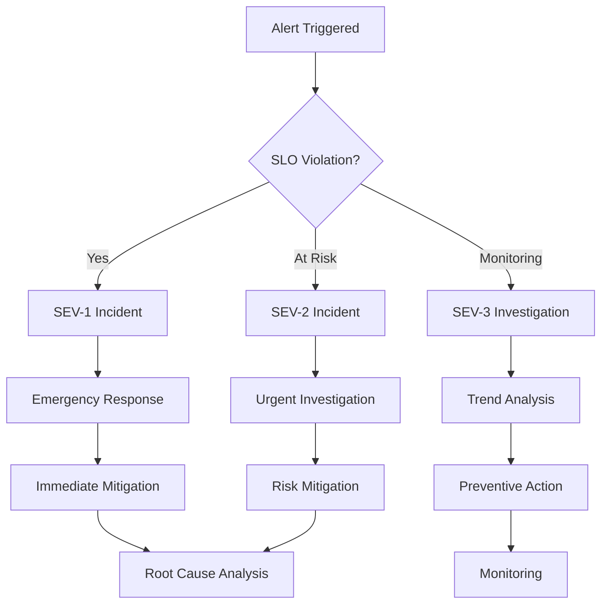

# FlowReader Service Level Objectives (SLO) Policy

**Version**: 1.0
**Date**: 2024-09-19
**Status**: ACTIVE
**Review Cycle**: Monthly

---

## Executive Summary

This document establishes the Service Level Objectives (SLOs) for FlowReader, defining measurable targets for availability, performance, quality, and security. These SLOs provide the foundation for operational excellence, incident response, and continuous improvement of the FlowReader platform.

### Key SLO Metrics
- **Availability**: 99.5% uptime target
- **Latency**: P95 < 1500ms, P99 < 2500ms
- **Error Rate**: < 1% of all requests
- **Dialog Success Rate**: > 95% successful completions
- **Security Score**: 100% compliance with security headers

---

## Table of Contents

1. [SLO Framework](#slo-framework)
2. [Service Level Indicators (SLIs)](#service-level-indicators-slis)
3. [Service Level Objectives (SLOs)](#service-level-objectives-slos)
4. [Error Budget Management](#error-budget-management)
5. [Alerting Strategy](#alerting-strategy)
6. [Incident Response](#incident-response)
7. [Monitoring Infrastructure](#monitoring-infrastructure)
8. [Exception Handling](#exception-handling)
9. [Review and Updates](#review-and-updates)

---

## SLO Framework

### SLO Philosophy

FlowReader's SLO framework is built on four pillars:

1. **User-Centric Metrics**: SLOs reflect user experience quality
2. **Achievable Targets**: Balanced between user needs and operational reality
3. **Error Budget Driven**: Allow for controlled risk-taking and innovation
4. **Continuous Improvement**: Regular review and optimization

### SLO Categories

#### Primary SLOs (Customer-Facing)
- **Availability**: System uptime and accessibility
- **Latency**: Response time for user requests
- **Throughput**: System capacity and performance
- **Correctness**: Quality and accuracy of responses

#### Secondary SLOs (Operational)
- **Security**: Compliance and protection metrics
- **Cost Efficiency**: Resource utilization optimization
- **Deployment Success**: Release reliability metrics
- **Recovery Time**: Incident resolution speed

---

## Service Level Indicators (SLIs)

### 1. Availability SLIs

#### System Availability
```
SLI Definition: Percentage of successful health checks over total health checks
Measurement: (Successful health checks / Total health checks) * 100
Data Source: /api/health endpoint monitoring
Collection Frequency: Every 30 seconds
```

#### API Availability
```
SLI Definition: Percentage of successful API requests over total API requests
Measurement: (HTTP 200-299 responses / Total HTTP responses) * 100
Data Source: Application logs and monitoring
Collection Frequency: Real-time aggregation over 5-minute windows
```

#### Database Availability
```
SLI Definition: Percentage of successful database connections over total attempts
Measurement: (Successful DB connections / Total DB connection attempts) * 100
Data Source: Database connection monitoring
Collection Frequency: Every 60 seconds
```

### 2. Latency SLIs

#### Request Latency
```
SLI Definition: Distribution of request response times
Measurement: P50, P95, P99 percentiles of HTTP response times
Data Source: Application performance monitoring
Collection Frequency: Real-time with 1-minute aggregation windows
```

#### End-to-End Dialog Latency
```
SLI Definition: Time from user request to complete dialog response
Measurement: Full dialog completion time including AI processing
Data Source: Dialog completion logs
Collection Frequency: Per-request measurement with 5-minute aggregation
```

#### Database Query Latency
```
SLI Definition: Time taken for database operations
Measurement: P95 and P99 of database query execution times
Data Source: Database performance logs
Collection Frequency: Real-time monitoring
```

### 3. Error Rate SLIs

#### HTTP Error Rate
```
SLI Definition: Percentage of HTTP requests returning error status codes
Measurement: (HTTP 4xx+5xx responses / Total HTTP responses) * 100
Data Source: Web server logs
Collection Frequency: 5-minute rolling windows
```

#### Dialog Error Rate
```
SLI Definition: Percentage of dialog sessions that fail to complete successfully
Measurement: (Failed dialog sessions / Total dialog sessions) * 100
Data Source: Application business logic logs
Collection Frequency: Per-session tracking with hourly aggregation
```

#### System Error Rate
```
SLI Definition: Percentage of requests that encounter system-level errors
Measurement: (System errors / Total requests) * 100
Data Source: Application error logs and monitoring
Collection Frequency: Real-time error tracking
```

### 4. Quality SLIs

#### Dialog Success Rate
```
SLI Definition: Percentage of dialogs that meet quality thresholds
Measurement: (Quality score >= 80 / Total scored dialogs) * 100
Data Source: Quality assessment system
Collection Frequency: Per-dialog measurement with daily aggregation
```

#### Knowledge Quality Score
```
SLI Definition: Average quality score of knowledge extraction and enhancement
Measurement: Weighted average of knowledge quality metrics
Data Source: Knowledge quality assessment
Collection Frequency: Per-request quality scoring
```

#### User Satisfaction Rate
```
SLI Definition: Percentage of positive user feedback
Measurement: (Positive feedback / Total feedback) * 100
Data Source: User feedback system
Collection Frequency: Weekly aggregation
```

### 5. Security SLIs

#### Security Header Compliance
```
SLI Definition: Percentage of requests with proper security headers
Measurement: (Requests with all security headers / Total requests) * 100
Data Source: HTTP header analysis
Collection Frequency: Real-time monitoring
```

#### HTTPS Compliance
```
SLI Definition: Percentage of requests served over HTTPS
Measurement: (HTTPS requests / Total requests) * 100
Data Source: Web server logs
Collection Frequency: Continuous monitoring
```

#### Authentication Success Rate
```
SLI Definition: Percentage of successful authentication attempts
Measurement: (Successful auth / Total auth attempts) * 100
Data Source: Authentication logs
Collection Frequency: Real-time tracking
```

---

## Service Level Objectives (SLOs)

### 1. Availability SLOs

#### System Availability SLO
```
Objective: 99.5% availability over a 30-day period
Measurement Window: 30 days rolling
Error Budget: 0.5% (3.6 hours of downtime per 30 days)
Target: ≥ 99.5%
Threshold Warning: < 99.8%
Threshold Critical: < 99.5%

Calculation:
- Success: HTTP 200 responses from /api/health
- Failure: HTTP non-200 responses or timeouts
- SLO = (Successful checks / Total checks) × 100
```

#### API Availability SLO
```
Objective: 99.9% API availability over a 7-day period
Measurement Window: 7 days rolling
Error Budget: 0.1% (10 minutes of API errors per week)
Target: ≥ 99.9%
Threshold Warning: < 99.95%
Threshold Critical: < 99.9%

Calculation:
- Success: HTTP 200-299 responses
- Failure: HTTP 4xx/5xx responses
- SLO = (Successful API calls / Total API calls) × 100
```

### 2. Latency SLOs

#### Request Latency SLO
```
Objective: 95% of requests complete within 1500ms (P95 latency)
Measurement Window: 24 hours rolling
Target: P95 ≤ 1500ms
Threshold Warning: P95 > 2000ms
Threshold Critical: P95 > 2500ms

Calculation:
- Measure: End-to-end HTTP request time
- Percentile: 95th percentile over measurement window
- SLO = P95 latency ≤ 1500ms
```

#### Extreme Latency SLO
```
Objective: 99% of requests complete within 2500ms (P99 latency)
Measurement Window: 24 hours rolling
Target: P99 ≤ 2500ms
Threshold Warning: P99 > 3000ms
Threshold Critical: P99 > 4000ms

Calculation:
- Measure: End-to-end HTTP request time
- Percentile: 99th percentile over measurement window
- SLO = P99 latency ≤ 2500ms
```

### 3. Error Rate SLOs

#### Overall Error Rate SLO
```
Objective: Less than 1% error rate over a 24-hour period
Measurement Window: 24 hours rolling
Error Budget: 1% of total requests
Target: < 1%
Threshold Warning: ≥ 2%
Threshold Critical: ≥ 5%

Calculation:
- Error: HTTP 5xx responses and timeouts
- Success: HTTP 2xx, 3xx, 4xx responses
- SLO = (Error responses / Total responses) × 100 < 1%
```

#### Critical Path Error Rate SLO
```
Objective: Less than 0.5% error rate for critical APIs
Measurement Window: 1 hour rolling
Error Budget: 0.5% of critical API requests
Target: < 0.5%
Threshold Warning: ≥ 1%
Threshold Critical: ≥ 2%

Critical Paths:
- /api/chat/stream
- /api/books/*
- /api/health

Calculation:
- Error: 5xx responses and service failures
- SLO = (Critical path errors / Critical path requests) × 100 < 0.5%
```

### 4. Quality SLOs

#### Dialog Success Rate SLO
```
Objective: 95% of dialogs complete successfully with quality ≥ 80
Measurement Window: 24 hours rolling
Target: ≥ 95%
Threshold Warning: < 90%
Threshold Critical: < 85%

Calculation:
- Success: Dialog quality score ≥ 80 and complete
- Failure: Dialog quality score < 80 or incomplete
- SLO = (Successful dialogs / Total dialogs) × 100 ≥ 95%
```

#### Knowledge Enhancement Quality SLO
```
Objective: 90% of knowledge enhancements meet quality threshold
Measurement Window: 7 days rolling
Target: ≥ 90%
Threshold Warning: < 85%
Threshold Critical: < 80%

Calculation:
- Success: Enhancement quality score ≥ 75
- Failure: Enhancement quality score < 75
- SLO = (Quality enhancements / Total enhancements) × 100 ≥ 90%
```

### 5. Security SLOs

#### Security Compliance SLO
```
Objective: 100% compliance with security headers
Measurement Window: 24 hours rolling
Target: 100%
Threshold Warning: < 99%
Threshold Critical: < 95%

Required Headers:
- Strict-Transport-Security (HSTS)
- Content-Security-Policy (CSP)
- X-Frame-Options
- X-Content-Type-Options
- X-XSS-Protection

Calculation:
- Success: All required headers present
- SLO = (Compliant responses / Total responses) × 100 = 100%
```

---

## Error Budget Management

### Error Budget Philosophy

Error budgets provide a framework for balancing reliability and innovation. They define acceptable levels of unreliability that allow for:
- Planned maintenance windows
- Feature deployments with acceptable risk
- Infrastructure changes and updates
- Learning from controlled failures

### Error Budget Calculations

#### System Availability Error Budget
```
SLO Target: 99.5% over 30 days
Error Budget: 0.5% = 216 minutes (3.6 hours) of downtime per month

Budget Allocation:
- Planned maintenance: 60 minutes (27.8%)
- Deployment windows: 36 minutes (16.7%)
- Infrastructure changes: 36 minutes (16.7%)
- Unplanned outages: 84 minutes (38.8%)

Budget Tracking:
- Daily: 7.2 minutes maximum downtime
- Weekly: 50.4 minutes maximum downtime
- Monthly: 216 minutes maximum downtime
```

#### API Error Budget
```
SLO Target: 99.9% over 7 days
Error Budget: 0.1% of total requests

For 10,000 requests/week:
- Error Budget: 10 failed requests per week
- Daily Budget: ~1.4 failed requests per day
- Hourly Budget: ~0.06 failed requests per hour

Budget Allocation:
- Deployment risks: 4 failed requests (40%)
- Infrastructure issues: 3 failed requests (30%)
- Third-party dependencies: 2 failed requests (20%)
- Unexpected issues: 1 failed request (10%)
```

### Error Budget Policies

#### Budget Consumption Thresholds
```
Green Zone (0-50% budget consumed):
- Normal operations
- Standard deployment cadence
- Feature development continues

Yellow Zone (50-85% budget consumed):
- Increased monitoring
- Deployment freeze for non-critical changes
- Focus on reliability improvements
- Daily error budget reviews

Red Zone (85-100% budget consumed):
- Emergency deployment freeze
- All hands focus on reliability
- Root cause analysis required
- Executive escalation

Budget Exceeded (>100%):
- Complete deployment freeze
- Incident response mode
- Mandatory post-mortem
- Recovery plan required before resuming deployments
```

### Error Budget Tracking and Reporting

#### Real-Time Monitoring
- Error budget dashboards with current consumption rates
- Burn rate alerts (projected budget exhaustion)
- Automated notifications at threshold crossings
- Historical trend analysis

#### Weekly Error Budget Report
```markdown
## Weekly Error Budget Report - Week of [DATE]

### System Availability Budget
- Target: 99.5% (50.4 minutes allowance)
- Consumed: [X] minutes ([Y]% of budget)
- Remaining: [Z] minutes ([W]% of budget)
- Status: [Green/Yellow/Red]

### API Error Budget
- Target: 99.9% ([X] failed requests allowance)
- Consumed: [Y] failed requests ([Z]% of budget)
- Remaining: [W] failed requests ([V]% of budget)
- Status: [Green/Yellow/Red]

### Budget Consumption Events
1. [Event description] - [X] minutes/requests consumed
2. [Event description] - [Y] minutes/requests consumed

### Recommendations
- [Action items based on current budget status]
```

---

## Alerting Strategy

### Alert Classification

#### Priority 1 (Critical - Immediate Response)
**Trigger**: SLO violation imminent or occurring
**Response Time**: 5 minutes
**Escalation**: 15 minutes
**Channels**: PagerDuty, Phone, SMS, Slack

Critical Alerts:
- System availability < 99.5%
- P95 latency > 2500ms
- Error rate > 5%
- Security compliance < 95%

#### Priority 2 (High - Urgent Response)
**Trigger**: SLO at risk, warning thresholds breached
**Response Time**: 30 minutes
**Escalation**: 2 hours
**Channels**: Slack, Email

High Priority Alerts:
- System availability < 99.8%
- P95 latency > 2000ms
- Error rate > 2%
- Dialog success rate < 90%
- Error budget > 85% consumed

#### Priority 3 (Medium - Business Hours Response)
**Trigger**: Trends indicating potential SLO risk
**Response Time**: 4 hours
**Escalation**: Next business day
**Channels**: Email, Slack

Medium Priority Alerts:
- Error budget > 50% consumed
- Quality scores declining
- Performance trends worsening
- Security compliance < 99%

### Alert Rules

#### Availability Alerts
```yaml
# Critical System Availability
alert: system_availability_critical
condition: availability < 99.5% over 5m
severity: critical
threshold: 99.5%
evaluation_period: 5m
notification_channels: [pagerduty, slack-critical]

# Warning System Availability
alert: system_availability_warning
condition: availability < 99.8% over 10m
severity: warning
threshold: 99.8%
evaluation_period: 10m
notification_channels: [slack-alerts, email]
```

#### Latency Alerts
```yaml
# Critical P95 Latency
alert: p95_latency_critical
condition: p95_latency > 2500ms over 5m
severity: critical
threshold: 2500ms
evaluation_period: 5m
notification_channels: [pagerduty, slack-critical]

# Warning P95 Latency
alert: p95_latency_warning
condition: p95_latency > 2000ms over 10m
severity: warning
threshold: 2000ms
evaluation_period: 10m
notification_channels: [slack-alerts]

# Critical P99 Latency
alert: p99_latency_critical
condition: p99_latency > 4000ms over 5m
severity: critical
threshold: 4000ms
evaluation_period: 5m
notification_channels: [pagerduty, slack-critical]
```

#### Error Rate Alerts
```yaml
# Critical Error Rate
alert: error_rate_critical
condition: error_rate > 5% over 5m
severity: critical
threshold: 5%
evaluation_period: 5m
notification_channels: [pagerduty, slack-critical]

# Warning Error Rate
alert: error_rate_warning
condition: error_rate > 2% over 10m
severity: warning
threshold: 2%
evaluation_period: 10m
notification_channels: [slack-alerts]
```

#### Error Budget Alerts
```yaml
# Error Budget Critical
alert: error_budget_critical
condition: error_budget_consumed > 85%
severity: critical
threshold: 85%
evaluation_period: immediate
notification_channels: [pagerduty, slack-critical, email]

# Error Budget Warning
alert: error_budget_warning
condition: error_budget_consumed > 50%
severity: warning
threshold: 50%
evaluation_period: immediate
notification_channels: [slack-alerts, email]

# Error Budget Burn Rate
alert: error_budget_burn_rate_high
condition: projected_budget_exhaustion < 24h
severity: warning
evaluation_period: 1h
notification_channels: [slack-alerts]
```

### Alert Response Procedures

#### Critical Alert Response (Priority 1)
1. **Immediate Assessment** (0-5 minutes)
   ```bash
   # Quick system status check
   ./scripts/monitoring/slo-check.sh --emergency

   # Check error budget status
   ./scripts/monitoring/error-budget-status.sh

   # Validate alert accuracy
   ./scripts/monitoring/alert-validator.sh --verify-alert [ALERT_ID]
   ```

2. **Impact Analysis** (5-15 minutes)
   ```bash
   # Assess user impact
   ./scripts/monitoring/user-impact-assessment.sh

   # Check dependency status
   ./scripts/monitoring/dependency-health-check.sh

   # Generate incident context
   ./scripts/monitoring/incident-context-report.sh
   ```

3. **Mitigation Actions** (15-30 minutes)
   - Execute immediate mitigation procedures
   - Communicate with stakeholders
   - Document actions taken
   - Implement temporary fixes if available

#### Warning Alert Response (Priority 2)
1. **Analysis and Investigation** (0-30 minutes)
   ```bash
   # Trend analysis
   ./scripts/monitoring/slo-trend-analysis.sh --last 24h

   # Performance diagnostics
   ./scripts/monitoring/performance-diagnostics.sh

   # Resource utilization check
   ./scripts/monitoring/resource-utilization.sh
   ```

2. **Preventive Actions** (30 minutes - 2 hours)
   - Implement preventive measures
   - Adjust system parameters
   - Schedule maintenance if needed
   - Monitor for improvement

---

## Incident Response

### SLO-Based Incident Classification

#### Severity 1 (SEV-1): SLO Violation in Progress
**Definition**: Current SLO target is being violated
**Examples**:
- System availability drops below 99.5%
- P95 latency exceeds 2500ms sustained
- Error rate above 5% for more than 5 minutes
- Complete service outage

**Response Requirements**:
- Immediate escalation to on-call engineer
- Incident commander assignment within 15 minutes
- Status page update within 30 minutes
- Executive notification within 1 hour

#### Severity 2 (SEV-2): SLO At Risk
**Definition**: SLO target likely to be missed without intervention
**Examples**:
- Error budget > 85% consumed
- Performance trending toward SLO violation
- Dependent service degradation affecting SLOs
- Security compliance below 95%

**Response Requirements**:
- On-call engineer notification within 30 minutes
- Investigation started within 1 hour
- Status update to stakeholders within 2 hours
- Mitigation plan within 4 hours

#### Severity 3 (SEV-3): SLO Monitoring
**Definition**: Metrics trending away from SLO targets
**Examples**:
- Error budget > 50% consumed
- Quality metrics declining
- Performance degradation detected
- Warning threshold alerts

**Response Requirements**:
- Engineering team notification within 4 hours
- Investigation during business hours
- Trend analysis and root cause identification
- Preventive action planning

### Incident Response Workflow

#### SLO Violation Response Process


#### Post-Incident Review Requirements

For SLO violations, mandatory post-incident reviews must include:

1. **SLO Impact Analysis**
   - Exact duration of SLO violation
   - Error budget consumption calculation
   - User impact assessment
   - Business impact quantification

2. **Root Cause Analysis**
   - Primary and contributing factors
   - Detection and response timeline
   - Effectiveness of existing monitoring
   - Alert accuracy and timeliness

3. **Action Items**
   - Immediate fixes implemented
   - Long-term prevention measures
   - Monitoring and alerting improvements
   - SLO policy adjustments if needed

4. **Learning and Improvement**
   - Process improvements identified
   - Tool and automation enhancements
   - Team training requirements
   - Knowledge sharing outcomes

---

## Monitoring Infrastructure

### SLO Monitoring Architecture

```
┌─────────────────────┐    ┌─────────────────────┐    ┌─────────────────────┐
│   Data Collection   │───▶│   SLO Calculator    │───▶│   Alert Engine     │
│   (Real-time SLIs)  │    │   (SLO Evaluation)  │    │   (Threshold Check) │
└─────────────────────┘    └─────────────────────┘    └─────────────────────┘
           │                          │                          │
           ▼                          ▼                          ▼
┌─────────────────────┐    ┌─────────────────────┐    ┌─────────────────────┐
│   Metrics Storage   │    │   SLO Dashboard     │    │   Notification      │
│   (Time Series DB)  │    │   (Visualization)   │    │   (Multi-channel)   │
└─────────────────────┘    └─────────────────────┘    └─────────────────────┘
```

### Data Collection Points

#### Application Layer
- HTTP request/response metrics
- Business logic success/failure rates
- User interaction completion rates
- Quality assessment scores

#### Infrastructure Layer
- System health checks
- Database connectivity and performance
- Resource utilization metrics
- Security compliance measurements

#### External Dependencies
- Third-party service availability
- API response times and error rates
- CDN performance metrics
- Authentication service status

### SLO Calculation Engine

#### Real-Time SLO Computation
```javascript
// SLO calculation example
class SLOCalculator {
  calculateAvailabilitySLO(metrics, windowMinutes = 1440) {
    const totalChecks = metrics.length;
    const successfulChecks = metrics.filter(m => m.status === 'success').length;
    const availability = (successfulChecks / totalChecks) * 100;

    return {
      value: availability,
      target: 99.5,
      status: availability >= 99.5 ? 'healthy' : 'violation',
      errorBudget: this.calculateErrorBudget(availability, 99.5, windowMinutes)
    };
  }

  calculateLatencySLO(latencyMetrics, percentile = 95, target = 1500) {
    const sortedLatencies = latencyMetrics.sort((a, b) => a - b);
    const pIndex = Math.ceil((percentile / 100) * sortedLatencies.length) - 1;
    const pValue = sortedLatencies[pIndex];

    return {
      value: pValue,
      target: target,
      percentile: percentile,
      status: pValue <= target ? 'healthy' : 'violation'
    };
  }

  calculateErrorBudget(currentSLO, targetSLO, windowMinutes) {
    const allowedErrorRate = 100 - targetSLO;
    const currentErrorRate = 100 - currentSLO;
    const budgetConsumed = (currentErrorRate / allowedErrorRate) * 100;

    return {
      allowedErrorRate,
      currentErrorRate,
      budgetConsumed,
      budgetRemaining: Math.max(0, 100 - budgetConsumed)
    };
  }
}
```

### Dashboard Requirements

#### Executive Dashboard
- High-level SLO status (Green/Yellow/Red)
- Error budget consumption summary
- Trend indicators for key metrics
- Business impact metrics

#### Operations Dashboard
- Real-time SLI values
- SLO target vs. actual performance
- Alert status and history
- Error budget burn rate

#### Engineering Dashboard
- Detailed performance metrics
- Service dependency health
- Deployment impact on SLOs
- Historical trend analysis

---

## Exception Handling

### Planned Maintenance Windows

#### Maintenance Window Policy
```
Standard Maintenance Windows:
- Duration: Maximum 2 hours
- Frequency: Monthly (first Sunday, 2:00-4:00 AM UTC)
- Notice Period: 48 hours minimum
- SLO Impact: Excluded from availability calculations during approved windows

Emergency Maintenance:
- Duration: Maximum 1 hour
- Approval: Engineering Manager required
- Notice Period: 2 hours minimum
- SLO Impact: Counted toward error budget consumption
```

#### Maintenance Window SLO Adjustments
```yaml
# Example maintenance window configuration
maintenance_window:
  scheduled:
    - start_time: "2024-09-22T02:00:00Z"
      end_time: "2024-09-22T04:00:00Z"
      type: "planned"
      slo_exclusion: true
      description: "Monthly system updates"

  emergency:
    - start_time: "2024-09-19T14:30:00Z"
      end_time: "2024-09-19T15:30:00Z"
      type: "emergency"
      slo_exclusion: false
      error_budget_impact: true
      description: "Security patch deployment"
```

### External Dependency Failures

#### Dependency Classification
```
Critical Dependencies (SLO Impact):
- OpenAI API (affects dialog quality and latency)
- Supabase Database (affects availability)
- Vercel Platform (affects availability)

Non-Critical Dependencies (Monitoring Only):
- Analytics services
- Logging systems
- Monitoring tools
```

#### Dependency SLO Impact Policy
```yaml
dependency_impact_policy:
  openai_api:
    failure_threshold: "5 minutes continuous failure"
    slo_impact: "Exclude affected requests from quality SLO"
    fallback_behavior: "Graceful degradation to cached responses"

  supabase_database:
    failure_threshold: "1 minute continuous failure"
    slo_impact: "Count as availability violation"
    fallback_behavior: "Emergency read-only mode"

  vercel_platform:
    failure_threshold: "30 seconds continuous failure"
    slo_impact: "Count as complete availability violation"
    fallback_behavior: "Automatic failover if available"
```

### Load and Traffic Spikes

#### Traffic Spike Handling
```
Normal Traffic Range: 0-200 requests/minute
Expected Spike Range: 200-500 requests/minute
Emergency Spike Range: 500+ requests/minute

SLO Adjustments:
- Normal Traffic: Standard SLO targets apply
- Expected Spike: Latency SLO relaxed by 25% (P95 < 1875ms)
- Emergency Spike: Error budget consumption excluded for first 30 minutes
```

#### Capacity-Based SLO Modifications
```yaml
capacity_adjustments:
  traffic_multiplier_1_5x:
    latency_target_adjustment: 1.25
    error_budget_adjustment: 1.0

  traffic_multiplier_2x:
    latency_target_adjustment: 1.5
    error_budget_adjustment: 1.2

  traffic_multiplier_3x:
    latency_target_adjustment: 2.0
    error_budget_adjustment: 0.5  # Reduced budget during extreme load
```

---

## Review and Updates

### SLO Review Schedule

#### Monthly SLO Review
**Participants**: Engineering Team, Product Team, Operations Team
**Agenda**:
- SLO achievement analysis
- Error budget consumption review
- Alert effectiveness assessment
- SLO target appropriateness
- Customer impact correlation

#### Quarterly SLO Assessment
**Participants**: Engineering Leadership, Product Leadership, Executive Team
**Agenda**:
- Business alignment review
- SLO target adjustments
- Resource allocation based on SLO performance
- Competitive benchmarking
- Long-term reliability strategy

#### Annual SLO Strategy Review
**Participants**: All stakeholders
**Agenda**:
- Complete SLO framework evaluation
- Industry best practice integration
- Technology evolution impact
- Business strategy alignment
- Multi-year reliability roadmap

### SLO Update Process

#### Minor Updates (Threshold Adjustments)
```
Approval Required: Engineering Manager
Notice Period: 7 days
Implementation: Immediate
Documentation: Update this document

Examples:
- Alert threshold fine-tuning
- Error budget allocation adjustments
- Monitoring window modifications
```

#### Major Updates (Target Changes)
```
Approval Required: VP Engineering, Product Director
Notice Period: 30 days
Implementation: Phased rollout
Documentation: Full document revision

Examples:
- SLO target modifications
- New SLI introduction
- SLO category additions
- Fundamental policy changes
```

#### Emergency Updates (Incident-Driven)
```
Approval Required: Incident Commander
Notice Period: Immediate
Implementation: Emergency change process
Documentation: Post-incident documentation required

Examples:
- SLO suspension during major incidents
- Emergency threshold adjustments
- Temporary SLO modifications
```

### Continuous Improvement

#### SLO Performance Analysis
```bash
# Monthly SLO performance report generation
./scripts/monitoring/slo-performance-report.sh --month $(date +%Y-%m)

# SLO trend analysis
./scripts/monitoring/slo-trend-analysis.sh --period 90d

# Error budget utilization analysis
./scripts/monitoring/error-budget-analysis.sh --quarterly
```

#### Feedback Integration
- Customer feedback correlation with SLO violations
- Engineering team input on SLO achievability
- Operations team recommendations for monitoring improvements
- Business stakeholder alignment verification

---

## Appendix

### SLO Calculation Formulas

#### Availability SLO Formula
```
Availability (%) = (Total Uptime / Total Time) × 100

Where:
- Total Uptime = Time period - Downtime
- Downtime = Time when service is unavailable (non-2xx responses)
- Total Time = Measurement window duration

Error Budget = 100% - SLO Target
Example: 99.5% SLO = 0.5% error budget
```

#### Latency SLO Formula
```
Percentile Latency = Value at Nth percentile of sorted response times

P95 Calculation:
1. Sort all response times in ascending order
2. Find position: P = (95/100) × N (where N = total requests)
3. Value at position P = P95 latency

SLO Compliance = (Requests meeting latency target / Total requests) × 100
```

#### Error Rate SLO Formula
```
Error Rate (%) = (Failed Requests / Total Requests) × 100

Where:
- Failed Requests = HTTP 5xx responses + timeouts + system errors
- Total Requests = All HTTP requests in measurement window

SLO Compliance = Error Rate ≤ Target Error Rate
```

### SLO Monitoring Commands

#### Quick SLO Status Check
```bash
# Overall SLO health check
./scripts/monitoring/slo-check.sh --status

# Detailed SLO report
./scripts/monitoring/slo-check.sh --detailed

# Error budget status
./scripts/monitoring/slo-check.sh --error-budget

# SLO violation check
./scripts/monitoring/slo-check.sh --violations --last 24h
```

#### SLO Historical Analysis
```bash
# Weekly SLO performance
./scripts/monitoring/slo-analysis.sh --week

# Monthly SLO trends
./scripts/monitoring/slo-analysis.sh --month

# SLO comparison between periods
./scripts/monitoring/slo-comparison.sh --compare "2024-08" "2024-09"
```

---

*This SLO policy provides the framework for maintaining high reliability and performance standards for FlowReader while enabling controlled innovation and continuous improvement.*